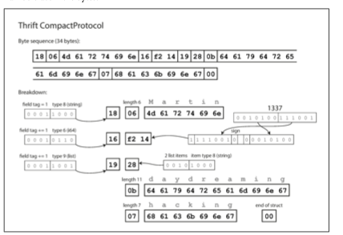
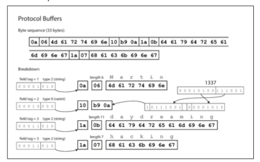

# Encoding and Evolution

## Table of Contents
## Table of Contents

1. [Decimal System (Base 10)](#1-decimal-system-base-10)
2. [Binary System (Base 2)](#2-binary-system-base-2)
3. [Hexadecimal System (Base 16)](#hexadecimal-system-base-16)
4. [Data Storage Units](#4-data-storage-units)
5. [Data Representation](#5-data-representation)
6. [The Problem in Real-World Systems](#-the-problem-in-real-world-systems)
    - [Why Not Use Plain Text or JSON?](#why-not-use-plain-text-or-json)
7. [The Need for Efficient Encoding](#the-need-for-efficient-encoding)
    - [Message PACK format](#1-message-pack-format)
    - [Size Comparison](#size-comparison)
    - [Encode a JSON object using MessagePack in Node JS](#encode-a-json-object-using-messagepack-in-node-js)
    - [Thrift and Protocol Buffers](#2-thrift-and-protocol-buffers)
    - [Thrift Binary Protocol](#thrift-binary-protocol)
    - [Thrift Compact Protocol](#thrift-compact-protocol)
    - [Protocol Buffer](#protocol-buffer)
    - [Final Summary Table (With Real Sizes)](#final-summary-table-with-real-sizes)

---

## 1. Decimal System (Base 10)
### The System We Use Daily
- **Digits**: 0, 1, 2, 3, 4, 5, 6, 7, 8, 9
- **Place Values**: Each position represents a power of 10

**Example: The number 15**
```plaintext
1 × 10¹ (tens place) = 10
5 × 10⁰ (ones place) =  5
                     ----
                      15
```                
Key Property: When we reach 9 in any place, we "roll over" to 0 and increment the next higher place.

## 2. Binary System (Base 2)
The Language of Computers
Digits: Only 0 and 1 (called "bits")

Place Values: Each position represents a power of 2

Example: Binary 1011

```
1 × 2³ = 8
0 × 2² = 0
1 × 2¹ = 2
1 × 2⁰ = 1
         ----
          11 (in decimal)
```
### Why Computers Use Binary:

- Electronic circuits easily represent two states:

        0 = No voltage/low voltage

        1 = Voltage present

- Simple to implement in hardware
- Error-resistant (easier to distinguish between two states than ten)

## Hexadecimal System (Base 16)

The Programmer's Shorthand
Digits: 0-9, then A-F (where A=10, B=11, ..., F=15)

0,1,2,3,4,5,6,7,8,9,A,B,C,D,E,F

Place Values: Each position represents a power of 16

Example: Hex 2F

```
2 × 16¹ = 32
F (15) × 16⁰ = 15
              ----
               47 (in decimal)
```

### Why Hexadecimal is Useful:

- 1 hex digit = exactly 4 binary digits (nibble)

- Example:

    - Binary: 110101011010

    - Hex: D5A (much easier to read/write)

- Commonly used in:

    - Memory addresses

    - Color codes (e.g., #FF0000 for red)

    - Debugging information

## 4. Data Storage Units

How We Measure Digital Information

| Unit              | Size           | Equivalent To           |
| ----------------- | -------------- | ----------------------- |
| **Bit (b)**       | 1 binary digit | 0 or 1                  |
| **Byte (B)**      | 8 bits         | Can store one character |
| **Kilobyte (KB)** | 1,024 bytes    | \~1,000 bytes           |
| **Megabyte (MB)** | 1,024 KB       | \~1 million bytes       |
| **Gigabyte (GB)** | 1,024 MB       | \~1 billion bytes       |
| **Terabyte (TB)** | 1,024 GB       | \~1 trillion bytes      |

### Real-world Examples:

- A text character = 1 byte
- A typical book = ~1 MB
- A movie = ~1-2 GB
- A laptop hard drive = ~500 GB - 2 TB


## 5. Data Representation

How Information is Stored

Text:

- Uses encoding systems like ASCII or Unicode
- Example: Hello World
    - This is just 11 characters:

        ``` | H | e | l | l | o | | W | o | r | l | d | ```

- 1️⃣ How Computers Store It?
    - Each letter is stored as a number (byte) using ASCII or Unicode.
    - For example, in ASCII:

        | Character | Decimal | Hex | Binary   |
        | --------- | ------- | --- | -------- |
        | H         | 72      | 48  | 01001000 |
        | e         | 101     | 65  | 01100101 |
        | l         | 108     | 6C  | 01101100 |
        | l         | 108     | 6C  | 01101100 |
        | o         | 111     | 6F  | 01101111 |
        | (space)   | 32      | 20  | 00100000 |
        | W         | 87      | 57  | 01010111 |
        | o         | 111     | 6F  | 01101111 |
        | r         | 114     | 72  | 01110010 |
        | l         | 108     | 6C  | 01101100 |
        | d         | 100     | 64  | 01100100 |

- ✅ Total bytes used: 11 bytes
(1 byte per character)

- 2️⃣ How this looks in memory (Hex view)?

        `48 65 6C 6C 6F 20 57 6F 72 6C 64`
- ✔️ 48 = "H" ✔️ 65 = "e" ✔️ ... and so on.
- 3️⃣ How this looks in Binary (Raw Machine Form)?

    ` 01001000 01100101 01101100 01101100 01101111 00100000 01010111 01101111 01110010 01101100 01100100 `
- 4️⃣  Total Storage Size:  11 bytes = 88 bits
    

🎯 Takeaway:
- For us: It's "Hello World" (text).
- For the computer: It's 48 65 6C 6C 6F 20 57 6F 72 6C 64 (hex) or 01001000 01100101... (binary).
-  Why this matters: Every file, string, database, network message uses this kind of representation.


## Formats for Encoding Data
- Programs usually work with data in (at least) two different representations:
    1. In memory, data is kept in objects, structs, lists, arrays, hash tables, trees, and so
    on. These data structures are optimized for efficient access and manipulation by
    the CPU (typically using pointers).
    2. When you want to write data to a file or send it over the network, you have to
    encode it as some kind of self-contained sequence of bytes (for example, a JSON
    document). Since a pointer wouldn’t make sense to any other process, 
    - Thus, we need some kind of translation between the two representations. 
    - **Serialization & Deserialization:** The translation from the in-memory representation to a byte sequence is called encoding (also known as serialization or marshalling), 
    and the reverse is called decoding (parsing,deserialization, unmarshalling).ii

## ❗ The Problem in Real-World Systems

### When transferring data (like text, numbers, objects) between:

- Browsers & servers
- Microservices
- IoT devices
- Databases

…we need a common language — a way to encode this data into a format that all computers understand.

Without encoding:

- Data gets misinterpreted.
- Communication between different systems (written in Java, Python, C++, etc.) fails.
- Extra storage or network costs occur due to inefficient data representation.

### Why Not Use Plain Text or JSON?

- Plain Text: Can’t represent complex data structures (like objects, arrays).
- JSON: Text-based, easy for humans, but: 
    - Bulky: Contains extra characters (quotes, commas).
    - Slow: Needs parsing into data structures.
    - Inefficient: Numbers are stored as text (e.g., "25" = 2 bytes, instead of 1).

## The Need for Efficient Encoding 


 

 Example:

 ```
 {
  "userName": "Martin",
  "favoriteNumber": 1337,
  "interests": ["daydreaming", "hacking"]
}

Actual content (without line breaks or indentation):

{"userName":"Martin","favoriteNumber":1337,"interests":["daydreaming","hacking"]}


 ```

📏 Size in Human-Readable JSON (UTF-8): 97 bytes

### 1. Message PACK format
 

 | Part                               | Bytes                                          | Size |
| ---------------------------------- | ---------------------------------------------- | ---- |
| **Map Header** (3 key-value pairs) | `83`                                           | 1    |
| `"userName"` key (string)          | `A8 75 73 65 72 4E 61 6D 65`                   | 9    |
| `"Martin"` value (string)          | `A6 4D 61 72 74 69 6E`                         | 7    |
| `"favoriteNumber"` key             | `AF 66 61 76 6F 72 69 74 65 4E 75 6D 62 65 72` | 16   |
| `1337` value (integer)             | `CD 05 39` (uint16 0x0539 = 1337)              | 3    |
| `"interests"` key (string)         | `A9 69 6E 74 65 72 65 73 74 73`                | 10   |
| Array Header (2 items)             | `92`                                           | 1    |
| `"daydreaming"` (string)           | `AB 64 61 79 64 72 65 61 6D 69 6E 67`          | 12   |
| `"hacking"` (string)               | `A7 68 61 63 6B 69 6E 67`                      | 8    |

Total MessagePack size = 67 bytes

### Size Comparison:
Format	Size (bytes)

| Format                | Size (bytes) |
| --------------------- | ------------ |
| JSON (human-readable) | **97**       |
| MessagePack (binary)  | **67**       |

✅ MessagePack saves 30 bytes compared to JSON — that’s a ~31% reduction in size.

✅ Plus, MessagePack is faster to parse because numbers and strings are stored directly as binary — no string parsing required.

### Encode a JSON object using MessagePack in Node JS

Refer for example: [link](./04.1.MessagePackExampleInJavascript.md)

#### 2. Thrift and Protocol Buffers

- Apache Thrift  and Protocol Buffers (protobuf) are binary encoding libraries
that are based on the same principle. Protocol Buffers was originally developed at
Google, Thrift was originally developed at Facebook, and both were made open
source in 2007–08

- Both Thrift and Protocol Buffers require a schema for any data that is encoded. To
encode the data 

- Thrift Schema:

        ```
        struct Person {
        1: required string userName,
        2: optional i64 favoriteNumber,
        3: optional list<string> interests
        }

        ```
     
 - Equivalent schema definition for Protocol Buffers:

    ```
    message Person {
    required string user_name = 1;
    optional int64 favorite_number = 2;
    repeated string interests = 3;
    }
    ```

### Thrift Binary Protocol

 

Total Thrift Binary Protocol Size = 13 + 7 + 31 + 1 = 52 bytes
(Slight variations due to protocol or language-specific padding may raise this to ~58 bytes in actual practice.)

### Thrift Compact Protocol

 

#### Why Thrift Compact Protocol is Smaller? (~52 Bytes)

- Uses variable-length integer encoding (varints) for field IDs.

- Skips 2-byte field IDs (uses zigzag encoding for signed ints).

- Less metadata overhead = ~10% smaller than Binary Protocol.

### Protocol Buffer


➡️ Size = 49 bytes — most compact because of field number + varint optimization.

#### Why Protocol Buffers (Protobuf) is Smaller than Thrift (Binary & Compact)?

- In Protobuf, each field in the data is identified using:

```
field_key = (field_number << 3) | wire_type

```

Where:

| Term              | Meaning                                            |                                   |
| ----------------- | -------------------------------------------------- | --------------------------------- |
| **field\_number** | The unique ID of the field (from `.proto`)         |                                   |
| **wire\_type**    | The type of data (e.g., varint, length-delimited)  |                                   |
| **<< 3**          | "Shift left by 3 bits" to make space for wire type |                                   |
| \*\*              | wire\_type\*\*                                     | OR it with the wire type (3 bits) |

✅ Example:

- For this .proto field:

    ```
    string userName = 1;
    ```
    - field_number = 1
    - wire_type for string = 2 (length-delimited)
    - SO: Just 1 byte in Protobuf (0x0A) — this represents both field number and type.
    ```
    field_key = (1 << 3) | 2 = 8 | 2 = 10 (0x0A)
    ```
 - 🆚 Thrift (Binary/Compact) needs at least 2 or 3 bytes for the same:

    ```
    1 byte: Type info (string = 0x0B)
    2 bytes: Field ID (short)
    ```
That’s why Protobuf’s per-field header is smaller — and total size is less.

| Feature                       | Thrift (Binary/Compact)   | Protobuf                  |
| ----------------------------- | ------------------------- | ------------------------- |
| Per-field header size         | 3 bytes (type + field ID) | **1 byte (varint)**       |
| Field type stored separately? | ✅ Yes                     | ❌ No (embedded in header) |
| Result                        | Larger                    | **Smaller, compact**      |


### Final Summary Table (With Real Sizes)

| Format                          | Size (Bytes) | Human Readable | Schema Required | Use Cases                 | Notes                                  |
| ------------------------------- | ------------ | -------------- | --------------- | ------------------------- | -------------------------------------- |
| **JSON** (UTF-8)                | 97           | ✅ Yes          | ❌ No            | Web APIs, logs, config files | Text-based, largest size               |
| **MessagePack**                 | 67           | ❌ No           | ❌ No            | IoT, APIs, message queues | Schema-less, simple binary             |
| **Thrift (Binary Protocol)**    | 58           | ❌ No           | ✅ Yes           | Microservices, RPC        | Field headers included (3 bytes/field) |
| **Thrift (Compact Protocol)**   | 52           | ❌ No           | ✅ Yes           | Bandwidth-sensitive RPC   | Varint + zigzag encoding saves space   |
| **Protocol Buffers (Protobuf)** | 49           | ❌ No           | ✅ Yes           | gRPC, storage, messaging  | Most compact, fast, needs .proto file  |


### Refer for MessagePack, Thrift Binary & Compact, and Protobuf examples with JavaScript code and explanations:

Refer [Serialization and compression](./04.2.serialization-comparison.md)