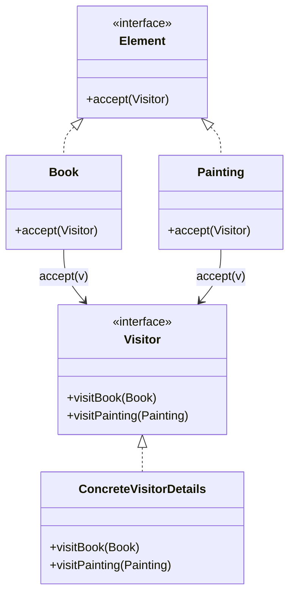

<!-- 
author: "Avinash Gurugubelli",
title: "Visitor Design Pattern",
description: "A detailed explanation of the Visitor design pattern, including its definition, example implementation in Java, and a real-world application use case.",
tags: ["Visitor", "Design Patterns", "Java", "OOP", "Software Principles"],
references: []
-->

Visitor Pattern
================

Analogy: Museum Tour Guide
-------------------------

A museum has many artifacts. Different tour guides (visitors) can enter and provide unique perspectives on any artifact—history, art, or science—without changing the artifacts themselves.


--------------------



Java Example
------------

### Visitor interface

```java
interface Visitor {
    void visit(Book book);
    void visit(Painting painting);
}
```

### Elements

```java
interface Element {
    void accept(Visitor visitor);
}

class Book implements Element {
    String title;
    Book(String title) { this.title = title; }
    public void accept(Visitor visitor) { visitor.visit(this); }
}

class Painting implements Element {
    String name;
    Painting(String name) { this.name = name; }
    public void accept(Visitor visitor) { visitor.visit(this); }
}
```

### Concrete Visitor

```java
class DetailVisitor implements Visitor {
    public void visit(Book book) {
        System.out.println("Book Title: " + book.title);
    }
    public void visit(Painting painting) {
        System.out.println("Painting Name: " + painting.name);
    }
}
```

### Usage

```java
Book book = new Book("GoF Design Patterns");
Painting painting = new Painting("Starry Night");
Visitor detailVisitor = new DetailVisitor();
book.accept(detailVisitor);
painting.accept(detailVisitor);
```

Real App Use Case
-----------------

Syntax tree manipulation in compilers: Visitor is often used to traverse ASTs (Abstract Syntax Trees) to implement different operations like type checking, code generation, or pretty printing, without modifying the tree node classes themselves.