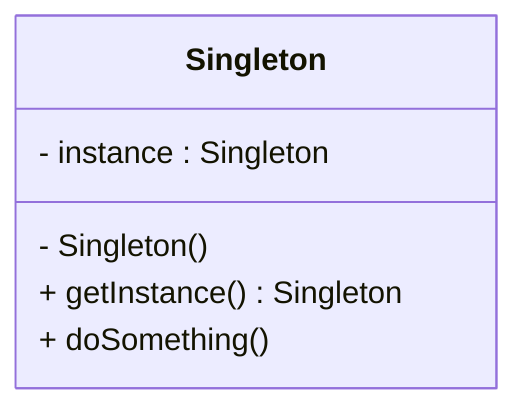

<!-- 
author: "Avinash Gurugubelli",
title: "Singleton Design Pattern — One Instance to Rule Them All",
description: "Learn the Singleton Design Pattern with a coffee machine analogy, Java implementation, thread-safe variants, and clear use cases. Understand when and how to use Singleton effectively.",
tags: ["Singleton", "Design Patterns", "Java", "OOP", "Creational Pattern", "Software Architecture"],
references: []
-->

# 🔒 Singleton Design Pattern — One Instance to Rule Them All

## 🚀 Introduction

Sometimes, we want exactly **one object** of a class in our application — for example, a **config manager**, a **database connection**, or a **logging service**.

That’s where the **Singleton Pattern** comes in. It ensures a class has **only one instance** and provides a global point of access to it.

Let’s break it down with a real-world analogy, class diagram, and Java code.

---

## 🧠 What is the Singleton Pattern?

The **Singleton Pattern** is a **creational design pattern** that restricts the instantiation of a class to a **single object** and provides a **global access point** to that instance.

---

## ☕ Real-Life Analogy: Coffee Machine

Imagine an office with a **single coffee machine**. Anyone can go and use it, but there’s **only one machine** shared among all.

Creating multiple machines is unnecessary and expensive.

That’s exactly what the Singleton Pattern does in software.

---

## 🧱 Key Characteristics

- **Private constructor** to prevent external instantiation  
- **Static instance** stored in the class  
- **Public method** to access the instance (e.g., `getInstance()`)

---

## 🖼️ Class Diagram (Mermaid)



---

## 💻 Java Example

### Basic Thread-safe Singleton
```java
public class Singleton {
    private static Singleton instance;

    // private constructor to prevent instantiation
    private Singleton() {
        System.out.println("Singleton instance created.");
    }

    // Thread-safe lazy initialization
    public static synchronized Singleton getInstance() {
        if (instance == null) {
            instance = new Singleton();
        }
        return instance;
    }

    public void doSomething() {
        System.out.println("Doing something with Singleton.");
    }
}
```

### Usage Example
```java
public class Main {
    public static void main(String[] args) {
        Singleton s1 = Singleton.getInstance();
        Singleton s2 = Singleton.getInstance();

        s1.doSomething();

        System.out.println("Are both instances same? " + (s1 == s2));  // true
    }
}
```

---

## 🧪 Variants of Singleton

| Type                        | Description                                       |
|-----------------------------|---------------------------------------------------|
| Eager Initialization        | Instance created at class loading                |
| Lazy Initialization         | Instance created when needed                     |
| Thread-safe Singleton       | Synchronized for multithreaded environments      |
| Bill Pugh Singleton         | Uses static inner class (efficient & thread-safe)|
| Enum Singleton              | Simplest and safest approach                     |

### Enum Singleton (Best Practice)
```java
public enum EnumSingleton {
    INSTANCE;

    public void doSomething() {
        System.out.println("Enum Singleton doing something.");
    }
}
```

Usage:
```java
EnumSingleton.INSTANCE.doSomething();
```

---

## 📋 Summary

| Feature          | Description                              |
|------------------|------------------------------------------|
| Pattern Type     | Creational                               |
| Purpose          | Ensure only one instance of a class      |
| Access           | Global                                   |
| Use Cases        | Logger, Config Manager, Thread Pool      |

---

## 🧠 When to Use Singleton?

Use Singleton when:

- You need exactly one object per class
- You want controlled access to a shared resource
- You want a global instance without global variables

⚠️ **Avoid overusing** Singleton — it introduces global state and tight coupling.

---

## ✨ Final Thoughts

The **Singleton Pattern** is one of the simplest and most commonly used patterns. When used right, it ensures **controlled, efficient, and centralized access** to a shared resource.