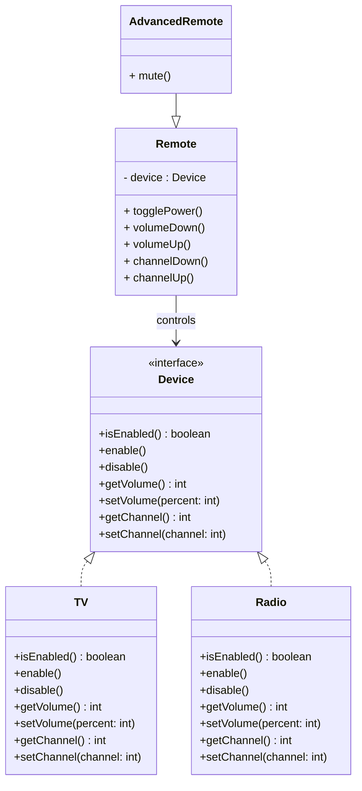

<!---
author: "Avinash Gurugubelli"
title: "Bridge Design Pattern — Decouple Abstraction from Implementation"
description: "A detailed explanation of the Bridge design pattern, including its definition, example implementation in Java, and a real-world application use case."
tags: ["Bridge", "Design Patterns", "Java", "OOP", "Software Principles"]
references: []
--->

# 🌉 Bridge Design Pattern — Decouple Abstraction from Implementation

## 🚀 Introduction

In object-oriented design, **tight coupling** between abstraction and implementation can lead to rigid and hard-to-maintain systems.

The **Bridge Design Pattern** solves this problem by **decoupling an abstraction from its implementation**, allowing both to vary independently.

Let's explore this elegant pattern with real-world analogies, class diagrams, and Java code.

---

## 🤔 What is the Bridge Pattern?

The **Bridge Pattern** is a **structural design pattern** that separates an abstraction from its implementation, so the two can evolve independently.

It’s called “bridge” because it **bridges the gap** between two hierarchies:

- Abstraction (interface or high-level control)
- Implementation (concrete platform-specific logic)

---

## 🌉 Real-Life Analogy: Remote Controls and Devices

Imagine:

- You have **multiple remote controls** (BasicRemote, AdvancedRemote)
- You also have **multiple devices** (TV, Radio)

Using the Bridge Pattern, you can mix and match:
- A **BasicRemote** can control a **TV**
- An **AdvancedRemote** can control a **Radio**

Instead of hardcoding all combinations, the pattern **decouples remotes from devices**.

---

## 🧱 Key Components

- **Abstraction**: The core interface (e.g., `Remote`)
- **RefinedAbstraction**: Extended versions (e.g., `AdvancedRemote`)
- **Implementor**: Interface for the implementation (e.g., `Device`)
- **ConcreteImplementor**: Specific implementations (e.g., `TV`, `Radio`)

---

## 🖼️ Class Diagram



---

## 💻 Java Example

### 1. `Device` interface (Implementor)
```java
public interface Device {
    boolean isEnabled();
    void enable();
    void disable();
    int getVolume();
    void setVolume(int percent);
    int getChannel();
    void setChannel(int channel);
}
```

### 2. `TV` and `Radio` classes (ConcreteImplementors)
```java
public class TV implements Device {
    private boolean on = false;
    private int volume = 30;
    private int channel = 1;

    public boolean isEnabled() { return on; }
    public void enable() { on = true; }
    public void disable() { on = false; }
    public int getVolume() { return volume; }
    public void setVolume(int percent) { volume = percent; }
    public int getChannel() { return channel; }
    public void setChannel(int channel) { this.channel = channel; }
}

public class Radio implements Device {
    private boolean on = false;
    private int volume = 50;
    private int channel = 101;

    public boolean isEnabled() { return on; }
    public void enable() { on = true; }
    public void disable() { on = false; }
    public int getVolume() { return volume; }
    public void setVolume(int percent) { volume = percent; }
    public int getChannel() { return channel; }
    public void setChannel(int channel) { this.channel = channel; }
}
```

### 3. `Remote` abstraction
```java
public class Remote {
    protected Device device;

    public Remote(Device device) {
        this.device = device;
    }

    public void togglePower() {
        if (device.isEnabled()) device.disable();
        else device.enable();
    }

    public void volumeDown() {
        device.setVolume(device.getVolume() - 10);
    }

    public void volumeUp() {
        device.setVolume(device.getVolume() + 10);
    }

    public void channelDown() {
        device.setChannel(device.getChannel() - 1);
    }

    public void channelUp() {
        device.setChannel(device.getChannel() + 1);
    }
}
```

### 4. `AdvancedRemote` (Refined Abstraction)
```java
public class AdvancedRemote extends Remote {
    public AdvancedRemote(Device device) {
        super(device);
    }

    public void mute() {
        device.setVolume(0);
    }
}
```

### 5. Usage Example
```java
public class Main {
    public static void main(String[] args) {
        Device tv = new TV();
        Remote remote = new Remote(tv);

        remote.togglePower();
        remote.volumeUp();
        remote.channelUp();

        Device radio = new Radio();
        AdvancedRemote advancedRemote = new AdvancedRemote(radio);
        advancedRemote.togglePower();
        advancedRemote.mute();
    }
}
```

---

## 📋 Summary

| Concept             | Description                                   |
|---------------------|-----------------------------------------------|
| Purpose             | Decouple abstraction from implementation      |
| Category            | Structural Design Pattern                     |
| Real-life Analogy   | Remote control and devices                    |
| Benefits            | Extensibility, Low coupling, Cleaner hierarchy|

---

## 🧠 When to Use Bridge Pattern?

Use the Bridge Pattern when:

- You want to separate abstraction from implementation
- You want to avoid a combinatorial explosion of classes
- You want to switch implementations at runtime

---

## ✨ Final Thoughts

The **Bridge Pattern** offers a clean way to extend systems across multiple dimensions without a deep inheritance tree. It's a **powerful ally** in building scalable, modular, and flexible systems.