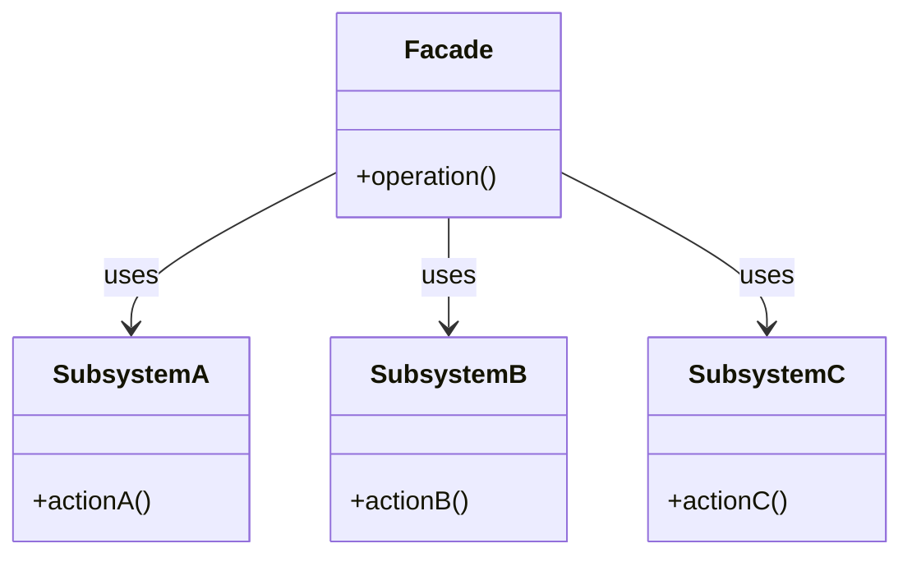

<!-- 
author: "Avinash Gurugubelli",
title: "Facade Design Pattern — Simplifying Complex Systems with a Unified Interface",
description: "Understand the Facade Design Pattern with a real-world remote control analogy, Java implementation, class diagram, and practical use cases. Learn how to simplify client interaction with complex subsystems.",
tags: ["Facade", "Design Patterns", "Java", "OOP", "Structural Pattern", "Software Architecture"],
references: []
-->

# Facade Design Pattern

The **Facade Pattern** is a **structural design pattern** that provides a simplified interface to a complex subsystem. It hides the complexities of the system and provides a client with an easy-to-use interface.

---

## 👓 Real-World Analogy

Think of a **universal remote**. Instead of using multiple remotes for TV, sound system, and gaming console, you use one remote to control all.

- TV, Sound System, and Console = complex subsystems
- Universal Remote = facade

---

## 🎯 Intent

> Provide a unified interface to a set of interfaces in a subsystem. The Facade defines a higher-level interface that makes the subsystem easier to use.

---

## ✅ When to Use

- You want to **simplify usage** of a complex or poorly designed API.
- You need to **decouple** a system from complex subsystems.
- You want to **minimize dependencies** between subsystems and clients.

---

## 🛠️ Participants

| Role     | Description |
|----------|-------------|
| Facade   | Offers a simple interface to the complex subsystems |
| Subsystems | Perform the actual work behind the scenes |
| Client   | Uses the Facade instead of directly accessing subsystems |

---

## 🧱 Structure (Mermaid)



## Code Example

```java
// Subsystems
class CPU {
    void freeze() { System.out.println("Freezing CPU..."); }
    void execute() { System.out.println("Executing CPU instructions..."); }
}

class Memory {
    void load(long position, byte[] data) {
        System.out.println("Loading data to memory at position " + position);
    }
}

class HardDrive {
    byte[] read(long lba, int size) {
        System.out.println("Reading " + size + " bytes from disk at " + lba);
        return new byte[size];
    }
}

// Facade
class Computer {
    private final CPU cpu;
    private final Memory memory;
    private final HardDrive hardDrive;

    public Computer() {
        this.cpu = new CPU();
        this.memory = new Memory();
        this.hardDrive = new HardDrive();
    }

    public void startComputer() {
        cpu.freeze();
        byte[] data = hardDrive.read(100, 4096);
        memory.load(0, data);
        cpu.execute();
    }
}

// Client
public class FacadeDemo {
    public static void main(String[] args) {
        Computer computer = new Computer();
        computer.startComputer();
    }
}
```

### Output
```
Freezing CPU...
Reading 4096 bytes from disk at 100
Loading data to memory at position 0
Executing CPU instructions...

```

### ✅ Benefits
- Simplifies API usage for clients.

- Reduces coupling between client and subsystems.

- Provides better control over subsystem behavior.

### ⚠️ Drawbacks
- Can become a god object if it tries to do too much.
- May hide important subsystem features from clients.