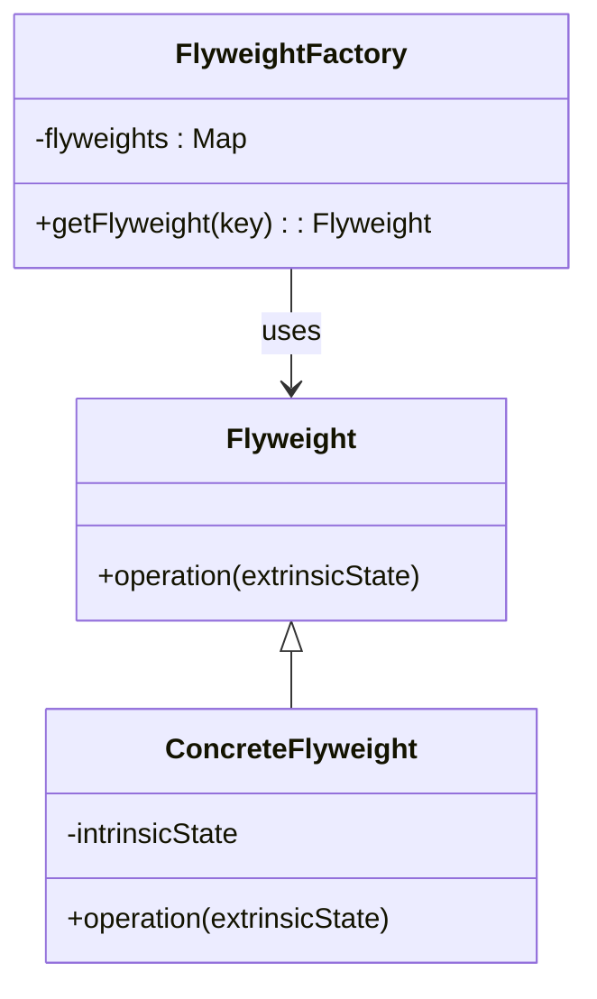
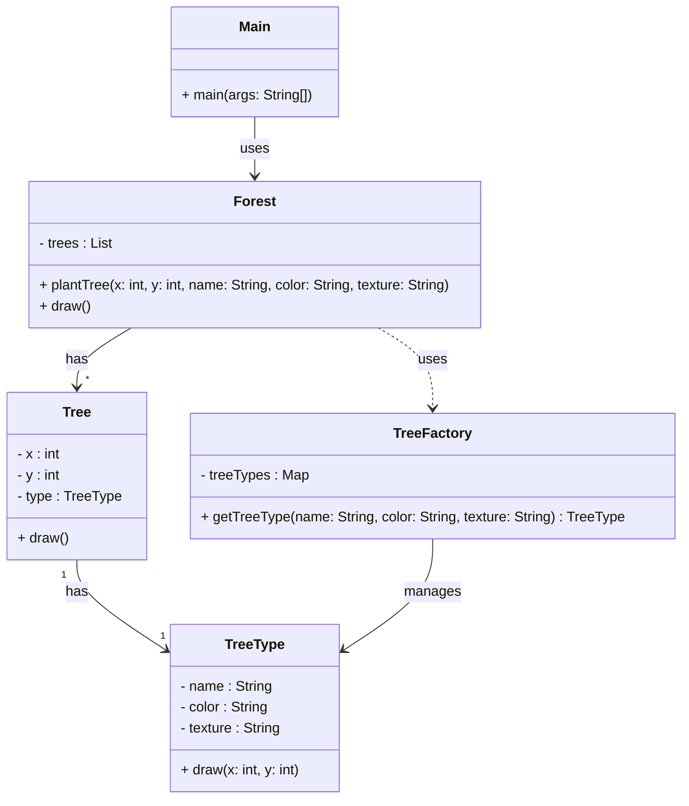

<!---
author: "Avinash Gurugubelli"
title: "Flyweight Design Pattern"
description: "A detailed explanation of the Flyweight design pattern, including its definition, example implementation in Java, and a real-world application use case."
tags: ["Flyweight", "Design Patterns", "Java", "OOP", "Software Principles"]
references: []
--->

# 🧠 Flyweight Design Pattern — Save Memory Like a Pro!

## 🚀 Introduction

Have you ever noticed how some applications can efficiently handle **thousands or even millions of objects** without slowing down or eating up all your memory?

Behind this magic is a design pattern called the **Flyweight Pattern**, which helps you **reuse existing objects instead of creating new ones repeatedly**.

Let’s dive into this space-efficient design!

---

## 📦 What is the Flyweight Pattern?

The **Flyweight Design Pattern** is a **structural pattern** that allows you to share objects to **reduce memory usage** when you have a **large number of similar objects**.

Instead of creating a new object every time, you **reuse existing instances** that share the same data.

---

## 🍕 Real-Life Analogy: Pizza Toppings

Imagine a pizza restaurant:

- There are **1000 pizzas** being made.  
- Each pizza may have **toppings like Cheese, Olives, Peppers**.
- Instead of creating a **new Cheese object** for each pizza, you create **one Cheese object** and reuse it on all pizzas.

This saves memory because the topping objects are **shared (intrinsic state)**, while the pizza size or order number remains **unique (extrinsic state)**.

---

## 📌 Key Concepts

- **Intrinsic State**: Shared, reusable part (e.g., topping type, shape, texture)  
- **Extrinsic State**: Varies per object and is provided externally (e.g., pizza size or order number)  
- **Flyweight**: The shared object  
- **Flyweight Factory**: Manages and reuses flyweight instances

---

## 🖼️ Class Diagram (Mermaid)



---

## 💻 Java Example: Reusing Tree Types in a Forest

Let's say we're creating a **forest visualization** with **thousands of trees**. Each tree can be of a **type (oak, pine, cherry)** with shared data like texture and color.

### 1. Flyweight (`TreeType`)
```java
class TreeType {
    private String name;
    private String color;
    private String texture;

    public TreeType(String name, String color, String texture) {
        this.name = name;
        this.color = color;
        this.texture = texture;
    }

    public void draw(int x, int y) {
        System.out.println("Drawing " + name + " tree at (" + x + ", " + y + ")");
    }
}
```

### 2. Flyweight Factory (`TreeFactory`)
```java
import java.util.HashMap;
import java.util.Map;

class TreeFactory {
    private static final Map<String, TreeType> treeTypes = new HashMap<>();

    public static TreeType getTreeType(String name, String color, String texture) {
        String key = name + ":" + color + ":" + texture;
        if (!treeTypes.containsKey(key)) {
            treeTypes.put(key, new TreeType(name, color, texture));
        }
        return treeTypes.get(key);
    }
}
```

### 3. Context Object (`Tree`)
```java
class Tree {
    private int x, y; // Extrinsic state
    private TreeType type; // Intrinsic state (shared)

    public Tree(int x, int y, TreeType type) {
        this.x = x;
        this.y = y;
        this.type = type;
    }

    public void draw() {
        type.draw(x, y);
    }
}
```

### 4. Forest (Client)
```java
import java.util.ArrayList;
import java.util.List;

class Forest {
    private List<Tree> trees = new ArrayList<>();

    public void plantTree(int x, int y, String name, String color, String texture) {
        TreeType type = TreeFactory.getTreeType(name, color, texture);
        Tree tree = new Tree(x, y, type);
        trees.add(tree);
    }

    public void draw() {
        for (Tree tree : trees) {
            tree.draw();
        }
    }
}
```

### 5. Usage
```java
public class Main {
    public static void main(String[] args) {
        Forest forest = new Forest();

        for (int i = 0; i < 1000; i++) {
            forest.plantTree(i, i + 1, "Oak", "Green", "Rough");
        }

        for (int i = 0; i < 1000; i++) {
            forest.plantTree(i, i + 1, "Cherry", "Pink", "Smooth");
        }

        forest.draw();
    }
}
```

✅ Even though 2000 trees are planted, only **2 TreeType objects** are created — thanks to Flyweight!

---



## 🧠 When to Use Flyweight?

Use Flyweight when:

- You have **a large number of similar objects**
- Most object data is **shared and immutable**
- Performance and **memory usage are critical**
- Object creation is **expensive**

---

## 📋 Summary

| Feature            | Description                             |
|--------------------|-----------------------------------------|
| Purpose            | Reduce memory usage via object sharing  |
| Category           | Structural Design Pattern               |
| Best For           | Large object graphs with shared states  |
| Analogy            | Pizza toppings (shared among pizzas)    |

---

## ✨ Final Thoughts

The **Flyweight Pattern** is all about **efficiency**. In a world where memory and performance matter, it's a smart way to **reuse and share objects** — just like toppings on thousands of pizzas 🍕!