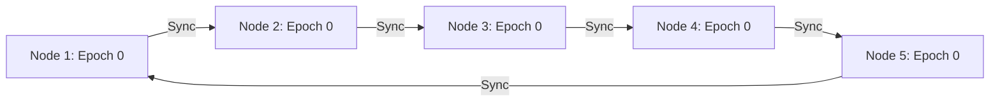
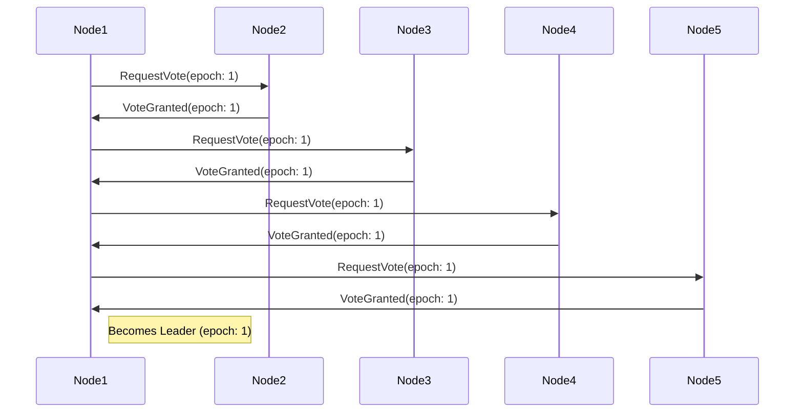
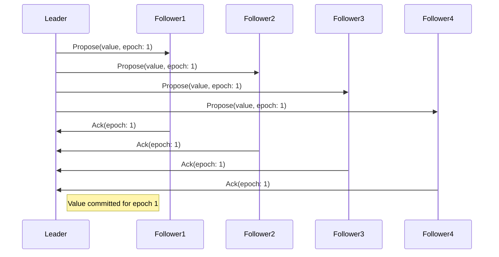
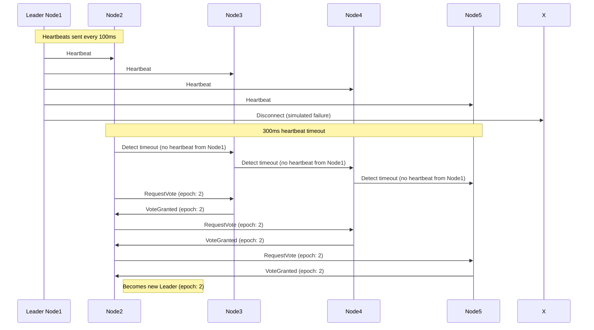
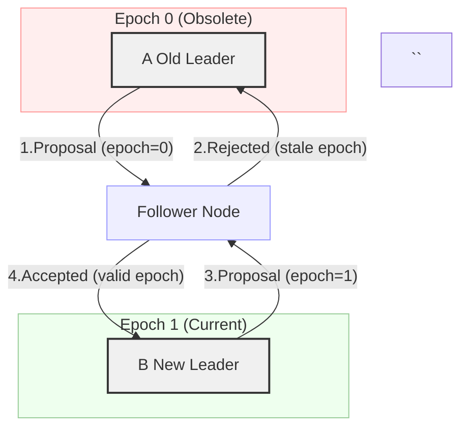
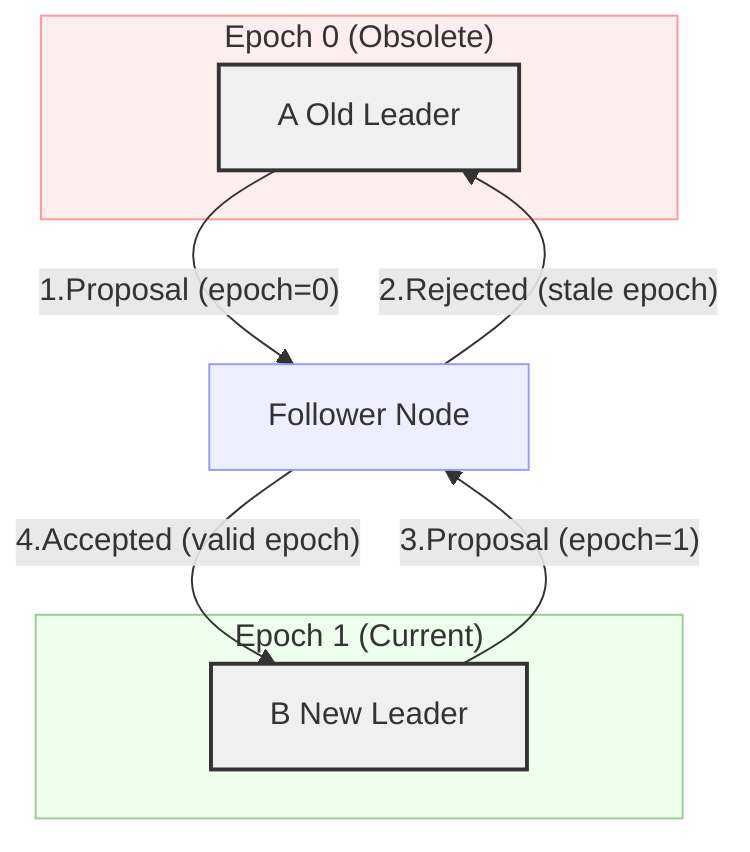
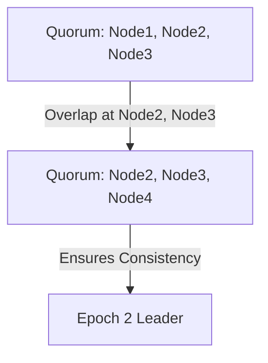
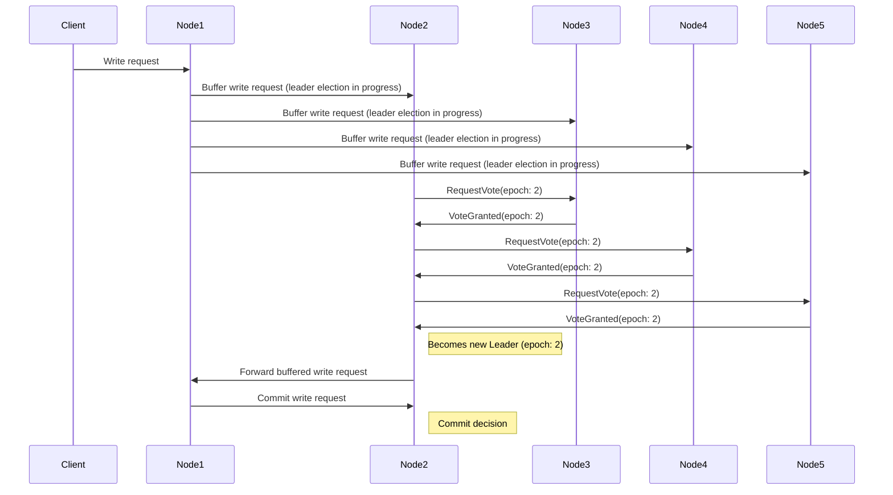
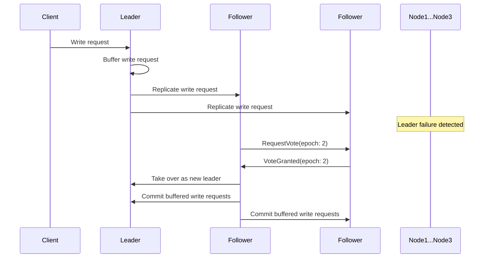

<!--
author: "Avinash Gurugubelli",
title: "Epochs in Raft",
description: "A discussion on epochs in Raft, a distributed consensus algorithm, including leader election and consistency in the cluster."
tags: ["Raft", "Epochs", "Distributed Systems", "Consensus Algorithm", "Leader Election"],
references: [{
    title: "In Search of an Understandable Consensus Algorithm",
    authors: ["Diego Ongaro", "John Ousterhout"],
    publisher: "Stanford University",
    year: 2014,
    url: "https://raft.github.io/"
}]
-->

# Understanding Epochs in Distributed Consensus

In distributed systems, epochs play a crucial role in building fault-tolerant consensus protocols like Paxos and Raft. This guide is designed for beginners, using Mermaid diagrams to visualize how epochs are used for leader election, consistency, and safe recovery. If you're familiar with concepts like quorums, leader election, and consensus, this article will connect the dots, making the topic concrete and visual.

## What is an Epoch?

An epoch is a unique and monotonically increasing number (often called a term, round, or view number, depending on the protocol) that marks a phase or era in the operation of a distributed system.

- **Purpose**: Epochs prevent confusion and split-brain scenarios when leadership changes.
- **Common Names**: Called "term" in Raft, "view" in Viewstamped Replication, "ballot number" in Paxos.

## Why Are Epochs Needed?

- **Uniqueness of Leadership**: Within a single epoch, only one leader is legitimate.
- **Safe Recovery**: If an old leader comes back after a network partition, the epoch ensures newer decisions prevail.
- **Overlapping Quorums**: At least one node is always present in consecutive quorums, keeping the system consistent.

## ⚙️ How Is Epoch Maintained?

Each node stores the latest epoch number it has seen.
- ### Durable Storage (Write to Disk)

    Every time a node:

    * Starts an election, or
    * Receives a higher epoch in a message

    It writes the new epoch to disk before proceeding. This ensures:

    * Even after a crash, the node remembers the latest epoch it saw.
    * It won’t go back and vote for someone in an older epoch.

### Epoch Maintenance Steps

1. **Start Election**: Node starts an election and increments its epoch number.
2. **Write to Disk**: Node writes the new epoch number to disk before proceeding.
3. **Receive Higher Epoch**: Node receives a message with a higher epoch number.
4. **Write to Disk**: Node writes the new epoch number to disk before proceeding.
5. **Crash Recovery**: Node recovers from a crash and reads the latest epoch number from disk.

By writing the epoch number to disk, nodes ensure that they can recover from crashes and maintain the correct epoch number, preventing split-brain scenarios and ensuring safe leadership transitions.

## How Epochs Work: Step-By-Step

**How Epochs Work: Step-By-Step**

### 1. Initial State: Nodes Start in Epoch 0

All nodes agree on the starting epoch. This ensures that all nodes have a common understanding of the initial state.

### 2. Leader Election with Next Epoch

When a leader seems unresponsive, nodes increment the epoch and vote for a new leader. This process ensures that a new leader is elected and the system remains available.

### 3. Proposals and Quorum in the New Epoch

The new leader proposes values to the others; decisions are tagged with the current epoch. This ensures that all nodes agree on the proposed value.

### 4. Leader Disconnection and New Epoch

If the leader (Node 1) disconnects, the nodes will detect the disconnection and increment the epoch.

### 5. Handling Stale Leaders

If a former leader from an old epoch returns, it cannot overwrite decisions from a newer epoch. This ensures that the system remains consistent.

### 4. Handling Stale Leaders

If a former leader from an old epoch returns, it cannot overwrite decisions from a newer epoch. This ensures that the system remains consistent.

### 5. Guaranteeing Safe Leadership

If a leader with the highest epoch number collects votes from a majority (quorum), it is safe to act. Overlapping quorums make sure that at least one node always knows the latest committed value.

## Detecting Disconnections in Distributed Systems

Detecting disconnections in a distributed system can be challenging. However, there are several techniques that can be used to detect disconnections:

### Heartbeats

Each node sends periodic "heartbeat" messages to the leader and other nodes. If a node fails to receive a heartbeat from the leader within a certain time window (e.g., 3-5 heartbeats), it assumes the leader is disconnected.

### Timeouts

Nodes set timeouts for receiving responses from the leader. If a node doesn't receive a response within the timeout period, it assumes the leader is disconnected.

### Monitoring

Nodes can monitor the leader's network connectivity, CPU usage, or other system metrics. If these metrics indicate a problem, the node may assume the leader is disconnected.

### Explicit Disconnection Messages

When a node disconnects, it can send an explicit "goodbye" message to the other nodes, indicating its intention to leave the cluster.

Raft Consensus Algorithm

In the context of the Raft consensus algorithm, the detection of disconnections is typically done using a combination of heartbeats and timeouts.

## Frequently Asked Questions (FAQs)

### 1. How do epochs prevent split-brain scenarios?
Epochs ensure that only one leader can be elected at a time. If a node tries to act as a leader with an older epoch, it will be rejected by nodes that have seen a newer epoch. This prevents multiple nodes from acting as leaders simultaneously, thus avoiding split-brain scenarios.

### 2. How does epochs work in a multi-leader mode?
1. **Single Leader Mode:** Yes, this explanation assumes a single leader mode. In a multi-leader mode, the process would be more complex, and additional mechanisms would be required to ensure consistency.

In a single leader mode, if Node 2 does not have the latest data, it cannot be elected as leader. The leader election process ensures that the node with the highest epoch number and

### 3. Lets say Node 2 elected as new leader , but if it does not have the latest data then will it will  be able to commit the decision ?

No, it will not be able to commit the decision. It will not have the latest data, so it will not be able to commit the decision.

let's say we are using Raft consensus protocol then it will not be able to commit the decision. Raft protocol ensures that the leader will commit the decision only if it has the latest data.

| Concern                         | Answer                                                  |
| ------------------------------- | ------------------------------------------------------- |
| Can multiple leaders exist?     | ❌ No — Epoch ensures one leader per term                |
| Can stale nodes become leaders? | ❌ No — Followers only vote for up-to-date logs          |
| How is “up-to-date” checked?    | By comparing `lastLogTerm` and `lastLogIndex`           |
| Who maintains the epoch number? | Every node persists the latest epoch it sees or creates |

### 4. lets say for electing a new later taking 200ms in between client make a write request then how it will be able to commit the decision ?

In a distributed system, it's possible that a client may make a write request while the system is in the process of electing a new leader. In this scenario, the system needs to ensure that the write request is not lost or committed prematurely.

Here are a few strategies that can be employed to handle this situation:

### 1. **Buffering the write request**

The node that receives the write request from the client can buffer the request until the new leader is elected. Once the new leader is elected, the node can forward the write request to the new leader, which can then commit the decision.

### 2. **Redirecting the client**

The node that receives the write request from the client can redirect the client to the new leader once it is elected. The client can then re-send the write request to the new leader, which can commit the decision.

### 3. **Using a **`pending`** state**

The system can use a **`pending`** state to indicate that a write request is pending while the new leader is being elected. Once the new leader is elected, the system can transition the **`pending`** state to a **`committed`** state, indicating that the write request has been successfully committed.

### 4. **Using a **`lease`** mechanism**

The system can use a **`lease`** mechanism to ensure that the write request is not committed prematurely. The node that receives the write request from the client can acquire a lease on the resource being written to, which prevents any other node from committing a write request to the same resource until the lease expires.

Here's an updated sequence diagram to illustrate the buffering strategy:

In this scenario, the client sends a write request to Node1, which buffers the request until the new leader (Node2) is elected. Once Node2 is elected, Node1 forwards the buffered write request to Node2, which commits the decision.

### 5. Who will do the buffering ? client or node itself ?

In a distributed system using Raft, the buffering of write requests is typically done by the database nodes themselves, not by the client.

Here's how it works:

1. The client sends a write request to one of the database nodes (e.g., Node1).
2. Node1 receives the write request and checks if it is the current leader. If it is not, it will redirect the client to the current leader (e.g., Node2).
3. If Node1 is the current leader, it will buffer the write request in its memory until it can be committed to the database.
4. If the leader (Node1) fails or becomes unavailable, the other nodes will detect the failure and initiate a new leader election.
5. Once a new leader (e.g., Node2) is elected, it will take over the responsibility of committing the buffered write requests.

The buffering of write requests is done automatically by the Raft protocol, without requiring any explicit action from the client. The client simply sends the write request to one of the database nodes, and the Raft protocol takes care of ensuring that the request is properly buffered and committed.

Here's a high-level overview of the buffering mechanism in Raft:

In this example, Node1 buffers the write request and replicates it to Node2 and Node3. When Node1 fails, Node2 takes over as the new leader and commits the buffered write requests.

## Key Takeaways

- **Epochs break ties**: Only the leader in the highest epoch can make decisions, preventing split-brain.
- **Quorum overlap**: Consecutive quorums must share at least one node to transfer knowledge across epochs.
- **Safe recovery**: Epoch numbers make it possible to safely transfer leadership and prevent data loss or inconsistency.

## When to Use Epochs

- In any distributed system where automatic leader election and consensus are needed (e.g., Raft, Paxos, Viewstamped Replication, ZooKeeper's Zab).
- When you want to ensure at-most-one leader at a time and safe failover with no split-brain or data divergence.
