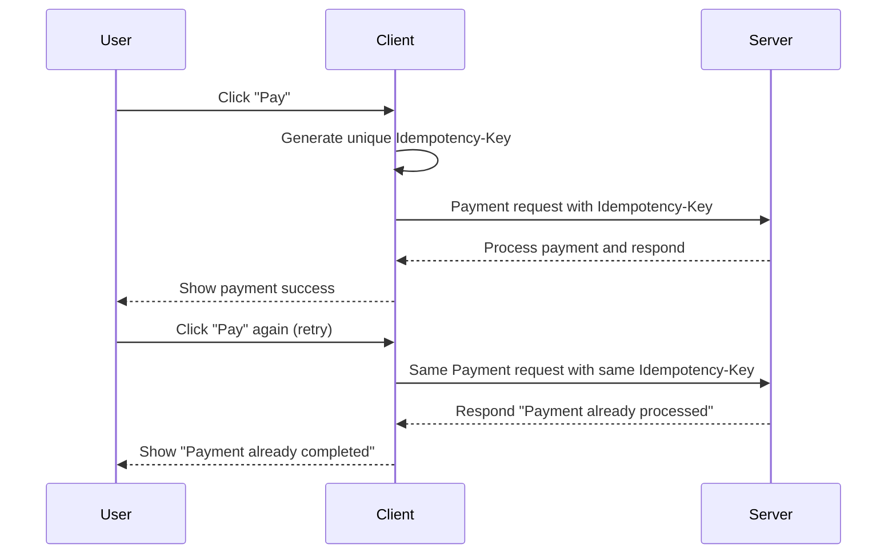

<!--
title: "Understanding Idempotency in System Design",
description: "A beginner-friendly guide to idempotency, its importance in system design, real-world applications, and practical coding examples.",
tags: ["System Design", "Idempotency", "APIs", "Payment Processing", "Reliability"],
author: "Avinash Gurugubelli",
references: [{
    "title": "Designing Data-Intensive Applications",
    "author": "Martin Kleppmann",
    "link": ""        
}]
-->


# Understanding Idempotency

Idempotency is a fundamental concept in software development that helps build reliable and safe systems. This blog covers everything you need to know about idempotency — from basic understanding to real-world applications, common challenges, and detailed coding examples including both client and server sides.

---

## What is Idempotency?

**Idempotency** means performing an operation multiple times results in the **same effect as performing it once**.

> Imagine pressing the elevator button for your floor multiple times; it doesn’t cause the elevator to come twice, it just comes once. That’s idempotency!

---

## Why Does Idempotency Matter?

- **Safety:** Prevents duplicate side effects, like double charges in payments.
- **Reliability:** Makes your system more robust, especially in distributed applications.
- **User Experience:** Reduces confusion and bugs caused by repeated requests.

---

## Real-World Applications of Idempotency

| Application      | How Idempotency Helps                 | Example                                |
|------------------|-------------------------------------|--------------------------------------|
| Online Payments  | Prevents duplicate charges          | A user presses "Pay" twice accidentally |
| REST APIs        | Safe repeatable HTTP methods        | PUT, DELETE requests                   |
| Booking Systems  | Avoid double bookings or purchases  | Re-submitting hotel or product orders |

---

## Idempotent vs Non-Idempotent Payment

- **Non-Idempotent Payment:** Pressing "Pay" twice may result in two charges.
- **Idempotent Payment:** The system ensures only one charge no matter how many times "Pay" is pressed with the same request.

---

## How Idempotency Works in Payment Processing



---

## User Drawbacks and Challenges of Idempotency

| Drawback              | Description                                                    |
|-----------------------|----------------------------------------------------------------|
| Complexity            | Requires extra logic and storage for tracking requests         |
| Resource Usage        | Need to store request states or ids to detect duplicates       |
| Handling Partial Failures | Ensuring system correctly recovers from partial operations   |

---

## Tips for Implementing Idempotency (Beginner Friendly)

- Use **unique identifiers** (like UUIDs) for each operation.
- Follow **HTTP conventions**: safe methods like GET, PUT, DELETE should be idempotent.
- Test with **repeat requests** to ensure correctness.
- On the client, generate and reuse the idempotency key for retries.

---

## Code Examples: Idempotency in Payment Processing

### Server-Side: Python (Flask) Example

```python
from flask import Flask, request, jsonify
import uuid

app = Flask(__name__)

# Store processed payments keyed by idempotency keys
processed_payments = {}

@app.route('/pay', methods=['POST'])
def process_payment():
    idempotency_key = request.headers.get('Idempotency-Key')
    if not idempotency_key:
        return jsonify({'error': 'Idempotency-Key header required'}), 400

    if idempotency_key in processed_payments:
        return jsonify({'message': 'Payment already processed', 'payment_id': processed_payments[idempotency_key]}), 200

    payment_id = str(uuid.uuid4())
    processed_payments[idempotency_key] = payment_id

    return jsonify({'message': 'Payment successful', 'payment_id': payment_id}), 201

if __name__ == '__main__':
    app.run(debug=True)
```

---

### Server-Side: Node.js (Express) Example

```javascript
const express = require('express');
const { v4: uuidv4 } = require('uuid');
const app = express();

app.use(express.json());

const processedPayments = {};

app.post('/pay', (req, res) => {
    const idempotencyKey = req.headers['idempotency-key'];
    if (!idempotencyKey) {
        return res.status(400).json({ error: 'Idempotency-Key header required' });
    }
    if (processedPayments[idempotencyKey]) {
        return res.status(200).json({ message: 'Payment already processed', payment_id: processedPayments[idempotencyKey] });
    }

    const paymentId = uuidv4();
    processedPayments[idempotencyKey] = paymentId;

    res.status(201).json({ message: 'Payment successful', payment_id: paymentId });
});

app.listen(3000, () => {
    console.log('Server running on port 3000');
});
```

---

### Client-Side: JavaScript Example for Payment Request with Idempotency-Key

```javascript
function generateUUID() {
    return 'xxxxxxxx-xxxx-4xxx-yxxx-xxxxxxxxxxxx'.replace(/[xy]/g, function(c) {
        const r = Math.random() * 16 | 0, v = c === 'x' ? r : (r & 0x3 | 0x8);
        return v.toString(16);
    });
}

let currentIdempotencyKey = null;

async function pay(amount) {
    if (!currentIdempotencyKey) {
        currentIdempotencyKey = generateUUID();
    }

    try {
        const response = await fetch('/pay', {
            method: 'POST',
            headers: {
                'Content-Type': 'application/json',
                'Idempotency-Key': currentIdempotencyKey
            },
            body: JSON.stringify({ amount: amount })
        });

        const data = await response.json();
        if (response.ok) {
            alert(data.message);
            currentIdempotencyKey = null;
        } else {
            alert('Payment failed: ' + data.error);
        }
    } catch (error) {
        alert('Network error occurred, you can retry payment.');
    }
}

document.getElementById('pay-button').addEventListener('click', () => {
    pay(10);
});
```

---

## Summary Table

| Concept        | Real-World Analogy          | Key Benefit              |
|----------------|----------------------------|--------------------------|
| Idempotency    | Elevator button press       | Prevents duplicate actions |
| Non-Idempotent | Light switch toggle         | Causes repeated actions  |

---

## Conclusion

Idempotency is a powerful technique to build safe, reliable systems — especially for payment processing where duplicated operations can lead to severe issues. By generating a unique idempotency key on the client side and verifying it on the server, you can prevent double charges and improve user experience.

Understanding this pattern is essential for beginners aiming to design robust APIs or payment flows.

> Want to explore more? Check out payment gateway APIs like Stripe or Razorpay that use idempotency in their real-world systems.

---

## References and Further Reading

- [Idempotent HTTP Methods - MDN Web Docs](https://developer.mozilla.org/en-US/docs/Glossary/Idempotent)
- [Stripe API Idempotency Keys](https://stripe.com/docs/idempotency)
- [REST API Design Guide](https://restfulapi.net/idempotent-rest-apis/)
- [UUID documentation](https://en.wikipedia.org/wiki/Universally_unique_identifier)

---

