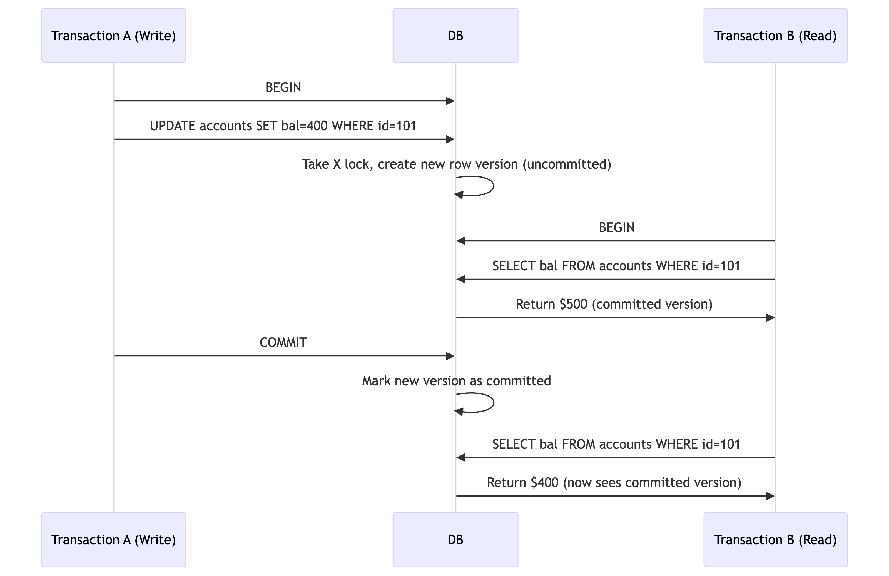

<!---
title: "Read Committed Isolation Level: Implementation Details",
description: "A detailed look at the Read Committed isolation level, its guarantees, mechanisms, and optimizations.",
author: "Avinash Gurugubelli"
tags: [
  "Database Transactions",
  "Isolation Levels"
],
references: [{
  title: "Designing Data-Intensive Applications",
  authors: ["Martin Kleppmann"],
  publisher: "O'Reilly Media",
  year: 2017,
  url: "https://dataintensive.net/"
}],
date: 2023-10-01
-->

# Read Committed Isolation Level: Implementation Details

## Core Guarantees
- ✅ **No Dirty Reads**: Never see uncommitted data
- ✅ **No Dirty Writes**: Never overwrite uncommitted changes
- ❌ Allows non-repeatable reads and phantoms


## 🔒 Core Mechanisms

### 1. Preventing Dirty Writes (Mandatory)
- Row-level exclusive locks for writes:
    ```
    Transaction A               Transaction B
    ────────────────────────────────────────────
    BEGIN;
    UPDATE accounts 
    SET balance = 400           ← Acquires X lock
    WHERE id = 101;
                                BEGIN;
                                UPDATE accounts
                                SET balance = 300
                                WHERE id = 101;
                                ← BLOCKS (waits for Transaction A's lock)
    COMMIT;                     ← Releases lock, Transaction B proceeds
    ```

## 2. Preventing Dirty Writes (Two Approaches)

- Approach 1: Read Locks (Rare)
  - Problem: Long writes block all readers
  - example:
     ```
     SELECT * FROM accounts LOCK IN SHARE MODE; -- Briefly acquires shared lock
     ```

- Approach 2: MVCC (Standard)
  - Maintains multiple versions of each row:
  - Readers always see the latest committed version
  - Writers create new versions (visible only after commit)

   ```
   Row versions in storage:
    ┌────┬─────────┬────────┬──────────┐
    │ id │ balance │ txn_id │ committed│ 
    ├────┼─────────┼────────┼──────────┤
    │101 │ $500    │ 123    │ true     │ ← Visible to readers
    │101 │ $400    │ 124    │ false    │ ← New uncommitted version
    └────┴─────────┴────────┴──────────┘
   ```

### Scenario: Concurrent Read + Write
- Key Behaviors:
    - Statement-Level Consistency: Each SELECT sees latest committed data at statement start
    - No Read Locks: Readers never block writers or other readers
    - Write-Write Blocking: Concurrent updates to same row serialize via X locks
    - 

## ⚡ Optimizations
 - Lock Escalation: Convert many row locks → table lock if threshold exceeded
 - Lock Timeouts: Abort transactions waiting too long for locks
 - Predicate Locking: (Some DBs) Lock search conditions to prevent phantom

## 🌟 Why It's the Default

- Balanced Performance: No snapshot overhead (unlike Repeatable Read)

- Predictable: No dirty reads/writes, but allows non-repeatable reads

- High Concurrency: Readers don't block writers, writers block only conflicting writers


> 💡 Pro Tip: In PostgreSQL, even SELECT queries create a tiny MVCC snapshot (statement duration), while Oracle reconstructs read-consistent views from undo logs. Same guarantees, different implementations.

