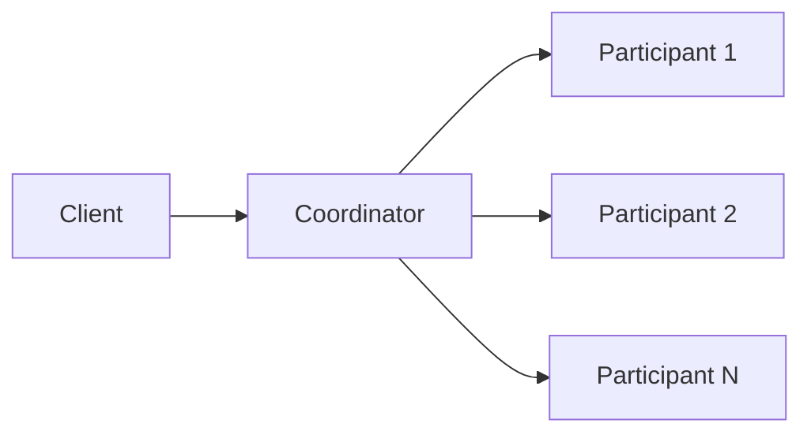
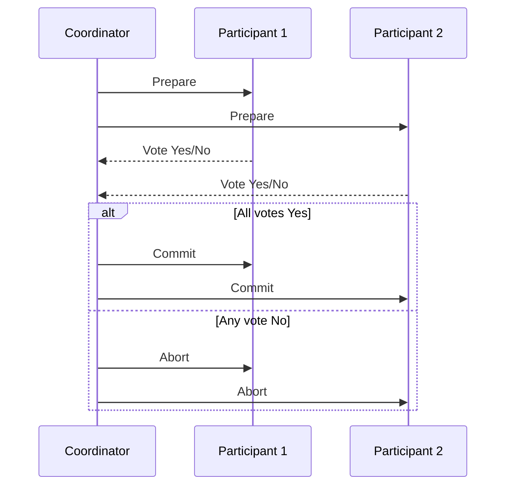
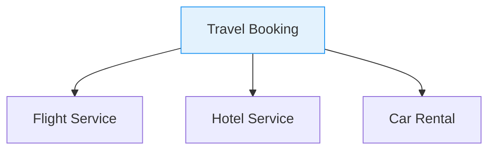
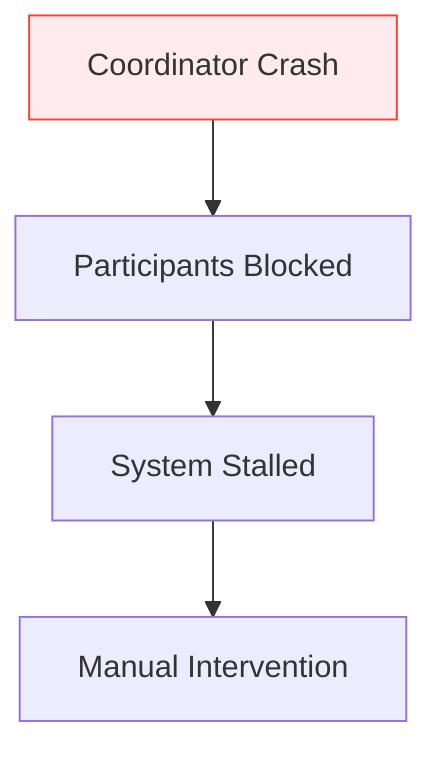
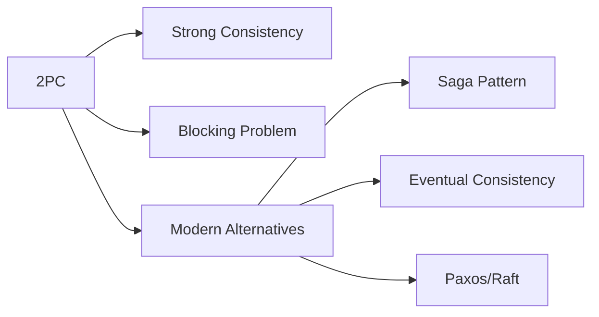

<!--
title: "Understanding Two-Phase Commit (2PC)",
description: "A comprehensive guide to Two-Phase Commit (2PC) in distributed systems, explaining its phases, guarantees, and limitations.",
tags: ["Distributed Systems", "Two-Phase Commit (2PC)", "Distributed Transactions", "System Design", "consensus"],
author: "Avinash Gurugubelli",
references: [{
    "title": "Designing Data-Intensive Applications",
    "author": "Martin Kleppmann",
    "link": ""
    }]
--->

# Understanding Two-Phase Commit (2PC): The Distributed Transaction Protocol

## What is Two-Phase Commit (2PC)?
Two-Phase Commit (2PC) is a distributed consensus protocol that ensures all participants in a distributed transaction either all commit or all abort, maintaining atomicity across multiple nodes. It's the distributed equivalent of ACID transactions in databases.

### Diagram

## How Does 2PC Work?
The protocol operates in two distinct phases:

### Phase 1: Prepare Phase
- The coordinator sends a prepare request to all participants.
- Each participant performs all operations but doesn't commit.
- Participants reply with "yes" (ready to commit) or "no" (must abort).

### Phase 2: Commit/Abort Phase
- If all participants voted "yes", coordinator sends commit.
- If any participant voted "no", coordinator sends abort.
- Participants acknowledge completion.

### Diagram

# Why 2PC Ensures Atomicity: A System of Promises

You might wonder: if network failures, disk crashes, or message loss can occur at any time, how does 2PC actually guarantee atomic commit?

The secret lies in a system of irrevocable promises, enforced through durable logging:

---

## Breakdown of the 2PC Process and the Guarantees

- ### Transaction Initialization
  - The application contacts the coordinator to get a **globally unique transaction ID**, used to tag local operations on each participant.
  - The coordinator generates a unique transaction ID for the transaction.

- ### Single-Node Transactions Begin
  - Participants begin local transactions with the global transaction ID.
  - Any failures here can lead to an abort **without violating atomicity**.

- ### Prepare Phase (Critical Promise)
  - The coordinator sends a **Prepare** request to all participants.
  - If a participant says "**YES**", it is making an **irrevocable promise** to commit the transaction later, even if it crashes and restarts.
  - To honor this promise:
    - Each participant writes all changes and metadata to **durable storage (log)**.
  - After replying YES, a participant can **no longer unilaterally abort**.

- ### Coordinator’s Commit Decision (Point of No Return)
  - If all participants voted YES, the coordinator:
    - Writes the **final decision** (commit or abort) to its own log.
    - This log ensures the decision **survives crashes**.
  - This moment is called the **commit point**.

- ### Final Commit/Abort Messages
  - The coordinator sends the final **COMMIT** or **ABORT** message to all participants.
  - If participants crash and miss the message:
    - They recover the status either by asking the coordinator or waiting for retries.
  - Since a YES vote was a promise:
    - A participant **must commit** once the coordinator says so — **no turning back**.

---

- ## Analogy: A Marriage Ceremony
    > Before saying “I do,” each person is free to walk away.  
    > But once they say "**I do**" (i.e., the participant votes YES), they are **bound to proceed**, regardless of what happens next.  
    > Even if the ceremony (commit message) is interrupted, the **vows (logs)** are on record and will be honored when things resume.

## Why is 2PC Needed?
2PC solves critical problems in distributed systems:

- **Atomicity Across Nodes**: Ensures multi-node transactions don't leave systems in inconsistent states.
- **Failure Handling**: Provides a structured way to handle partial failures.
- **Data Consistency**: Maintains consistency across sharded or partitioned databases.

## When is 2PC Used?
Common use cases include:

- Distributed Databases: MySQL Cluster, MongoDB multi-document transactions.
- Microservices Transactions: Saga pattern implementations.
- Message Systems: Exactly-once message processing.
- File Systems: Distributed file operations.

## Real-World Applications
- **Banking Systems**: Transferring money between accounts in different banks.
- **E-commerce**: Order processing involving inventory, payment, and shipping services.
- **Travel Booking**: Coordinating flights, hotels, and car rentals.

### Diagram

## Limitations and Demerits
- **Blocking Problem**: If coordinator fails after Phase 1, participants remain blocked.
- **Performance Overhead**: Multiple network round-trips increase latency.
- **Single Point of Failure**: Coordinator is a bottleneck.
- **No Fault Tolerance**: Cannot handle network partitions well.

### Diagram

## How Modern Systems Handle These Limitations
- **Three-Phase Commit (3PC)**: Non-blocking but complex.
- **Paxos/Raft**: For leader election and consensus.
- **Saga Pattern**: Breaks transactions into compensatable steps.
- **Eventual Consistency**: Accepts temporary inconsistency.

## Conclusion
While 2PC provides strong consistency guarantees, its limitations have led to alternative approaches in modern systems. Understanding 2PC remains essential as it forms the foundation for more advanced distributed transaction protocols.

### Diagram

