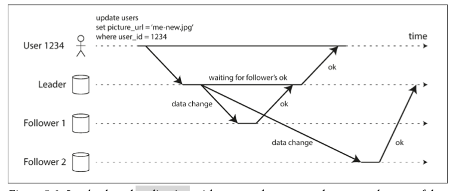
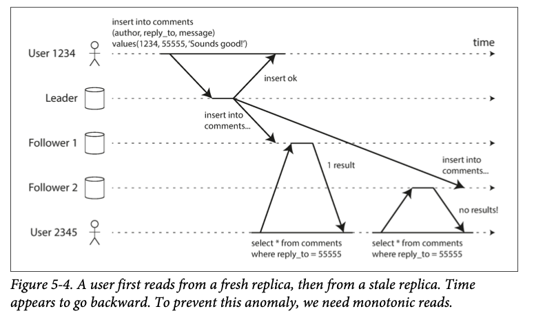
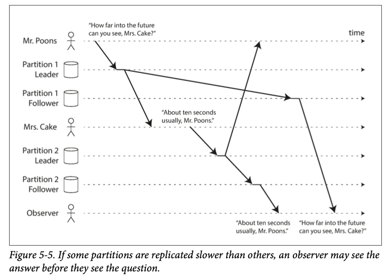

<!--
author: "Avinash Gurugubelli",
title: "Single leader Replication",
description: "A deep dive into single-leader (master-slave) replication, covering synchronous/asynchronous approaches, replication logs, and real-world implementations."  
tags: [[
  "DatabaseReplication",
  "LeaderFollower",
  "ReplicationLag",
  "ReadWriteSplitting",
  "SynchronousReplication",
  "AsynchronousReplication",
  "SemiSynchronousReplication",
  "ReplicationStrategies",
  "DatabaseDesign",
  "Scalability",
  "FaultTolerance",
  "SystemDesign"
],
references: [{
    title: "Designing Data-Intensive Applications",
    authors: ["Martin Kleppmann"],
    publisher: "O'Reilly Media",
    year: 2017,
    url: "
}]
-->

# The Complete Beginner's Guide to Database Replication: Leader-Follower (Single leader Replication) Architecture Explained

## Understanding the Leader-Follower Model

### The Cast of Characters

#### The Leader (Master):
- The primary database that accepts all write operations
- Like the conductor of an orchestra — all updates flow through it
- **Example**: When a customer places an order, it goes to the leader first

#### The Followers (Slaves/Read Replicas):
- Copies that replicate data from the leader
- Can handle read operations but not writes
- Like assistants who mirror the leader's work

### How They Work Together

#### Write Process:
1. Client sends write request to leader  
2. Leader records the change locally  
3. Leader forwards change to followers (more on this timing later)  

#### Read Process:
- Clients can read from leader or any follower  
- Reads from followers reduce load on leader  

---

## Synchronous vs. Asynchronous: The Replication Timing Dilemma

### Synchronous Replication - The Careful Accountant

**How it works**: Leader waits for confirmation from followers before completing write

**Pros**:
- No data loss if leader fails  
- All replicas are always in sync  

**Cons**:
- Slower writes (must wait for all confirmations)  
- System halts if any follower goes down  

**Analogy**: Like a meticulous project manager who won't mark a task complete until every team member confirms they've updated their records.

---

### Asynchronous Replication - The Optimistic Salesperson

**How it works**: Leader doesn't wait for follower confirmations

**Pros**:
- Faster write operations  
- System keeps running even if followers lag  

**Cons**:
- Potential data loss if leader fails  
- Followers might have stale data  

**Analogy**: Like sending out a newsletter and assuming it will eventually reach all subscribers, without checking each delivery.

---

### Below Fig shows the leader based replication with one synchronous and one asynchronous follower.

### The Middle Ground: Semi-Synchronous

Most practical systems use a hybrid approach:
- At least one **synchronous** follower (for safety)  
- Other followers **asynchronous** (for performance)  

---

## Handling the Inevitable: Server Failures

### When a Follower Fails

- The follower goes offline (crash, maintenance, network issue)  
- When it comes back:
  - Checks its last known position in the replication log  
  - Requests all changes it missed from the leader  
  - Catches up (when follower applied all the missing changes and caught up to the leader) and resumes normal operation  

---

### When the Leader Fails - The Drama of Failover

This is more complex and involves several steps:

1. **Detection**: The system notices the leader isn't responding  
2. **Election**: Followers vote to choose a new leader (usually the most up-to-date one)  
3. **Reconfiguration**:
   - Clients are redirected to new leader (via request Routing)  
   - Other followers start syncing from new leader  
   - Old leader demoted to follower if it comes back  

**Common pitfalls**:
- **Split brain**: Two servers think they're the leader (old and new) - both accepting writes and there is no process for resolving conflicts leads to data corruption.  
- **Data loss**: Writes not replicated to follower before failure of the leader
- **Slow failovers**: Taking too long to detect failure  (this generally check by heart beat)

---

## Implementation Methods: How Replication Actually Works

### 1. Statement-Based Replication

- **What happens**: The leader logs the actual SQL commands (`INSERT`, `UPDATE`, etc.) and sends them to followers  
- **Pros**: Simple, compact  
- **Cons**: 
  - Can break with non-deterministic functions (like `NOW()` to get the current data or `RAND()` to generate the random number is likely generate the different in each replica)
  - If statements use an autoincrementing column, or if they depend on the existing
data in the database (e.g., UPDATE … WHERE <some condition>), they must be
executed in exactly the same order on each replica, or else they may have a differ‐
ent effect. This can be limiting when there are multiple concurrently executing
transactions.
 - Statements that have side effects (e.g., triggers, stored procedures, user-defined
functions) may result in different side effects occurring on each replica, unless
the side effects are absolutely deterministic.

---

### 2. Write-Ahead Log (WAL) Shipping

- **What happens**: Leader sends the low-level storage engine changes (either SSTables, LMS trees, B-trees, or append only sequence log)  
- **Used by**: PostgreSQL, Oracle  
- **Pros**: Very efficient  
- **Cons**: 
  - Tightly coupled to database version (If the database changes its storage format from one version to another) 

---

### 3. Logical (Row-Based) Replication

- **What happens**: Different log formats for replication and for the storage engine, which allows the replication log to be decoupled from the storage engine internals. This kind of replication log is called a logical log, to distinguish it from the storage engine’s (physical) data representation. A logical log for a relational database is usually a sequence of records describing writes to database tables at the granularity of a row.
- 
- **Pros**:
  - More flexible than WAL  
  - Works across different versions  
- **Cons**: Slightly more overhead  

---

## The Consistency Trade-off: Dealing with Replication Lag

When using **asynchronous replication**, followers might lag behind the leader, causing temporary inconsistencies. Let's examine common scenarios:

### 1. Read-After-Write Consistency Problem

**Scenario**: You post a comment on social media but don’t see it when refreshing the page because the read went to a lagging follower.

**Solutions**:
- Read your own writes from the leader  
- The Client can remember most recent write timestamps, then the sys‐
tem can ensure that the replica serving any reads for that user reflects updates at least until that timestamp. If a replica is not sufficiently up to date, either the read can be handled by another replica or the query can wait until the replica has caught up. The timestamp could be a logical timestamp (something that indicates
ordering of writes, such as the log sequence number)

---

### 2. Monotonic Reads Problem

**Scenario**: Refreshing a page shows newer data first, then older data as requests hit different followers.

**Solution**: 
- Ensure a user's reads always go to the same replica. For example, the replica can be chosen based on a hash of the user ID, rather than randomly. However, if that replica fails, the user’s queries will need to be rerouted to another replica. 

---

### 3. Consistent Prefix Problem

**Scenario**: Seeing answers before questions in a conversation because different parts replicated at different speeds.

**Solution**: Ensure causally related writes go to the same partition  

---

## Practical Advice for Developers

- Know your **consistency requirements**: Not all data needs strong consistency  
- Monitor **replication lag**: Many systems provide metrics for this  
- Test **failure scenarios**: How does your app behave during failover?  
- Consider **read patterns**: Maybe some queries should always go to the leader  

---

## Conclusion

Leader-follower replication offers a powerful pattern for building scalable, available systems, but comes with important trade-offs around consistency and complexity. Understanding these mechanisms helps you make informed decisions about your database architecture and application design.

**Remember**: There's no one-size-fits-all solution. The right approach depends on your specific requirements for consistency, availability, and performance.
