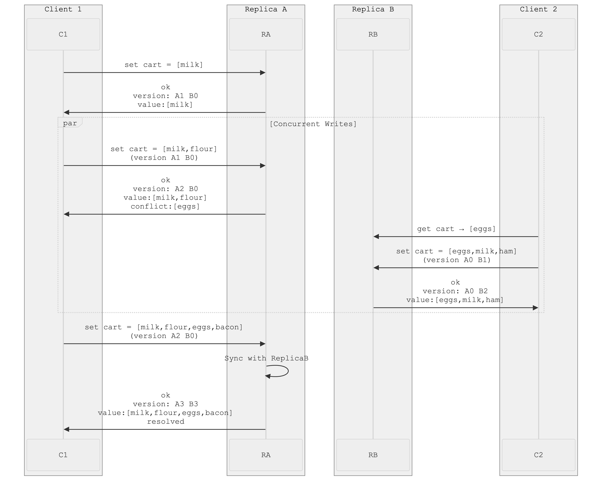

<!--
author: "Avinash Gurugubelli",
title: "Leaderless Replication",
description: "Dive deep into leaderless replication—its architecture, benefits, challenges, and how it ensures availability and fault tolerance in distributed systems.",
tags: [
  "LeaderlessReplication",
  "DistributedDatabases",
  "QuorumReads",
  "QuorumWrites",
  "ConflictResolution",
  "CRDTs",
  "OperationalTransformation",
  "SystemDesign",
  "DatabaseConsistency",
  "ReplicationStrategies",
  "HighAvailability",
  "Version Vectors",
  "Quorum Based Consistency"
],
references: [{
  title: "Designing Data-Intensive Applications",
  authors: ["Martin Kleppmann"],
  publisher: "O'Reilly Media",
  year: 2017,
  url: "https://dataintensive.net/"
}]
-->


# 🔄 Leaderless Replication: How Distributed Databases Stay Available Without a Single Leader

In traditional replication systems, a **leader node** coordinates all writes, ensuring a clear order and consistency. But what happens if the leader fails? Or if network partitions block access to it?  
Enter **Leaderless Replication** — a design pattern used by distributed databases like **Amazon Dynamo**, **Cassandra**, **Riak**, and **Voldemort**, where **any replica can accept writes**, and coordination is decentralized.

In this post, we’ll explore:
- What leaderless replication is
- How it handles write conflicts and data synchronization
- Its quorum-based consistency model
- The trade-offs it introduces

---

## 🧠 What Is Leaderless Replication?

Leaderless replication allows **any replica** in a distributed system to **accept writes directly from clients**, removing the bottleneck and single point of failure that comes with a leader node.


🔍 **Key traits:**
- No leader = no failover complexity.
- Higher write availability, especially in distributed and partitioned environments.
- Used in **Dynamo-style** databases.

---

## 🔁 How Do Replicas Catch Up After Downtime?

When a replica is offline and misses writes, it needs to **sync back up** after recovery. Two common techniques are:

### 🔧 1. Read Repair
- When a client reads from multiple replicas, it may detect that one is **stale**.
  - from the above example: user 2345 gets a version 6 value from rep‐
lica 3 and a version 7 value from replicas 1 and 2. The client sees that replica 3
has a stale value and writes the newer value back to that replica.
- The client then **writes the correct value back** to the stale node.
- Effective for **frequently read data**.

### 🧹 2. Anti-Entropy (Background Sync)
- A continuous background process compares data between replicas and syncs missing changes.
- Ensures consistency for **rarely accessed keys** that won’t benefit from read repair.

---

## 📊 Quorum-Based Reads and Writes

To balance availability and consistency, leaderless systems use **quorum strategies**.

- `n` = Total number of replicas for a piece of data.
- `w` = Minimum number of replicas that must **acknowledge a write**.
- `r` = Minimum number of replicas that must **respond to a read**.

🧮 To ensure consistency:  
**`w + r > n`**  
This guarantees that **at least one replica** involved in the read has the latest write.

📌 Example:
- `n = 3`
- `w = 2`
- `r = 2`
- Guarantees overlap, tolerates 1 node failure.
- Reads and writes that obey these **r** and **w** values are called quorum reads
and writes.
- You can think of r and w as the minimum number of votes required
for the read or write to be valid.
---

## ⚠️ Quorum Limitations

Even with `w + r > n`, edge cases can still lead to **stale reads**, especially under high-latency or network partitions.

🚫 **No linearizability**:  
Leaderless replication doesn't guarantee that a read will return the most recently written value as if there were a single copy.

---

## 🪄 Sloppy Quorum & Hinted Handoff

To enhance availability during network issues, many systems use a **sloppy quorum**.

- In a large cluster (with significantly more than n nodes) it’s likely that the client can
connect to some database nodes during the network interruption, just not to the
nodes that it needs to assemble a quorum for a particular value. In that case, database
designers face a trade-off:
  - Is it better to return errors to all requests for which we cannot reach a quorum of w or r nodes?
  - Or should we accept writes anyway, and write them to some nodes that are
reachable but aren’t among the n nodes on which the value usually lives?
The latter is known as a sloppy quorum.

- Writes and reads still require `w` and `r` successful responses. but those may include nodes that are not among the designated
n “home” nodes for a value.
This is where **Hinted Handoff** comes in:
- A node that temporarily accepts a write for another replica stores a **hint**.
- Once the target replica is back online, the hint is **forwarded** to it this is called **Hinted Handoff** .

🔄 Great for write availability, but:
- Increases **inconsistency window**.
- Can lead to temporary **read anomalies**.

---

## 🌍 Multi-Datacenter Support

Leaderless databases often support multiple data centers:

- **Writes are broadcasted** to all replicas across regions.
- Clients usually wait for quorum **only from the local datacenter**.
- **Asynchronous replication** handles syncing across DCs — improving **latency** without sacrificing **availability**.

---

## ⚔️ Handling Write Conflicts

In systems with no central write coordinator, **concurrent writes** are inevitable.

### 🔄 What are concurrent writes?
Two writes are **concurrent** if:
- They happen at different nodes,
- And neither “happens before” the other.

Leaderless systems must **resolve these conflicts** using strategies like:

### 🕓 Last Write Wins (LWW)
- Choose the version with the **highest timestamp**.
- ⚠️ Can lead to **silent data loss**, especially if clocks aren’t synchronized.

### 🧬 Siblings (Multiple Versions)
- Instead of discarding data, preserve **all conflicting versions** (called *siblings*).
- Let the **application** resolve the conflict — either:
  - On **read**, or
  - On **write** using custom merge logic.

### 🔄 CRDTs (Conflict-Free Replicated Data Types)
- Special data types that automatically **merge concurrent changes** safely.
- Great for counters, sets, maps, etc.
- Can resolve deletes, adds, and updates **without data loss**.

---

## ⏱️ Detecting Conflicts: Version Vectors

To distinguish between **newer, older, and concurrent writes**, leaderless systems use **version vectors**:

- ### How Version Vectors Work  

    Each replica maintains a **version number** (or a vector of versions) that tracks its update history. Here’s how it works:  

    1. **Initial State**:  
      - Every replica starts with a version number (e.g., `A:0`, `B:0`, `C:0`).  

    2. **On a Write**:  
      - The replica increments its own version (e.g., `A:0 → A:1`).  
      - The new version is attached to the written data.  

    3. **On a Read**:  
      - The system collects versions from multiple replicas.  
      - By comparing version vectors, it can determine:  
        - **Dominant Write**: If one version is strictly higher on all replicas, it supersedes older ones.  
        - **Concurrent Writes**: If versions conflict (e.g., `A:2` vs. `B:1`), they must be resolved (e.g., via last-write-wins, CRDTs, or application-level merging).  

    ### 🏆 Why Version Vectors Matter  
    - ✅ **Preserves Causality**: Ensures that if Write A happens before Write B, B’s version reflects that. 

    - ✅ **Detects Conflicts**: Instead of blindly overwriting, the system knows when concurrent writes need merging. 

    - ✅ **Scalable & Decentralized**: No single bottleneck—each replica tracks its own updates.

    ### Example:

    <!--   -->

    ```mermaid
    sequenceDiagram
    participant C1 as Client 1
    participant A as Replica A
    participant B as Replica B
    participant C2 as Client 2

    Note over A,B: Initial State: {"value": [], "version": {"A":0, "B":0}}

    C1->>A: Add("milk")
    A->>A: Increment version (A:0→1)
    A-->>C1: {"value": ["milk"], "version": {"A":1, "B":0}}

    C2->>B: Add("eggs") [Concurrent]
    B->>B: Increment version (B:0→1)
    B-->>C2: {"value": ["eggs"], "version": {"A":0, "B":1}}

    Note over A,B: Conflict Detected: Concurrent versions exist

    loop Background Sync Process
        A->>B: Sync request with version {"A":1, "B":0}
        B->>A: Send conflicting version {"A":0, "B":1}
        A->>A: Detect conflict (no version dominates)
        A->>B: Merge strategy: Union items ["milk", "eggs"]
        B->>A: Acknowledge merge
    end

    Note over A,B: Post-Sync State: {"value": ["milk", "eggs"], "version": {"A":1, "B":1}}

    C1->>A: Add("flour") [Sees merged state]
    A->>A: Increment version (A:1→2)
    A-->>C1: {"value": ["milk","eggs","flour"], "version": {"A":2, "B":1}}

    C2->>B: Add("ham") [Sees merged state]
    B->>B: Increment version (B:1→2)
    B-->>C2: {"value": ["milk","eggs","ham"], "version": {"A":1, "B":2}}

    loop Final Sync
        A->>B: Sync version {"A":2, "B":1}
        B->>A: Sync version {"A":1, "B":2}
        A->>B: Merge to ["milk","eggs","flour","ham"]
        B->>A: Update to version {"A":2, "B":2}
    end

    Note over A,B: Final State: {"value": ["milk","eggs","flour","ham"], "version": {"A":2, "B":2}}
    ```

    ```
        1. 🛒 Version Vectors in Action: Shopping Cart Example

            ## System Setup
            - **2 Replicas**: Replica A, Replica B
            - **Initial State**:
            json
            {
                "key": "user123_cart",
                "value": [],
                "version": {"A": 0, "B": 0}
            }
        2. Client 1 Adds Milk (via Replica A)
            - Increments its version counter: A:0 → A:1
            - Stores new value:
                {
                    "value": ["milk"],
                    "version": {"A": 1, "B": 0}
                }

        3. Client 2 Adds Eggs (via Replica B) Concurrently
            - Replica B hasn't seen A's update
            - Creates parallel version:
                {
                    "value": ["eggs"],
                    "version": {"A": 0, "B": 1}
                }         

        4. Current System State:
                [
                    {
                        "value": ["milk"],
                        "version": {"A": 1, "B": 0}
                    },
                    {
                        "value": ["eggs"],
                        "version": {"A": 0, "B": 1}
                    }
                ]
        5. Client 1 Adds Flour (via Replica A) > Operation Flow:

            - Client 1 knows about {"A": 1, "B": 0}
            - Sends Add("flour") to create ["milk", "flour"]
            - Store new value:
                {
                    "value": ["milk", "flour"],
                    "version": {"A": 2, "B": 0}  // Supersedes A:1
                }
        6. Updated Conflict Set:
                [
                    {
                        "value": ["milk", "flour"],
                        "version": {"A": 2, "B": 0}
                    },
                    {
                        "value": ["eggs"],
                        "version": {"A": 0, "B": 1}
                    }
                ]
        7.Client 2 Adds Ham (via Replica B): Operation Flow:
            - Client 2 knows about {"A": 0, "B": 1}
            - Merges local view (["eggs"]) + ham
            - result:
                {
                    "value": ["eggs", "ham"],
                    "version": {"A": 0, "B": 2}  // Supersedes B:1
                }
        8. Final Conflict State:
                [
                    {
                        "value": ["milk", "flour"],
                        "version": {"A": 2, "B": 0}
                    },
                    {
                        "value": ["eggs", "ham"],
                        "version": {"A": 0, "B": 2}
                    }
                ]                
    ```

    ### 🛠️ Resolution Strategies (How Version Vectors Resolve Conflicts ?)

    | Strategy         | Result                         | Pros/Cons                     |
    |------------------|--------------------------------|-------------------------------|
    | Last-Write-Wins  | Randomly keep one              | ✅ Fast<br>❌ Loses data       |
    | Union Merge      | `["milk", "flour", "eggs", "ham"]` | ✅ Preserves all items         |
    | Custom Logic     | Prompt user                    | ✅ Most accurate<br>❌ Slower or manual |

## 🧩 Trade-Offs of Leaderless Replication

| ✅ Advantages                     | ⚠️ Trade-Offs                                |
|----------------------------------|----------------------------------------------|
| High write availability          | No strong consistency (no linearizability)   |
| Fault tolerance (no failover)    | Requires conflict resolution logic           |
| Supports multi-region easily     | Read anomalies possible (stale reads)        |
| Parallel writes improve speed    | Harder to reason about data correctness      |

---

## 🔚 Summary

Leaderless replication gives distributed systems like Dynamo, Cassandra, and Riak the power to **scale**, **stay available**, and **handle network failures gracefully**. But that flexibility comes at the cost of **complex conflict resolution**, **weaker consistency**, and more logic at the **application layer**.

If you're building a **highly available, partition-tolerant** system, leaderless replication might be your best friend — just be ready to **merge some siblings** along the way. 😉
