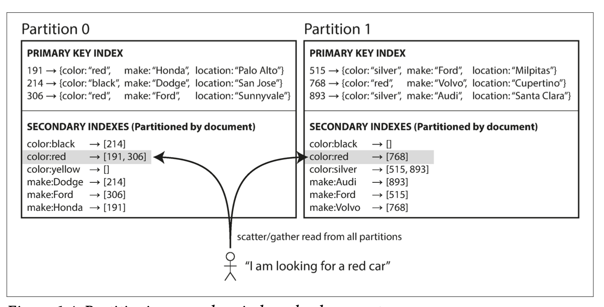
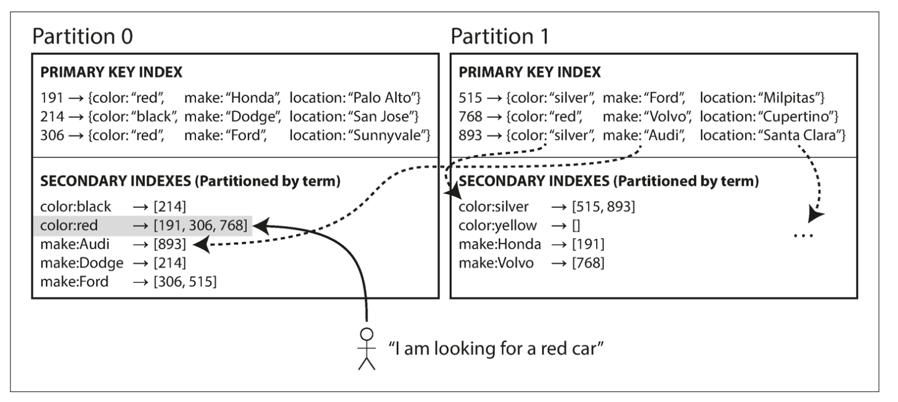

<!--
author: "Avinash Gurugubelli",
title: "Partitioning Strategies in Distributed Databases",
description: "An overview of how data is partitioned across distributed systems, using range and hash-based techniques, along with secondary index strategies.",
tags: [
"Partitioning",
  "Sharding",
  "Distributed Databases",
  "System Design",
  "Secondary Indexes",
  "Hash Partitioning",
  "Range Partitioning",
  "Hot Spot",
  "Consistent Hashing",
  "Global Index",
  "Local Index",
  "Scatter Gather"
],
references: [{
  title: "Designing Data-Intensive Applications",
  authors: ["Martin Kleppmann"],
  publisher: "O'Reilly Media",
  year: 2017,
  url: "https://dataintensive.net/"
}]
-->


Partitioning helps split massive datasets across multiple nodes, improving scalability and performance.

---

## 🎯 Goal of Partitioning
Distribute **data** and **query load** evenly across all nodes.

If not done well, you'll face:
- **Skew** – Uneven distribution of data
- **Hotspots** – One partition gets overloaded while others sit idle

---

## 📚 Key Partitioning Strategies


### 1. 📏 Range Partitioning

**How it works:**  
Keys are divided into continuous, ordered ranges—just like organizing books alphabetically in an encyclopedia.

**Example:**
```
Partition 1: keys A–E  
Partition 2: keys F–J  
Partition 3: keys K–Z
```

**👍 Benefits:**
- Great for **range queries** (e.g., fetch logs from Jan to Mar)
- Keys remain **sorted**, which enables efficient scanning

**⚠️ Common Pitfall — Hotspots:**  
- If keys are time-based (like logs or sensor data), all recent writes go to the "latest" partition—overloading a single node.
  
Because of this risk of skew and hot spots, many distributed datastores use a hash
function to determine the partition for a given key.

--- 
### 2. 🎲 Hash Partitioning

- Applies a **hash function** to the key to determine its partition
- Distributes data **uniformly**
- Example: MD5 or Fowler-Noll-Vo (FNV) hashing.

⚠️ **Downside**: Loses key ordering (as the key is hashed) → No efficient **range queries**

> 🔧 **Fix**: Prefix keys with something variable like `sensor1_2025-07-03` or `user42_2025-07-04`.  
> This spreads writes across partitions and avoids hotspots.

📌 **Bonus:**  
This pattern helps in time-series apps—e.g., all updates from a specific user (`user_id + timestamp`) are stored in the same partition, **ordered by time**.  
You can efficiently retrieve updates per user in chronological order, while distributing data across partitions.

---

### Handling Secondary Indexes

In partitioned databases, secondary indexes introduce complexity because:

| Index Type          | Use Case                                        | Partition Routing                                |
| ------------------- | ----------------------------------------------- | ------------------------------------------------ |
| **Primary Index**   | Find data by primary key (e.g., `user_id = 42`) | Easy – key tells you the partition               |
| **Secondary Index** | Find data by other fields (e.g., `color = red`) | Hard – value doesn’t map directly to a partition |


🧩 The Problem

When you query by a non-primary field:
 - You don’t know which partition the data is in.
 - You may need to query all partitions (called scatter/gather).
 - This can be slow and inefficient, especially at scale.

Example:

you're building a car marketplace:

 - Partitioned by car_id (primary key)
 - Want to search cars by color = red

You can't just go to one partition — red cars could be anywhere!

---

## 🔍 Partitioning with Secondary Indexes

## 1. Document-Partitioned Indexes (Local Indexes)
- In a document-partitioned index, each partition manages its own secondary index—only for the data it stores.

    ### 💡 How It Works
    - Imagine you're running a used car listing platform:

    - The database is partitioned by car ID (primary key).

    - Each partition handles a slice of car listings.

    - Now you want to allow users to filter by color or make.
    
    

    ### ⚙️ Querying the Index
    - To search for color = red:
    - ❌ There's no central index.
    - ✅ So the query must be sent to all partitions.
    - ✅ Each partition returns matching results.
    - ✅ The application combines the results.
    - This is known as **scatter/gather.**
  
    ### 📉 Downsides
    - 🔁 Increases read latency, especially with many partitions.
    - 🔥 Can worsen tail latency (slowest partition drags down response).
    - 🚫 Not ideal for complex queries involving multiple filters.
  
    ### ✅ Benefits
    - 📝 Fast writes – New data only touches one partition.
    - 🛠️ Simpler design – Each partition operates independently.

    ### 📦 Used In:
    - MongoDB
    - Cassandra
    - Elasticsearch
    - Solr

## 🌐 2. Term-Partitioned Indexes (Global Indexes)

In a **term-partitioned index**, the index is global—it spans all partitions—and is itself **partitioned by the indexed terms** (not by document ID).

### 💡 How It Works

  - Let’s revisit the used car listings platform:
  - The database is still partitioned by **car ID**.
  - But now, we build a **global index** for search terms like `color:red` or `make:Toyota`.
  - 🔧 Index is split **by term**, like this:



### 🔎  Querying the Index
- To search color = red:

- ✅ Just query one partition in the index (Partition 1).

- ✅ Faster and more efficient than scatter/gather.

### 🧱 Downsides
- ✍️ Slower writes – Inserting or updating a car might touch multiple index partitions.
- ⚠️ Requires coordination across index partitions.
- 💡 Global indexes often updated asynchronously, so they might be slightly out of sync with the main data.

### ✅ Benefits
- 🚀 Fast reads – Only the relevant index partition is queried.

- 🎯 Efficient for high-read workloads, especially with filters/search.

### 📦 Used In:
- DynamoDB (Global Secondary Indexes)
- Riak Search
- Oracle Data Warehouse (Global Indexing Option)

> 📌 Tip: If your workload is read-heavy, global indexes help reduce latency. But if you expect frequent writes, plan for complexity and eventual consistency.


## 📊 Local vs Global Secondary Indexes

 Feature / Type                        | 🗂️ Local Index (Document-Partitioned)                         | 🌐 Global Index (Term-Partitioned)                             |
|--------------------------------------|---------------------------------------------------------------|----------------------------------------------------------------|
| **Index Scope**                      | Per partition                                                 | Spans across all partitions                                   |
| **Index Partitioning Strategy**      | Based on document ID                                          | Based on indexed term                                         |
| **Write Performance**               | ✅ Fast (index is local to partition)                         | ❌ Slower (writes may update multiple index partitions)        |
| **Read Performance**                | ❌ Requires scatter/gather across all partitions              | ✅ Reads from a single partition (based on term)               |
| **Consistency**                     | Typically consistent with document writes                     | Often eventually consistent                                   |
| **Complexity**                      | Simpler to implement                                          | More complex coordination, possible need for distributed txn   |
| **Best for**                        | Write-heavy workloads                                         | Read-heavy search/filter workloads                            |
| **Examples**                        | MongoDB, Cassandra, Elasticsearch                             | DynamoDB, Riak Search, Oracle DW Global Index                 |

---


### 📌 Tips:

> - 💡 Use **local indexes** when you need fast writes and can tolerate scatter/gather reads.  
> 
> - Use **global indexes** when low-latency reads with filters are more important—even if writes become more complex.
