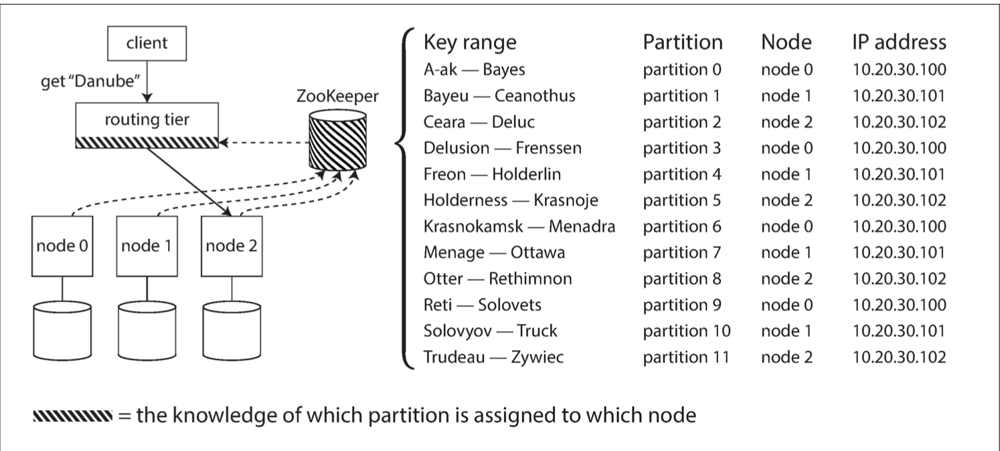

<!--
author: "Avinash Gurugubelli",
title: "Request Routing and Parallel Query Execution in Distributed Systems",
description: "Understand how distributed databases route client requests to the correct node, and how analytical queries are executed in parallel using MPP architectures.",
tags: [
  "Distributed Databases",
  "Request Routing",
  "Service Discovery",
  "ZooKeeper",
  "Gossip Protocol",
  "Partitioning",
  "Routing Tier",
  "MPP",
  "Parallel Query Execution",
  "System Design",
  "Database Scalability"
],
references: [{
  title: "Designing Data-Intensive Applications",
  authors: ["Martin Kleppmann"],
  publisher: "O'Reilly Media",
  year: 2017,
  url: "https://dataintensive.net/"
}]
-->

## 🔀 Request Routing in Distributed Databases

When data is **partitioned across multiple nodes**, the big question becomes:

> **“Where should a client send a request for key `foo`?”**

As partition-to-node mappings **change dynamically** (e.g., during rebalancing), the system needs a way to **route requests to the right node**. This is part of a broader challenge known as **service discovery**.

### 🚦 3 Common Routing Strategies

#### 1. Any Node as Entry Point
- Client contacts *any* node.
- If the node owns the partition, it handles the request.
- Otherwise, it forwards the request to the correct node.
- ✅ Simple for clients, but adds an extra network hop.

#### 2. Routing Tier (Partition-Aware Load Balancer)
- All client requests go through a routing layer.
- This tier knows the partition-to-node mapping and forwards the request.
- ✅ Centralized logic, easier to manage at scale.

> **Used by**: LinkedIn Espresso (with Helix + ZooKeeper), HBase, SolrCloud, Kafka

#### 3. Partition-Aware Clients
- Clients maintain knowledge of which node holds which partition.
- They route requests directly, without intermediaries.
- ✅ Fastest request path
- ⚠️ Requires consistent metadata and more client logic.

---

### 🧠 How Is Routing Metadata Managed?

- **ZooKeeper** (or similar tools) is used to maintain the mapping of partitions to nodes.
- Nodes register themselves and routing layers or clients subscribe to changes.

ß
- **Cassandra and Riak** avoid external dependencies using **gossip protocols** to propagate state across nodes.
- **Couchbase** uses a static routing tier (`moxi`) and manual rebalancing.
- **DNS** is typically used to resolve initial node addresses.

---

## ⚙️ Parallel Query Execution (MPP Style)

While most NoSQL databases support basic read/write and scatter/gather queries, **analytical databases** support more powerful operations.

### 💡 MPP: Massively Parallel Processing

- MPP systems break a complex SQL query into smaller steps (joins, filters, aggregates).
- These steps are distributed and **executed in parallel** across nodes.
- This is ideal for **data warehousing** and **OLAP workloads**.

#### Examples of MPP Systems:
- Amazon Redshift
- Google BigQuery
- Snowflake

These systems are optimized to scan huge datasets quickly and return results in seconds by using **parallelism at scale**.

---
