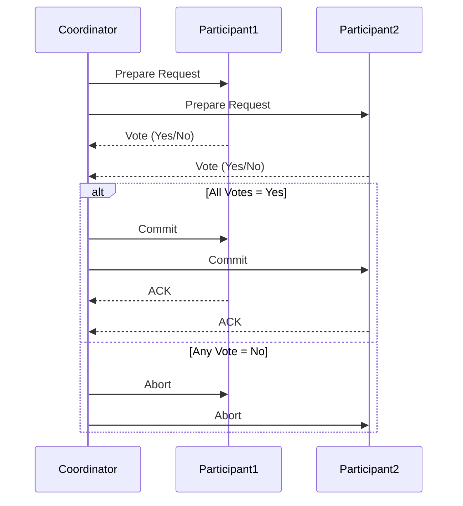
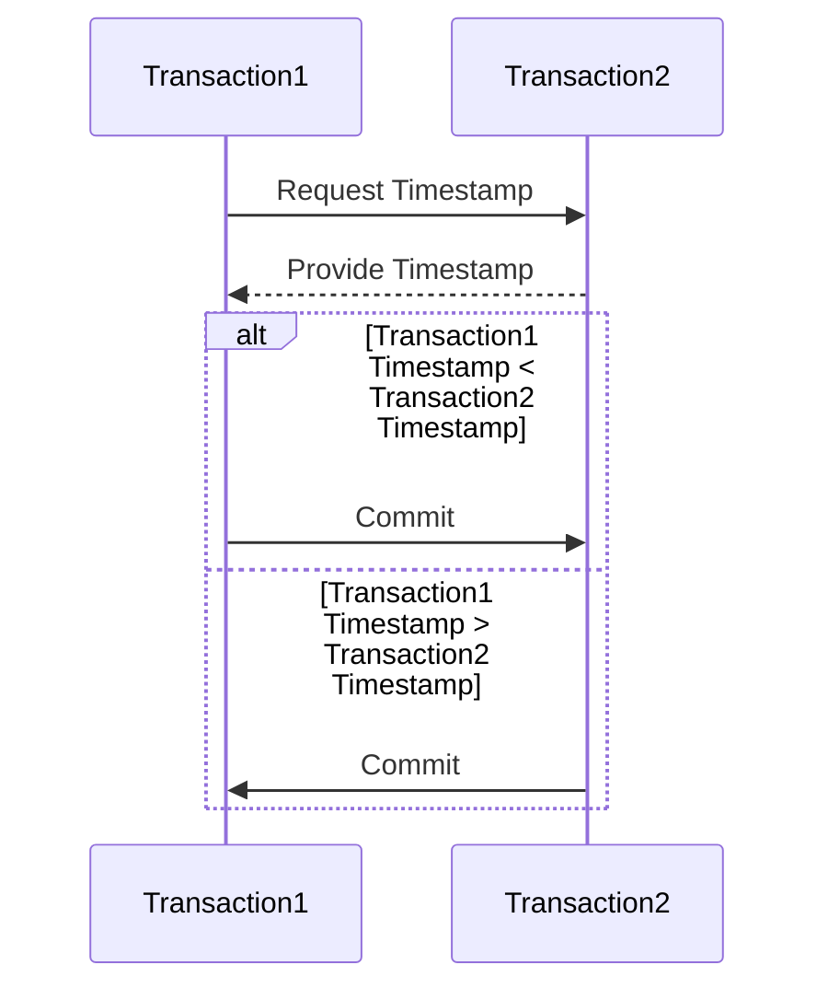
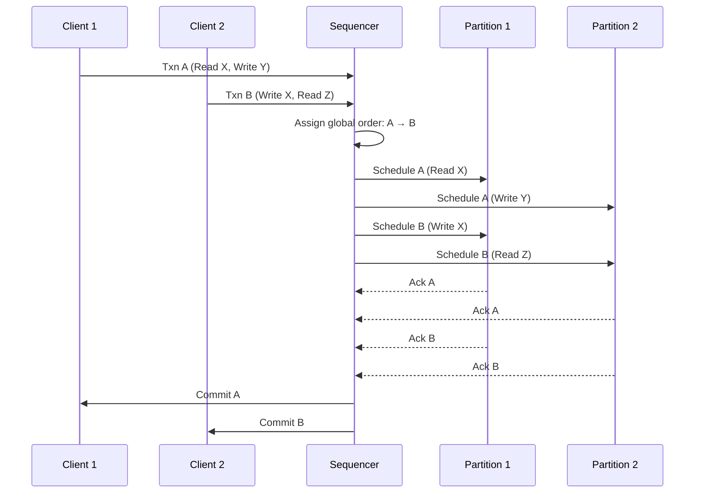

<!-- 
  title: "Transactions in Distributed Context",
  description: "Understanding how transactions work in a distributed context, including serialization across partitions and replicas.",
  tags: ["transactions", "distributed systems", "serialization"],
  author: "Avinash Gurugubelli"
-->

# Transactions in Distributed Context

**Question:** How do transactions work in a distributed context, especially regarding serialization across partitions and replicas?

---

## Transaction Serialization in Distributed Partitions and Replication

Distributed databases use partitioning and replication to achieve scalability, availability, and fault tolerance. However, these architectural choices introduce significant complexity in ensuring transaction serialization—guaranteeing that concurrent transactions produce the same result as some sequential execution.

## What Is Transaction Serialization?

Serializability is a property where concurrent transactions across the system are executed as if they occurred in some serial (one-after-another) order, ensuring data consistency and correctness.

**One-Copy Serializability:** In replicated environments, this means that the outcome of transactions is as if they were executed serially on a single logical copy of the data, even though multiple physical copies exist.

## Challenges in Distributed Systems

Distributed partitioning and replication create several challenges for transaction serialization:

- **Network Delays/Failures:** Can result in inconsistent or partial updates.
- **Concurrent Client Access:** Multiple clients may read or write to the same data across different nodes.
- **Replication Lag:** Updates must propagate across replicas, potentially exposing stale data.

## Key Techniques for Distributed Transaction Serialization

### 1. Two-Phase Commit (2PC)

- **Purpose:** Ensures all involved nodes (partitions/replicas) agree to commit or abort a transaction.

- **How it Works:**
  - **Prepare Phase:** Coordinator asks participants if they can commit.
  - **Commit Phase:** If all vote "yes," coordinator instructs them to commit; else, aborts.

- **Issues:** Blocking if coordinator fails, slow recovery in presence of network partitions.

- ### Failure Modes & Solutions
  1. Coordinator Fails
      - During Prepare Phase:
          - Participants block indefinitely (awaiting decision).
           Solution: Timeout + auto-abort (but risks inconsistency if coordinator later recovers).

      - During Commit Phase:
        - Some participants may commit while others don’t.
        Solution: Recovery protocols (e.g., query other participants).

  2. Participant Fails
      - Before Voting:
          - Coordinator treats as "No" and aborts.

      - After Voting "Yes":
          - Must wait for recovery to commit (blocking).

  3. Network Partition
      - Split-brain scenarios may cause partial commits.
      - Solution: Use a 3-Phase Commit (3PC) (non-blocking but complex).
### 2. Timestamp Ordering

- **Purpose:** Assigns a logical timestamp to each transaction; operations are serialized based on these timestamps.

- **Implementation:** Transaction requests at each partition/replica are processed in timestamp order. Conflicts are resolved by aborting or delaying out-of-order transactions.
- Here timestamps are not actual wall-clock times(as it can have clock skew) but logical timestamps that ensure a consistent order across the distributed system. e.g. log sequence numbers (LSNs) in database

### 3. Lock-Based Protocols

- **Purpose:** Ensures exclusive access to data.

- **Typical Protocols:**
  - **Two-Phase Locking (2PL):** Transaction acquires all locks before any are released, guaranteeing serializable schedules.
  - **Quorum-Based Approaches:** Require majority agreement on update or read, avoiding split-brain issues in replicated scenarios.

### 4. Snapshot Isolation & Serializable Snapshot Isolation

- **Snapshot Isolation:** Transactions operate on a consistent snapshot of data at the start of the transaction, avoiding many concurrency anomalies.

- **Serializable Snapshot Isolation:** Enhances snapshot isolation by checking for and preventing serialization anomalies, achieving full serializability guarantees.

### 5. Sequencer-Based Approaches (e.g., Calvin)

- **Sequencer:** Aggregates incoming transaction requests and determines a global order before transactions are dispatched to partitions. Transactions are then executed following this deterministic schedule, guaranteeing serializability even in a partitioned/replicated environment.

### Key Components

- **Sequencer:**
  - Receives all transaction requests.
  - **Assigns a globally ordered sequence number** (e.g., epoch + logical timestamp).
  - **Batches transactions into deterministic "blocks"** for parallel execution.

- **Partitions:**
  - **Execute transactions** in the sequencer’s predefined order.
  - **No locks or validation phases needed** (order is already resolved).

- **Replicas:**
  - **Sequencer’s output is replicated via Paxos/Raft** for fault tolerance.

## Transaction Serialization in Partitions and Replicas

| Technique                 | Partitioned Data                          | Replicated Data                               | Common Issues                          |
|--------------------------|-------------------------------------------|-----------------------------------------------|----------------------------------------|
| Two-Phase Commit (2PC)   | Locks all relevant partitions             | Instructs all replicas to commit              | Coordinator failure, blocking          |
| Timestamp Ordering       | Assigns global or logical timestamps      | Global synchronization of transaction order   | Clock skew, distributed coordination   |
| Quorum/Locking           | Needs majority/locks per partition        | Quorum of replicas must agree to read/write   | Deadlocks, contention                  |
| Snapshot Isolation       | Each partition provides snapshot          | Each replica serves snapshot; validation needed | Stale reads, write skew                |
| Sequencer (e.g., Calvin) | Central or distributed sequencer sets order | All partitions/replicas follow sequence       | Fault tolerance, sequence recovery     |
