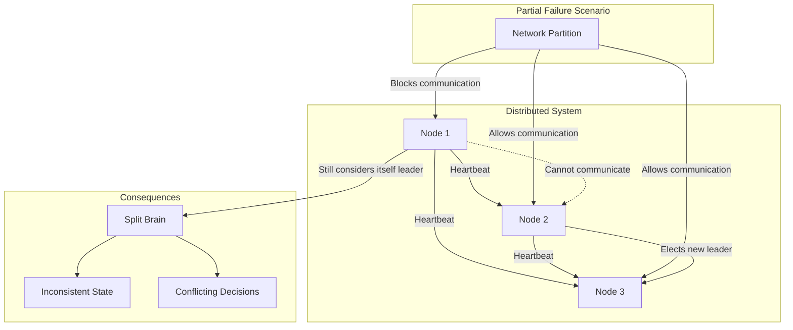
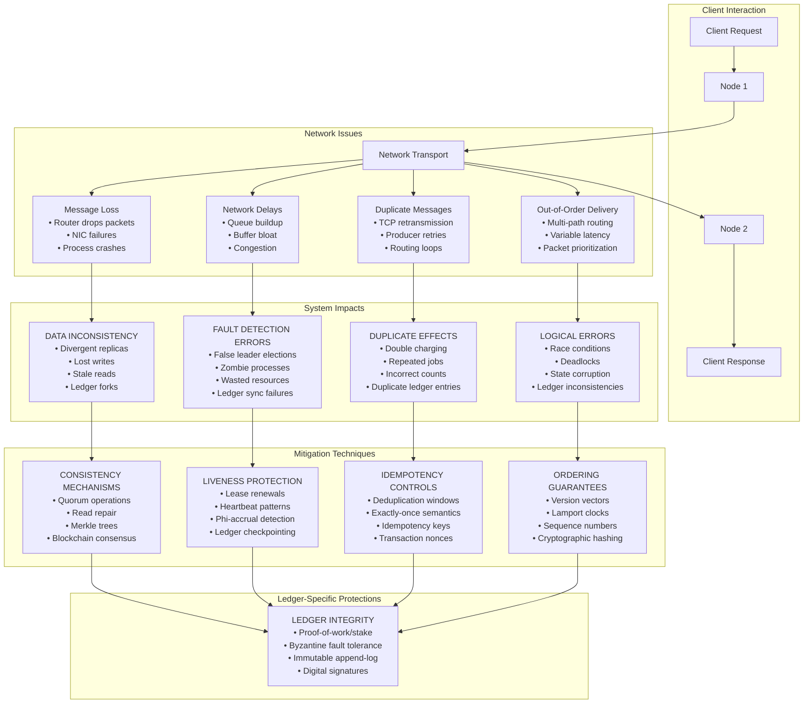

<!--
author: "Avinash Gurugubelli",
title: "The Troubles of Distributed Systems",
description: "This blog discusses the common challenges faced in distributed systems, including network issues, data consistency, and fault tolerance.",
tags: [
  "Distributed Systems",
  "Network Issues",
  "Data Consistency",
  "Fault Tolerance",
  "System Design"
],
references: [{
  title: "Designing Data-Intensive Applications",
  authors: ["Martin Kleppmann"],
  publisher: "O'Reilly Media",
  year: 2017,
  url: "https://dataintensive.net/"
}]
-->

## Introduction
This blog focuses on the inherent challenges of distributed systems: partial failures, unreliable networks, time/clock issues, and distributed consensus

### 1. Partial Failure in Distributed Systems
Key idea: In distributed systems, individual components may fail, while others function—this is called partial failure. Such failures can lead to "split brain" or inconsistent views of the system.

Diagram: Network partition causes two parts of a cluster to become isolated—each may believe they are still operating normally.

### 2. Unreliable Networks
Key idea: Networks can be unreliable, leading to message loss, duplication, or reordering.
This can cause inconsistencies in data and complicate communication between distributed components.

