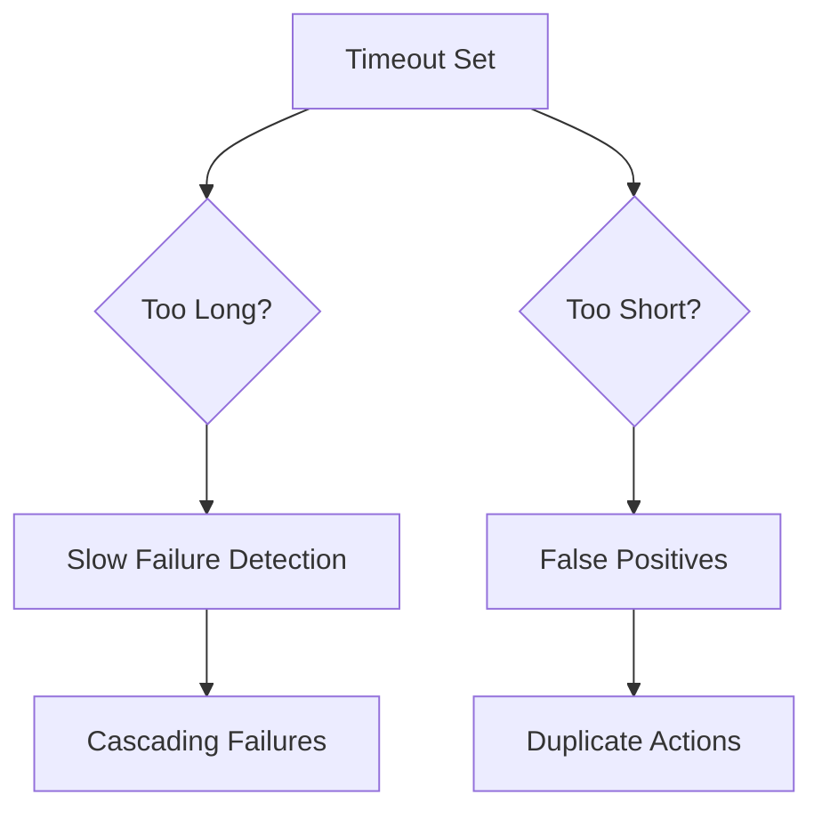

<!--
author: "Avinash Gurugubelli",
title: "The Troubles of Distributed Systems",
description: "This blog discusses the common challenges faced in distributed systems, including network issues, data consistency, and fault tolerance.",
tags: [
  "Distributed Systems",
  "Network Issues",
  "Data Consistency",
  "Fault Tolerance",
  "System Design",
  "Network Partitioning
],
references: [{
  title: "Designing Data-Intensive Applications",
  authors: ["Martin Kleppmann"],
  publisher: "O'Reilly Media",
  year: 2017,
  url: "https://dataintensive.net/"
}]
-->

## Introduction
This blog focuses on the inherent challenges of distributed systems: partial failures, unreliable networks, time/clock issues, and distributed consensus

### 1. Partial Failure in Distributed Systems
Key idea: In distributed systems, individual components may fail, while others function—this is called partial failure. Such failures can lead to "split brain" or inconsistent views of the system.


Diagram: Network partition causes two parts of a cluster to become isolated—each may believe they are still operating normally.

Solution: Use consensus algorithms like Paxos or Raft to ensure that only one leader is elected, even in the presence of network partitions.

### 2. Unreliable Networks
Key idea: Networks can be unreliable, leading to message loss, duplication, or reordering.
This can cause inconsistencies in data and complicate communication between distributed components.


Networks face variable delays due to:
- Queueing: Packets wait in buffers at switches/OS.
- TCP Retransmissions: Lost packets add latency.
- Dynamic Bandwidth Sharing: Bursty traffic competes for resources.
- Congestion Control: TCP adjusts rates based on perceived network conditions.
- Network Partitioning: Physical or logical separation of nodes can lead to communication breakdowns.


Diagram: Network issues can lead to message loss, duplication, and reordering, causing inconsistencies in distributed systems.

Solution: Use techniques like:
- **Quorum reads/writes**: Require a majority of nodes to agree on data.
- **Read repair**: Fix inconsistencies during reads.
- **Merkle trees**: Efficiently verify data integrity across nodes. 
- **Blockchain consensus**: Ensure all nodes agree on the same state.
- **Lease renewals**: Prevent stale leadership by requiring periodic updates.
- **Heartbeat patterns**: Regularly check node liveness.
- **Phi-accrual detection**: Dynamically adjust failure detection based on observed latencies.
- 
### 3. Timeouts

Problem: Choosing timeout values is a fundamental challenge in fault detection.
Why?

- Long timeouts delay failure recovery (users wait unnecessarily).
- Short timeouts cause false positives (nodes declared dead prematurely).


### Solution: 
 - Use adaptive timeouts based on recent latency patterns, exponential backoff, and retries before declaring a node dead.

 - Algorithms like **Phi-accrual failure detection** can help balance these trade-offs by dynamically adjusting timeout thresholds based on observed latencies.
  
---
### What is a Network Partition?
A network partition (also called a "split-brain" scenario) occurs when a distributed system's nodes (servers/replicas) lose communication with each other due to a network failure. This creates isolated subgroups that cannot exchange data, leading to potential inconsistencies.

### How Network Partitions Happen
- Network cable failures
- Router/switch crashes
- Internet outages between data centers
- Firewall misconfigurations
- Cloud provider failures (e.g., AWS AZ outage)

````mermaid
sequenceDiagram
    participant Client1
    participant Client2
    participant US
    participant EU
    participant AS
    
    Note over US,EU: NETWORK PARTITION (US & EU cannot communicate)
    
    Client1->>US: Book seat 12A
    US->>AS: Sync update (works)
    US-->>Client1: "Booked!" (but EU never got the update)
    
    Client2->>EU: Is seat 12A available?
    EU-->>Client2: "Yes" (STALE DATA, because partition prevents sync)
    Client2->>EU: Book seat 12A
    EU-->>Client2: "Booked!" (CONFLICT: 12A now double-booked)
````


### How Systems Handle Partitions (Solution)

  - ### 1. CAP Theorem Trade-offs
      When a network partition occurs, systems must make trade-offs between consistency, availability, and partition tolerance. There are two common approaches:

      ### CP (Consistency + Partition Tolerance)
      * Reject writes during partitions to ensure consistency
      * Example: ZooKeeper

      ### AP (Availability + Partition Tolerance)

      * Allow writes but risk inconsistency
      * Example: Cassandra

  - ### 2. Recovery After Partition Heals
    When a partition heals, systems must recover from any conflicts that may have arisen. Two common techniques are:

    ### Conflict Resolution
    * "Last write wins" approach
    * Manual merge of conflicting data

    ### Rollback of Conflicting Transactions
    * Roll back transactions that conflicted during the partition

  ### Prevention Techniques
  To prevent partitions from causing issues, systems can use:

  - ### Quorum Systems
    * Require majority agreement among nodes before making decisions
    * Prevents split-brain scenarios
  - ### Leases/Heartbeats
    * Detect failures faster by requiring nodes to send periodic heartbeats
    * Allows for quicker recovery from partitions

  ## Key Takeaways
  ----------------

  * Network partitions break communication between nodes
  * Can cause data inconsistency (split-brain)
  * Handled via CAP trade-offs (CP vs. AP)
  * Strict serializability prevents conflicts but may sacrifice availability