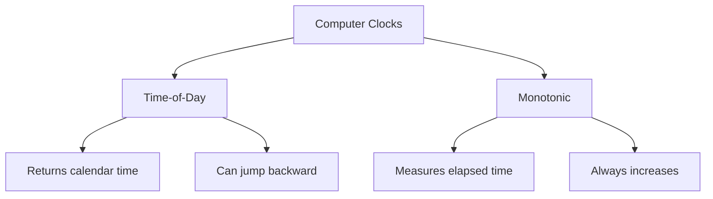
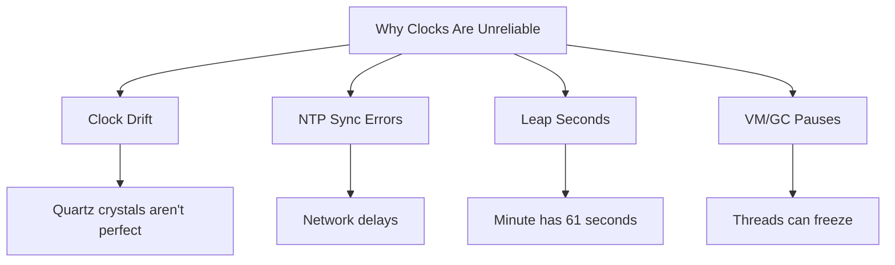
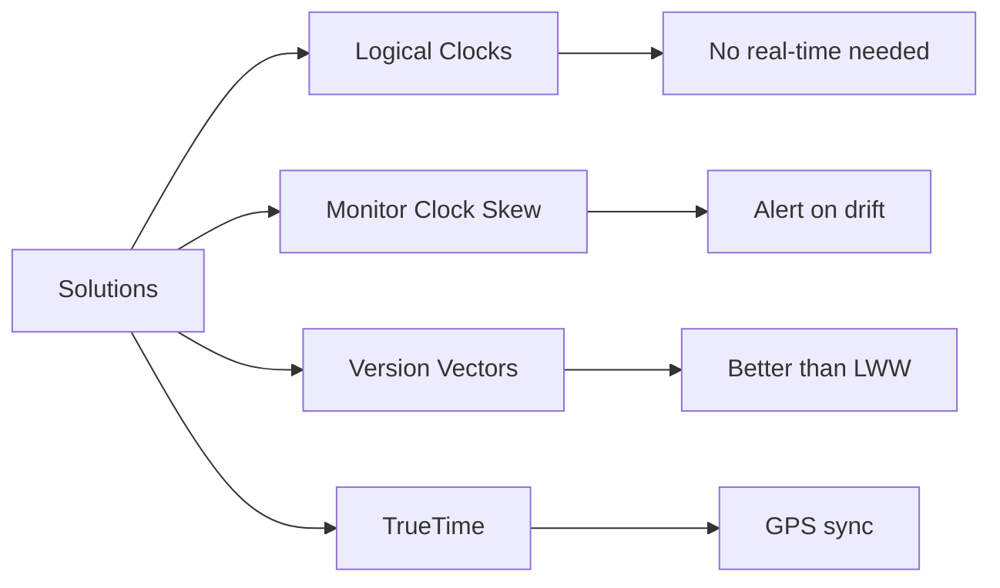

<!---
title: "Troubles with Clocks in Distributed Systems"
description: "This blog discusses the challenges of clock synchronization in distributed systems, including issues with time-of-day clocks, monotonic clocks, and the dangers of trusting clocks for operations like leader elections and data consistency."
tags: [
  "Distributed Systems",
  "Clock Synchronization",
  "Time-of-Day Clocks",
  "Monotonic Clocks",
  "Leader Elections",
  "Data Consistency"
],
references: [{
  title: "Designing Data-Intensive Applications",
  authors: ["Martin Kleppmann"],
  publisher: "O'Reilly Media",
  year: 2017,
  url: "https://dataintensive.net/"
}].
author: "Avinash Gurugubelli"
--->

# Why Do We Need Clocks?

Clocks help computers answer questions like:

1. Has this request timed out yet?
2. What’s the 99th percentile response time of this service?
3. How many queries per second did this service handle on average in the last five minutes?
4. How long did the user spend on our site?
5. When was this article published?
6. At what date and time should the reminder email be sent?
7. When does this cache entry expire?
8. What is the timestamp on this error message in the log file?

But in distributed systems (where multiple machines work together), **time is unreliable**.

---

## Two Types of Clocks

Computers use two kinds of clocks, and they work very differently:

### 1. Time-of-Day Clocks (Wall-Clock Time)

**What it does:** Tells you the current date and time (e.g., `2025-07-19 14:30:00`).

**Problems:**

- Can jump backward (if NTP adjusts it).
- Not great for measuring durations (due to leap seconds, drift).
- Different machines can show different times (even with NTP sync).

### 2. Monotonic Clocks

**What it does:** Measures elapsed time (e.g., “This operation took 150ms”).

**Why it’s better:**

- Always moves forward (never jumps back).
- Good for measuring timeouts and performance.

**But:** Values are meaningless across different machines.

### Diagram

---

## Why Are Clocks Unreliable?

### 1. Clock Drift

**Problem:** A computer’s internal clock (quartz crystal) isn’t perfect—it speeds up or slows down.

- Example: A server might drift 200 microseconds per second (Google’s estimate).
- **Solution:** Sync with NTP (Network Time Protocol).

### 2. NTP Isn’t Perfect Either

**Problem:** Network delays make NTP synchronization fuzzy.

- Example: Over the internet, NTP can still be 35ms off (or worse during congestion).
- Worst case: If NTP fails, clocks can drift seconds per day.

### 3. Leap Seconds & Time Jumps

**Problem:** Sometimes we add a "leap second" to keep clocks aligned with Earth’s rotation.

What happens:

- Some systems crash (because they assume 1 minute = 60 seconds).
- Others smear the leap second (Google spreads it over 24 hours).

### 4. Virtual Machines & Garbage Collection

**Problem:** A VM or program can freeze for seconds (due to CPU sharing, GC pauses).

- Example: A Java app might pause for minutes during garbage collection.

### Diagram

---

## Dangers of Trusting Clocks

### 1. Last Write Wins (LWW) Conflicts

**Problem:** If two machines write at the "same time," the one with the later timestamp wins.

**But:** If clocks are out of sync, new data can be lost!

Example:

- Machine A (fast clock): Writes at 12:00:05 (but real time is 12:00:00).
- Machine B (slow clock): Writes at 12:00:03 (but real time is 12:00:06).
- **Result:** Machine A’s write overrides B’s, even though B happened later!

### 2. False Leader Elections

A distributed system might think a node is "dead" because its clock is slow.

**Result:** Two leaders = data corruption (both try to write at once).

### 3. Silent Data Loss

If clocks drift, no errors are reported—data just disappears.

---

## How to Deal with Unreliable Clocks?

### 1. Use Logical Clocks (Not Physical Time)

Logical clocks (like **Lamport timestamps**) track order of events, not real time.

> Instead of “Event A at 12:00:00,” use “Event A happened after Event B.”

### 2. Monitor Clock Skew

- Alert if clocks drift too far apart (e.g., >100ms).
- Fix: Automatically remove bad nodes.

### 3. Avoid Last Write Wins (LWW)

- Use version vectors or conflict-free replicated data types (CRDTs).

### 4. Google’s Solution: TrueTime

Spanner database uses GPS/atomic clocks for tight sync (~7ms error).

- Trick: Wait 7ms before committing to avoid conflicts.

### Diagram

---

## ✅ Key Takeaways

- Clocks drift—don’t trust them blindly.
- Time-of-day clocks ≠ Monotonic clocks (use the right one).
- Last Write Wins (LWW) can lose data—use better conflict resolution.
- Monitor clock skew to catch problems early.
- For strong consistency, use logical clocks or TrueTime-like systems.

---

> _“In distributed systems, time is an illusion—order is what really matters.”_

---

## 📚 Further Reading

- NTP vs. PTP: For better sync, some use **Precision Time Protocol (PTP)**.
- [Spanner Paper](https://research.google/pubs/pub39966/): Google’s TrueTime system.
- [Lamport Clocks](https://lamport.azurewebsites.net/pubs/time-clocks.pdf): How to order events without real time.
