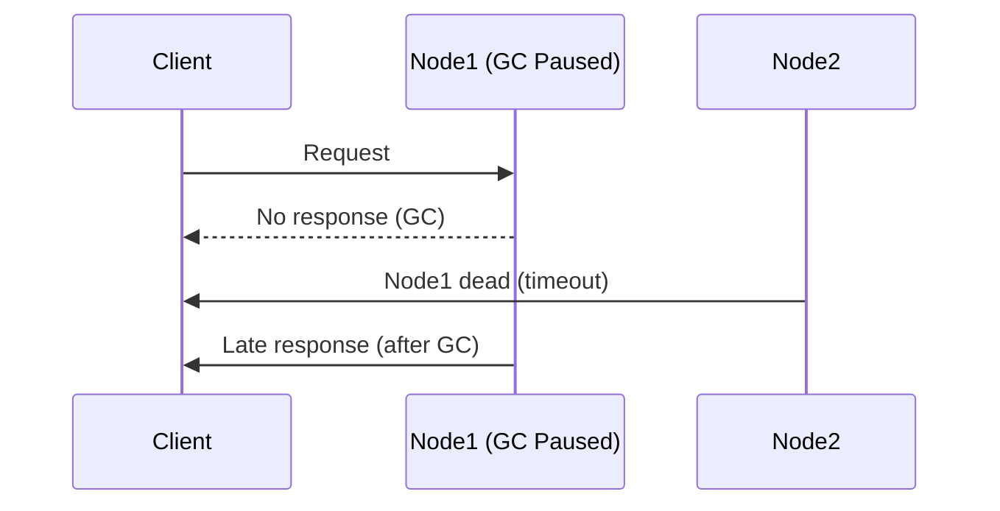
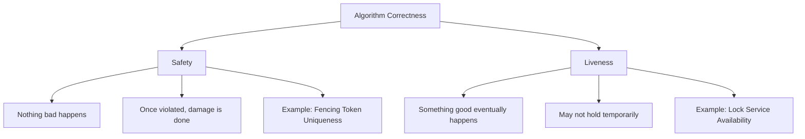

<!---
title: "Truth, Trust, and Correctness in Distributed Systems"
description: "This blog explores the challenges of establishing truth and trust in distributed systems, including leadership election, split brain, fencing tokens, system and failure models, and the distinction between safety and liveness properties."
tags: [
  "Distributed Systems",
  "Leadership Election",
  "Split Brain",
  "Fencing Tokens",
  "System Models",
  "Failure Models",
  "Safety Properties",
  "Liveness Properties",
  "Consensus",
  "ZooKeeper",
  "Byzantine Fault Tolerance"
],
references: [{
  title: "Designing Data-Intensive Applications",
  authors: ["Martin Kleppmann"],
  publisher: "O'Reilly Media",
  year: 2017,
  url: "https://dataintensive.net/"
}],
author: "Avinash Gurugubelli"
--->

# Knowledge, Truth, and Lies in Distributed Systems

## Introduction

Distributed systems operate fundamentally differently from single-machine programs:
- **No shared memory** → Communication happens through unreliable networks
- **Partial failures** → Nodes may fail independently
- **Uncertainty** → Nodes can't know the true state of other nodes directly

## The Challenge of Truth in Distributed Systems
The Majority Decides
In distributed systems, truth is determined by quorum (majority agreement). Examples:

- Network Partition Scenario:
    - Node can receive but not send messages
    - Other nodes declare it dead despite it being functional

- GC Pause Scenario:
    - Node pauses for 1 minute during garbage collection
    - Others declare it dead, then it "resurrects" after pause



## Leadership and Locks in Distributed Systems
In distributed systems, certain tasks require exclusive control to prevent conflicts and ensure consistency. Common scenarios include:

- Single Leader per Partition (e.g., in databases like Kafka or MongoDB)

- Exclusive Locks (e.g., preventing multiple clients from modifying the same file)

- Unique Registration (e.g., ensuring only one user can claim a username)

### The Problem: False Leaders (Split Brain)
When a distributed system relies on a leader or lock holder, network issues (partitions, delays) can cause confusion:

- A node may believe it’s still the leader even if the rest of the cluster has declared it dead.
- Another node may take over leadership, leading to two "leaders" acting independently (split brain).
- If both leaders accept writes, data corruption can occur.

#### Example: A Lock Gone Wrong
Suppose a distributed lock service (e.g., ZooKeeper) grants a lease to Client A to modify a file:

- **Client A** acquires the lock (lease for 10 seconds).

- Due to a **GC pause or network delay**, **Client A** freezes for 15 seconds.

- The lock service expires the lease and grants it to **Client B**.

- **Client A wakes up**, unaware it lost the lock, and proceeds to write to the file.

- **Client B** also writes to the same file → data corruption! (split brain/data corruption).

The above example illustrates the problem: due to delays/pauses, two clients believe they have the lock at the same time, leading to conflicting writes (split brain/data corruption).

```mermaid
sequenceDiagram
    participant A as Client A
    participant L as Lock Service
    participant B as Client B
    A->>L: Acquire lock (lease)
    L-->>A: Granted (lease for 10s)
    Note over A: GC Pause (15s)
    L->>B: Lease expired, lock granted to B
    B->>L: Writing to file (valid)
    A->>L: Writing to file (invalid, lease expired)
    L-->>A: Reject (but too late, file corrupted)
 ```   

 #### Solution to above problem: (Fencing Token)
- **Fencing tokens—monotonically** increasing numbers that ensure stale requests are rejected.
- A fencing token is a unique identifier associated with each lock lease.
- When a client acquires a lock, it also receives a fencing token.
- If the client becomes unresponsive and later tries to use the lock, it must present the correct fencing token.
- The lock service can then verify the token before allowing any operations, ensuring only the current holder can modify the resource.

```mermaid
sequenceDiagram
    participant C1 as Client1
    participant LS as Lock Service
    participant SS as Storage Service
    C1->>LS: Get lock
    LS-->>C1: Token 33
    C1->>SS: Write (token 33)
    Note over C1: GC Pause
    LS->>C2: Token 34 (to Client2)
    C2->>SS: Write (token 34)
    C1->>SS: Write (token 33)
    SS-->>C1: Rejected (older token)
```    

- Lock service issues a token (e.g., token=33) to Client A.
- If Client A gets paused, the lock expires, and Client B gets token=34.
- When Client A wakes up, it tries to write with token=33.
- The storage service checks tokens and rejects stale writes (since 33 < 34).

### Key Takeaways
- Locks alone are not enough—network delays and pauses can cause false leadership.
- Fencing tokens enforce ordering—only the latest holder can proceed.
- Storage i.e servers must validate tokens even clients performing checks— clients can’t be trusted to self-check.


---
## System and Failure Models in Distributed Systems

When designing distributed systems, understanding **system models** and **failure models** is crucial. These models help us reason about timing, fault tolerance, and the expected behavior of components under various conditions.

### 🕒 System Timing Models

Distributed systems operate over networks with multiple independent components. Timing assumptions vary depending on the system model:

| **Model**              | **Network Delay** | **Process Pauses** | **Clock Drift**  |
|------------------------|-------------------|---------------------|------------------|
| **Synchronous**        | Bounded           | Bounded             | Bounded          |
| **Partially Synchronous** | Usually bounded  | Usually bounded     | Usually bounded  |
| **Asynchronous**       | Unbounded         | Unbounded           | No clock         |

#### 🔹 Synchronous Model
- Assumes **everything is predictable**.
- Network latency, process execution time, and clock drift are all within **known bounds**.
- Rare in the real world, but useful for theoretical analysis.

#### 🔹 Partially Synchronous Model
- More **realistic** than the synchronous model.
- Bounds exist but are not always known or consistent.
- System may behave **asynchronously at times**, but synchrony can eventually be assumed.

#### 🔹 Asynchronous Model
- **No assumptions** about time.
- Network messages can be delayed indefinitely.
- Processes may pause arbitrarily.
- **No global clock** — each node operates independently.


### 💥 Failure Models

In real systems, things go wrong. Failure models describe **how components might fail**:

#### 🔹 Crash-stop
- A node **fails permanently** and stops participating in the system.
- Once crashed, it **never recovers**.
- Example: A web server crashes and stops responding.
- Less common in real-world systems as most systems are designed to recover.

#### 🔹 Crash-recovery
- A node may **fail and then recover**.
- If it has **stable storage** (i.e data store in persistent storage), it can **resume** from its last consistent state. In-memory data is lost.
- Example: A web server crashes but can restart and recover its last state from disk.
- Most common in real-world systems.


#### 🔹 Byzantine failures: 
  - **Nodes may act maliciously or erroneously, spreading false information.**
  - This often called as two general problem, where nodes may send conflicting information to different parts of the system.
  - for example In Army Battle: There are Many Army Commanders, and some of them may be traitors, who send false information to other commanders to mislead them. similar in the distributed system, where nodes may send conflicting information to different parts of the system which leads to confusion and inconsistency. sending misleading
  - Sending misleading information may be due to bugs, network issues, or intentional sabotage or compromise in the system.
- The most **severe and complex** failure model.
- A node can behave **arbitrarily**: lying, sending corrupt data, colluding with malicious nodes, or impersonating others.
- Requires **specialized protocols** like Byzantine Fault Tolerance (BFT).

#### 🧠 Why These Models Matter

- **Synchronous models** are idealistic but easier to reason about.
- **Asynchronous models** reflect real-world networks but are harder to manage.
- Choosing the right **failure model** helps determine the **fault tolerance** and **consensus protocols** required.


## Algorithm Correctness: Safety vs. Liveness

When we say an algorithm in a distributed system is **correct**, we usually mean that it satisfies two fundamental properties: **Safety** and **Liveness**. These two properties define how a system should behave under normal and exceptional conditions.

---

### ✅ Safety Properties: "Nothing Bad Happens"

A **safety property** asserts that the system **avoids bad states**. If violated, the damage is done — you **cannot recover** from it.

### Characteristics:
- Must **always** hold.
- Violation = permanent inconsistency or corruption.
- Often verified using **invariants** and **assertions**.

### 🔧 Example:
**Uniqueness of fencing tokens** in a distributed lock service.

Imagine two clients think they both hold the same exclusive lock — this breaks safety. Only one client should be allowed to act on a lock at a time.

### 🧠 Mnemonic:
> If a safety property is violated, **you’re doomed** — the system has done something **it should never do**.

### 🕓 Liveness Properties: "Something Good Eventually Happens"

A **liveness property** ensures that the system will **eventually** make progress — even if it temporarily seems stuck.

### Characteristics:
- Guarantees **progress** or **response** over time.
- May be temporarily violated (e.g., during network partitions).
- Usually phrased as **eventual outcomes**.

### 🔧 Example:
**Availability of a lock service** — clients will eventually acquire a lock.

Even if there's some delay or temporary downtime, the system should recover and continue servicing requests.

### 🧠 Mnemonic:
> If a liveness property is violated, you’re just **stuck**, but not yet **corrupted**.

---

### 📊 Safety vs Liveness Comparison



### 🚦 Real-World Analogy
| Property     | Analogy                                        |
| ------------ | ---------------------------------------------- |
| **Safety**   | "You never enter the wrong lane while driving" |
| **Liveness** | "You eventually reach your destination"        |

You might get delayed by traffic (liveness), but as long as you don’t crash (safety), you're okay.

### 🔁 Relationship & Trade-offs
- In practice, there's often a trade-off between safety and liveness, especially in the face of failures like network partitions.

- For example, the CAP theorem forces a choice between Consistency (Safety) and Availability (Liveness) under network partitioning.