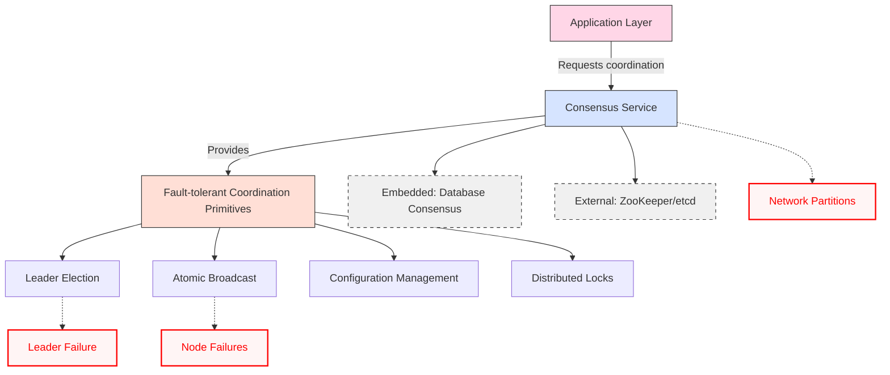

<!---
title: "Consistency and Consensus",
description: "Understanding the consistency and consensus mechanisms in Databases and in Distributed systems.",
tags: ["Distributed Systems", "Consistency", "Linearizability", "System Design"],
author: "Avinash Gurugubelli"
references: [{
    "title": "Designing Data-Intensive Applications",
    "author": "Martin Kleppmann",
    "link": ""
}]
--->

## Introduction
Distributed systems are inherently unreliable: networks can drop or delay packets, clocks drift, and nodes crash or pause unpredictably. Yet, modern systems must continue to function even under such faults.

This blog dives into key strategies and abstractions used to build **fault-tolerant and consistent distributed systems**, focusing on **consistency guarantees**

### The Power of Abstraction

Just as transactions simplify programming by hiding:
- Crashes (atomicity)
- Concurrency (isolation)
- Storage failures (durability)

**Similar to transactions, distributed systems need their own abstractions that hide:**

Instead of dealing with every possible failure manually, distributed systems use **abstractions** that **hide complexity and failure modes**:

- Network partitions
- Clock skew
- Unreliable nodes


#### 1. Application Layer

- **Represents**: Your business logic (web servers, microservices, etc.)

- **Dependency**: Needs coordination primitives but shouldn't implement complex consensus logic

Example Actions:
- "Who is the current database leader?"
- "Atomically update this configuration cluster-wide"
- "Lock this resource across all nodes"

#### 2. Consensus Service
- **Implementation**: Runs algorithms like Raft, Paxos, or Zab

- Key Responsibilities:
  - Maintains replicated log of all decisions
  - Ensures majority agreement before acting
  - Handles leader failures automatically
- Examples: etcd, ZooKeeper, Consul

#### 3. Coordination Primitives

- **Leader Election**:
  - Ensures a single node is designated as the leader for coordination tasks
  - Mechanism: Lease-based with timeouts
  - Use Case: Database primary selection
    ```mermaid
    sequenceDiagram
        participant App1
        participant App2
        participant Consensus
        App1->>Consensus: Campaign for leadership
        Consensus->>App1: Grant lease (10s)
        loop Heartbeats
            App1->>Consensus: Renew lease
        end
        Note over App1: Crashes
        Consensus->>App2: Promote to leader
    ```
- **Atomic Commits**:
  - Ensures all-or-nothing updates across distributed nodes
  - Mechanism: Two-phase commit (2PC)
  - Use Case: Financial transactions
    ```mermaid
        flowchart LR
        T[Transaction] --> P[Propose to consensus]
        P --> Q{Quorum agrees?}
        Q -->|Yes| C[Commit globally]
        Q -->|No| A[Abort]
    ```
- 2PC example
    - Prepare phase (check readiness)
    - Commit phase (make durable)
    - Failure Handling: Survives node crashes mid-commit
  ```mermaid
  sequenceDiagram
      participant C as Client
      participant Coord as Coordinator
      participant P1 as Participant 1
      participant P2 as Participant 2
      
      C->>Coord: BEGIN TRANSACTION
      Note right of C: Client starts transaction
      
      loop Transaction Operations
          C->>P1: Execute operation
          C->>P2: Execute operation
      end
      
      C->>Coord: COMMIT REQUEST
      Note right of C: Phase 1: Prepare
      
      Coord->>P1: PREPARE
      Coord->>P2: PREPARE
      P1-->>Coord: VOTE (Yes/No)
      P2-->>Coord: VOTE (Yes/No)
      
      alt All participants voted Yes
          Note right of Coord: Phase 2: Commit
          Coord->>P1: COMMIT
          Coord->>P2: COMMIT
          P1-->>Coord: ACK
          P2-->>Coord: ACK
          Coord->>C: TRANSACTION COMMITTED
      else Any participant voted No
          Note right of Coord: Phase 2: Abort
          Coord->>P1: ABORT
          Coord->>P2: ABORT
          Coord->>C: TRANSACTION ABORTED
      end
  ```
- **Configuration Management**:
  - Ensures consistent configuration across distributed components
  - Mechanism: Centralized stores with versioning
  - compare and set (CAS) - cas(x, v0, V1) if x == v0 then set x = v1 else fail
  - Optimized Read Path:
    - Read from local cache
        ```mermaid
        flowchart LR
        A[Read Request] --> B{Valid Cache?}
        B -->|Yes| C[Return Local]
        B -->|No| D[Linearizable Read]
        D --> E[Update Cache]
        E --> F[Return Value]
        ```
    - Safe write
  
        ```mermaid
            flowchart LR
            A[Write Request] --> B[Get Current Version]
            B --> C[CAS Operation]
            C --> D{Success?}
            D -->|Yes| E[Invalidate Cache]
            D -->|No| F[Retry/Abort]
        ```   
### Abstraction Benefits:
Developers work with simple primitives (locks, elections) rather than implementing complex distributed algorithms

The consensus layer handles:
 - Network partitions
 - Node failures
 - Message ordering guarantees
 - Fault-tolerant state replication

#### Implementation Choices:

> **Embedded:** Built into databases (like MongoDB, CockroachDB)
> 
> **External:** Dedicated services (ZooKeeper, etcd) for broader system coordination

This abstraction allows application developers to focus on business logic rather than the complexities of distributed consensus.

## 🔄 Replication and Eventual Consistency

Replication improves availability and performance, but introduces inconsistency:

- When clients write and read from different replicas, they may see **stale or conflicting data**.
- Most systems offer **eventual consistency**, meaning replicas **converge over time**.

> 🧠 This model works—but it makes programming harder due to unexpected reads and edge cases under failure or concurrency.

---