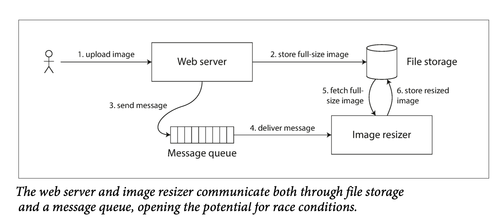

<!--
author: "Avinash Gurugubelli",
title: "Linearizability in Distributed Systems",
description: "Understanding linearizability and its importance in distributed systems.",
tags: ["Distributed Systems", "Consistency", "Linearizability", "System Design", "CAP", "CAP Theorem"],
references: [{
    "title": "Designing Data-Intensive Applications",
    "author": "Martin Kleppmann",
    "link": ""
}]
-->

## 🔍 Stronger Consistency: Linearizability

To provide more predictable behavior, systems can aim for **linearizability** — a strong consistency guarantee.

### ✳️ What is Linearizability?

Linearizability makes a system **appear as if there’s only one copy** of the data, and **all operations happen atomically** in a single global timeline.

**Key properties: What makes Systems Linearizable:**

- Once a write completes, all subsequent reads must see that value.
  

- Clients must not see older data after someone else has seen the newer value.
    

- compare and set (CAS) - cas(x, v0, V1) if x == v0 then set x = v1 else fail
  
  - Final Read by B is not linearizable as A has read the value as 4, but B is showing as 2 which is the value before the update. hence it is not linearizable
  - In the Figure there might is confusion like:
    - Client B reads x, then Client D writes x=0, then Client A writes x=1.
    - Yet, B’s read returns 1 (A’s value), not 0 (D’s value).
    - The database processed requests in the order: D’s write → A’s write → B’s read, even though requests were sent in a different order.
    - This is acceptable for concurrent operations (no real-time ordering guarantees).
    Possible cause: Network delays made B’s read arrive later than the writes.

    ### ⚠️ Consequences of Violating Linearizability
    - Violations (like "split-brain" reads or stale views) confuse users and can cause data loss.

    - User B sees old data even after User A has seen the update — not acceptable in linearizable systems.

## 🛠️ Why Linearizability Matters

You might not need linearizability for everything, but it’s **critical in certain scenarios**:

### 🔒 1. Distributed Locks & Leader Election
- Only one node must become the leader — no “split brain” allowed.
- Tools like **ZooKeeper** or **etcd** use **linearizable writes** to safely elect a leader.

### ✅ 2. Uniqueness & Constraints
- Want to enforce unique usernames or prevent overselling? You need all nodes to **agree on a single, up-to-date value**.

### ⏳ 3. Race Conditions Across Channels
- Multiple communication paths (like file storage + message queue) may result in **inconsistent data** without linearizability.

- Example: Say you have a website
where users can upload a photo, and a background process resizes the photos to lower resolution for faster download (thumbnails)
  - If the file storage service is linearizable, then this system should work fine. If it is not
linearizable, there is the risk of a race condition: the message queue (steps 3 and 4 in
Figure 9-5) might be faster than the internal replication inside the storage service. In
this case, when the resizer fetches the image (step 5), it might see an old version of the
image, or nothing at all. If it processes an old version of the image, the full-size and
resized images in the file storage become permanently inconsistent.

---

## 🧠 How to Achieve Linearizability in Distributed Systems

**Linearizability** ensures that operations on a single object appear instantaneous and globally ordered. Once a write completes, **all subsequent reads must reflect that write or a newer one**. But how do we **actually implement this guarantee in real systems**?

## 1. 🧭 Single-Leader Replication (Partial Linearizability)

### ✅ How it works:
- All **writes** are routed through a **single leader**.
- **Reads** from the **leader** (or synchronously replicated followers) are linearizable.

### ⚠️ Limitations:
- **Async follower reads** may return **stale data**.
- **Leader failure** can break linearizability if failover is not handled correctly.

### 📌 Example:
- **PostgreSQL** with `synchronous_commit = on`.

---

## 2. 🗳️ Consensus Algorithms (Strong Linearizability)

### ✅ How it works:
- Algorithms like **Raft** and **Paxos** ensure linearizability by:
  - Electing a **single leader**.
  - Requiring a **quorum** of nodes to agree on each write.
  - Preventing **split-brain** scenarios.

### 📌 Examples:
- **ZooKeeper**, **etcd**, **Consul** (linearizable reads/writes via consensus).
- **Google Spanner** (uses Paxos across regions).

### ⚠️ Limitations:
- **Higher latency** due to quorum-based coordination.
- Some systems (e.g., ZooKeeper) require **`sync()`** for linearizable reads.

---

## 3. 🔒 Two-Phase Locking (2PL) & Serial Execution

### ✅ How it works:
- **2PL** locks objects during transactions, avoiding concurrent writes.
- **Serial execution** (e.g., Redis single-threaded model) forces strict ordering.

### ⚠️ Limitations:
- **Scalability issues**: locks block concurrency.
- **Deadlocks** possible in 2PL.

---

## 4. ⚖️ Quorum Reads & Writes (Not Always Linearizable!)

### ✅ How it works (Dynamo-style systems):
- Use `w + r > n`, where:
  - `w`: number of nodes to write.
  - `r`: number of nodes to read.
  - `n`: total replicas.

### ⚠️ Problem:
- Still prone to **race conditions**.
- Requires **synchronous read repair or anti-entropy** to avoid stale reads.

### 📌 Example:
- **Cassandra** with `QUORUM` reads/writes (not fully linearizable due to **last-write-wins** conflicts).

---

## 5. 🧬 Hardware-Assisted Linearizability

### ✅ How it works:
- Use **Compare-and-Swap (CAS)** or atomic operations.
- Sequential consistency (weaker but sometimes sufficient).

### 📌 Example:
- **Redis** `SETNX` (linearizable if used correctly).

---

## Linearizability Table
| Replication Method       | Linearizable?     | Notes |
|--------------------------|------------------|-------|
| ✅ Single-leader         | Potentially      | Reads must go to the leader. |
| ✅ Consensus protocols   | Yes              | Used by ZooKeeper, etcd. |
| ❌ Multi-leader          | No               | Concurrent writes cause conflicts. |
| ❌ Leaderless (Dynamo)   | Rarely           | Quorum doesn’t always mean consistency. |
| ✅ Hardware-assisted      | Potentially      | Requires atomic operations. by using CAS.|

## 🛠️ When Linearizability Is Too Costly

If **performance** is more important than **strict consistency**:

- ✅ Use **causal consistency** (e.g., MongoDB, Dynamo).
- ✅ Accept **eventual consistency** (e.g., Cassandra).
- ✅ Use **fencing tokens** (e.g., ZooKeeper’s `zxid`) to enforce ordering.

---

## 🌐 Availability Trade-offs (CAP Theorem)
> If the network splits, you must choose:
>
> - **Consistency (linearizability)** ➡️ Some replicas go offline.
> - **Availability** ➡️ Some data may be stale or conflicting.

This is the **CAP theorem** in action: **Consistent OR Available when Partitioned**.

## 🧾 Choosing a Consistency Model

| Need | Recommended Approach |
|------|----------------------|
| ✅ Strict consistency | Use **Consensus** (Raft, Paxos) |
| ✅ High availability | Relax to **eventual consistency** |
| ✅ Balanced approach | Explore **strict serializability** (Spanner, FoundationDB) |

---

> **Key Takeaway:**  
Linearizability gives strong guarantees but comes at the cost of **latency**, **availability**, and **complexity**. Choose it **only when necessary**, and prefer **weaker consistency models** where appropriate for performance or availability.

--
