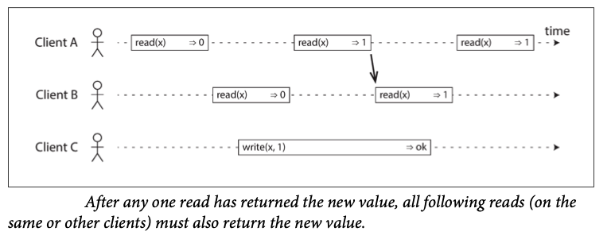
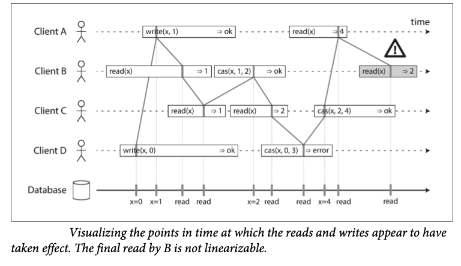

<!--
author: "Avinash Gurugubelli",
title: "Linearizability in Distributed Systems",
description: "Understanding linearizability and its importance in distributed systems.",
tags: ["Distributed Systems", "Consistency", "Linearizability", "System Design"],
references: [{
    "title": "Designing Data-Intensive Applications",
    "author": "Martin Kleppmann",
    "link": ""
}]
-->

## 🔍 Stronger Consistency: Linearizability

To provide more predictable behavior, systems can aim for **linearizability** — a strong consistency guarantee.

### ✳️ What is Linearizability?

Linearizability makes a system **appear as if there’s only one copy** of the data, and **all operations happen atomically** in a single global timeline.

**Key properties: What makes Systems Linearizable:**

- Once a write completes, all subsequent reads must see that value.
  

- Clients must not see older data after someone else has seen the newer value.
    

- compare and set (CAS) - cas(x, v0, V1) if x == v0 then set x = v1 else fail
  
  - Final Read by B is not linearizable as A has read the value as 4, but B is showing as 2 which is the value before the update. hence it is not linearizable
  - In the Figure there might is confusion like:
    - Client B reads x, then Client D writes x=0, then Client A writes x=1.
    - Yet, B’s read returns 1 (A’s value), not 0 (D’s value).
    - The database processed requests in the order: D’s write → A’s write → B’s read, even though requests were sent in a different order.
    - This is acceptable for concurrent operations (no real-time ordering guarantees).
    Possible cause: Network delays made B’s read arrive later than the writes.

### ⚠️ Consequences of Violating Linearizability
- Violations (like "split-brain" reads or stale views) confuse users and can cause data loss.

- Bob sees old data even after Alice has seen the update — not acceptable in linearizable systems.