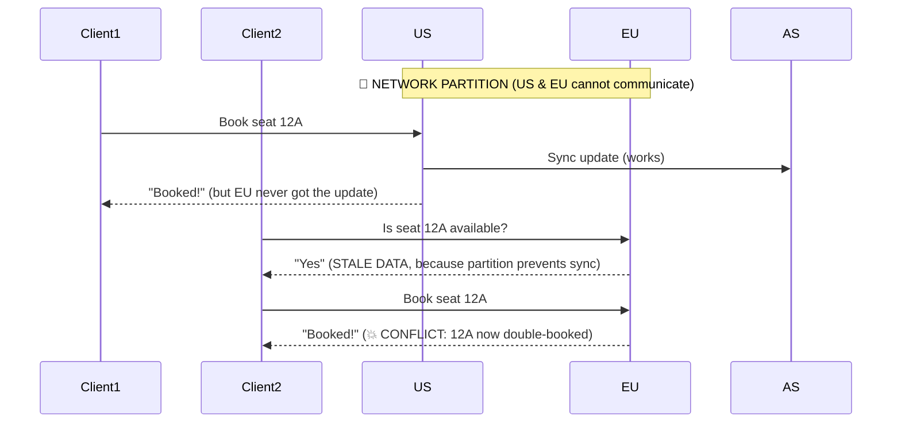
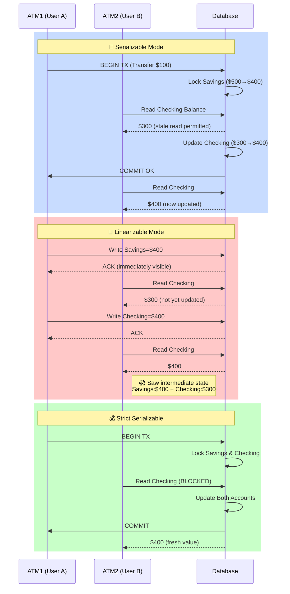

<!--
author: "Avinash Gurugubelli",
title: "Linearizability vs. Serializability: What Every Developer Should Know",
description: "A practical guide to understanding the differences between linearizability and serializability in distributed systems, with real-world examples, trade-offs, and implementation notes.",
tags: [
  "Distributed Systems",
  "Consistency",
  "Linearizability",
  "Serializability",
  "Strict Serializability",
  "System Design",
  "CAP Theorem",
  "Transaction Isolation"
],
references: [{
  title: "Designing Data-Intensive Applications",
  author: "Martin Kleppmann",
  link: "https://dataintensive.net/"
}]
--->

# Linearizability vs. Serializability: What Every Developer Should Know

When building modern distributed systems, you’ll quickly encounter the terms **linearizability** and **serializability**. They *sound* similar, but they represent **very different guarantees**. Understanding the difference is essential if you're dealing with databases, distributed locks, leader election, or building fault-tolerant systems.

Let’s break it down in simple terms.

---

## 🧩 Serializability: The Gold Standard of Transaction Isolation

**Serializability** is an *isolation property* of **transactions** — where each transaction may read or write *multiple* pieces of data.

> It guarantees that the **final result** is **as if** transactions had run one after the other, in some serial order — even if they actually ran concurrently.

**Key Points:**
- Applies to **multi-object transactions**.
- The *serial order* doesn’t have to match real-time order.
- Prevents anomalies like dirty reads or non-repeatable reads.
- Doesn’t necessarily say anything about how “fresh” a value is.

**Real-world analogy:**  
Imagine multiple people editing different paragraphs of a shared document at the same time. Serializability ensures that it's as if they had edited the document one at a time.

---

## ⏱️ Linearizability: The Recency Guarantee

**Linearizability** is about **individual operations** on a single object (or register), like reading or writing a value.

> It guarantees that **operations appear to happen instantly**, in **real-time** order.

**Key Points:**
- Applies to **single-object** operations.
- Operations must reflect the **most recent** writes.
- Critical for correctness in **leader election**, **distributed locks**, or **unique constraints**.
- Can’t group operations into transactions.

**Real-world analogy:**  
Think of booking a seat on a flight. Once someone books it, nobody else should be able to book the same seat, instantly and globally. That’s linearizability.

---

## 🎯 Strict Serializability = Serializability + Linearizability

Some databases provide both guarantees — known as **strict serializability** or **strong one-copy serializability**. These systems behave **exactly like a single, centralized database**.

---

## Real-World Examples

#### ✈️ Real-World Example 1 : Airline Booking System with Network Partitions

Let’s imagine an international airline offering online seat bookings. They have data centers (replicas) located in:

- 🇺🇸 United States
- 🇪🇺 Europe
- 🌏 Asia

These replicas sync data across regions. However, due to network issues, a connection between some regions may temporarily fail (a "network partition").

### 👩‍💻 Scenario (Without Strong Guarantees)

We’ll break down a typical situation:

### 🧭 Timeline

- Alice in 🇺🇸 wants to book seats 12A and 12B (together).
- A network partition occurs — 🛑 US can't talk to Europe, Asia.
- Bob in 🌏 Asia checks with 🇪🇺 Europe replica — "Is 12A free?" (It still shows as available due to delay).
- Bob books seat 12A.

❗ Conflict — two users booked the same seat!

### 🛠️ Code-style Sequence Diagram

### 🧠 What Different Consistency Guarantees Would Mean

- ### 💡 With Serializability Only
  - ✅ Your transactions behave like they happened in some serial (one-at-a-time) order.
  - ➡️ Booking 12A and 12B together will always succeed or fail as a whole.
  - ❌ But Bob’s read of 12A might still see outdated information.
  - ✅ Protects FROM split bookings
  - ❌ Does NOT prevent old/stale reads

- ### 💡 With Linearizability Only
  - ✅ Every read will return the most up-to-date value — “What’s the latest state of 12A RIGHT NOW?”
  - ➡️ Bob sees Alice's booking instantly if it was committed first.
  - ❌ But booking multiple seats together might not be atomic (half might fail).
  - ✅ Protects FROM stale reads
  - ❌ Risk of partial/incomplete bookings

- ### 💡 With Strict Serializability = The Best of Both
  - ✅ Transactions behave as if they happened one after the other
  - ✅ Every read sees the latest state (recency guaranteed)
  - ✅ No stale reads
  - ✅ No split or partial bookings
  - 🔁 Matches real-time and transactional correctness

## 🏦 Real-World Example 2 :Banking System: Another Real-World Analogy

Imagine you’re transferring $100 from savings to checking. You want the following:

- Either both balances change, or neither (correct transaction)
- Everyone (ATMs, apps) sees the latest update

### Let’s see different consistency levels:

#### 🔁 Serializable (Not Linearizable)
- Transactions are correct: savings -$100, checking +$100
- But while this is happening, another ATM might still show outdated balances!
- 💬 ATM: “Your checking: $300” (but you already transferred $100 🤨)
- ✅ Safe from accounting errors
- ❌ Old balances may be shown

#### 👀 Linearizable (Not Serializable)
- Each individual update is always immediately visible
- But the transfer as a whole is not atomic — you might briefly see money gone from both accounts!
- 💬 ATM: “Savings: $0, Checking: $0” 😱 (before it finishes moving)
- ✅ Reads are fresh
- ❌ Funds appear to “disappear” temporarily

#### 💰 Strict Serializability
- ✅ Transfer is atomic
- ✅ Any ATM sees up-to-date balance
- ✅ No one sees “in-progress” or partial data
- 👌 Perfect behavior — correct, immediate, and intuitive

## ⚖️ Trade-Offs in Distributed Systems

| Guarantee             | Strongest Safety     | Protects Against             | Drawbacks                          |
|-----------------------|----------------------|-------------------------------|-------------------------------------|
| 🧱 Serializability     | Transaction-ordering | Split or partial transactions | May return stale reads              |
| 📡 Linearizability     | Real-time reads      | Stale or out-of-order reads  | No grouped (atomic) operations      |
| 🔐 Strict Serializability | Both              | ALL anomalies                 | Slowest, hardest to scale           |

## 💬 Final Thoughts

- 🟢 Use Strict Serializability when correctness matters most (money, seats, locks)
- 🟡 Use Linearizability for real-time status reads (availability, locks, counters)
- 🔵 Use Serializability when you're focused on preventing data corruption across multi-object actions.

**Remember**, you trade off performance and availability for guarantees. Choosing the right consistency level isn’t just technical—it’s a business decision.

## ⚙️ Implementing Linearizability in Distributed Systems

Linearizability is often implemented through **replication**, but the method matters:

| Replication Method       | Linearizable?     | Notes |
|--------------------------|------------------|-------|
| ✅ Single-leader         | Potentially      | Reads must go to the leader. |
| ✅ Consensus protocols   | Yes              | Used by ZooKeeper, etcd. |
| ❌ Multi-leader          | No               | Concurrent writes cause conflicts. |
| ❌ Leaderless (Dynamo)   | Rarely           | Quorum doesn’t always mean consistency. |

---

## ⚖️ The Cost of Linearizability

- ### 🚧 1. Performance Overhead
  - Requires **synchronous coordination**.
  - Higher **latency**, especially under variable network delays.

- ### 🧠 Even RAM Isn’t Linearizable?

    Even **modern CPUs** aren’t linearizable by default due to multi-core cache issues. **Memory fences** are required to enforce it.

    The trade-off is **performance** — and the same applies to distributed databases. Linearizability is **slow** and comes at a cost.

---

## 🏁 TL;DR

| Property         | Serializability         | Linearizability           |
|------------------|-------------------------|----------------------------|
| Scope            | Multi-object transactions | Single-object operations   |
| Real-time order? | No                      | Yes                        |
| Use case         | Shopping carts, banking  | Locks, leader election     |
| Complexity       | Medium                  | High (especially under fault tolerance) |

---