# 📘 Understanding Ordering Guarantees in Distributed Systems

---

## ✨ Why Does “Ordering” Matter?

Imagine you're talking to a friend. You ask a question, and then they answer. Makes total sense, right?

Now imagine hearing the **answer before the question**. Confusing?  
That's what happens when distributed systems don't preserve order.

In distributed systems like messaging apps, Google Docs, or banking systems, operations (reads/writes) may appear out of order due to:

- 🌐 Network delays (packets arrive out-of-order)

- 🖥️ Multiple servers processing requests independently

- 🔄 Concurrent updates to the same data

To make sense of the system, we need **ordering guarantees**.

---

## What Is Ordering and Causality?

**Ordering** in distributed systems is about making sure that actions (like reading or updating data) happen in a sensible sequence—even when multiple computers and people are involved.

**Causality** is cause-and-effect: if one event causes another, the system should reflect that order.  
*Example: You should never see an answer before its question appears!*

---

## 🔄 Two Main Types of Ordering

**Definitions with Analogies**

| Type            | What It Means                              | Analogy                                    |
|------------------|--------------------------------------------|---------------------------------------------|
| Linearizability  | Everything happens in a strict one-by-one order | One person writing on a whiteboard |
| Causality        | Things happen after their causes           | Asking a question before hearing the answer |

**Comparison**

| Guarantee         | Strengths                          | Weaknesses                   | Best For                  |
|-------------------|------------------------------------|------------------------------|---------------------------|
| **Linearizability** | Strong consistency, simple mental model | High latency, poor availability | Banking systems, leader election |
| **Causal Consistency** | Preserves cause-effect, high performance | Complex conflict resolution | Chat apps, collaborative docs |
---

## ⚙️ What is Linearizability?

🧠 The strongest form of ordering: every operation appears **instantaneous** and **globally visible**.

### Real-world analogy:
Imagine two ATMs for the same account:

### ✅ Example:
1. ATM 1: Check balance → Shows $100

2. ATM 2: Withdraw $50 → New balance $50

3. ATM 1: Now checks balance again → Must show $50 (not the stale $100)


**Key Property:** No stale reads - every client sees the latest state.

---

## 💡 What is Causality?

Causality ensures that if one event **causes** another, the system reflects that order.

It doesn’t order **everything**—just related events.

### ✅ Example:
- Alice: “What’s the football score?”
- Bob: “2–0 to Spain.”

Bob's reply **must** come after Alice’s question.

### ❌ Violation:
- You see Bob's answer _before_ Alice’s question.  
→ Breaks causality!

### 🌱 Mermaid Diagram – Partial Order:

```mermaid
%%{init: {'theme': 'base', 'themeVariables': { 'primaryColor': '#f0f9ff', 'edgeLabelBackground':'#fff'}}}%%
graph TD
    %% Causally Related Events
    A[("Q: What's the score? 
    ⌚ T1")] -->|happens-before| B[("A: 2-0 to Spain
    ⌚ T2 (T2 > T1)")]
    
    %% Concurrent Event
    C[("Post cat meme 
    ⌚ T3 (concurrent)")]
    
    %% Styling
    style A fill:#e3f9e5,stroke:#2ecc71
    style B fill:#e3f9e5,stroke:#2ecc71
    style C fill:#f0f0ff,stroke:#9b59b6
    
    classDef causal fill:#e3f9e5,stroke:#2ecc71;
    classDef concurrent fill:#f0f0ff,stroke:#9b59b6;
    
    class A,B causal
    class C concurrent
```



> **The image post (cat meme) is unrelated — its order doesn’t matter.**

---

## Why Is Causality Important? (With Simple Examples)

### Chat Example:
You read a chat where you see, “That’s a great idea!” before the original suggestion.  
**Confusing?** That breaks causality.

### Database Example:
An update to a row is seen before the row creation.  
This can happen due to **network delays** or **out-of-order replication**.

### Real Life Analogy:
You can’t eat a cake **before it’s baked!**  
The baking causes the cake to exist.

---

# 📌 How Does Causality Show Up in Databases and Distributed Systems?


- ### ✅ Consistent Prefix Reads
    **Definition:**  
    When reading from a replicated system, you must see operations in the exact order they were written — or at least in a prefix of that order (no skipping ahead to future writes).

    **Example:**  
    You’re browsing a forum and see the reply “Yes, absolutely!” but the corresponding question “Do you agree?” appears below it or not at all. That’s confusing — the answer appeared before the question!

    > 🧩 That’s a causality violation. The system exposed the effect before the cause.

---

- ### 🔁 Replication (Especially in Multi-Leader Systems)
    **Definition:**  
    In systems with multiple leaders, each node might accept writes independently. Due to network delays, some nodes may receive operations out of order, violating causality.

    **Example:**  
    A “withdraw $50” operation is replicated to one node before the “create account” operation that initializes the balance.  
    Now, it looks like you're withdrawing from an account that doesn’t exist yet!

    > 🔥 That would never happen in a single-node system — distributed systems need to ensure that cause (account creation) comes before effect (withdrawal).

---

- ### 📸 Snapshot Isolation (Used in Transactions)
    **Definition:**  
    Every transaction reads from a consistent snapshot of the data — it must reflect all changes up to a point (before the transaction started), but not beyond (excludes anything that happened after).  
    
    This guarantees causal consistency within the transaction.

    **Example:**  
    If a transaction sees:  
    > A comment saying, “I agree with Bob's suggestion!”  

    …and doesn’t see:  (say it was written shortly afterward and wasn’t part of the snapshot.)
    > Bob’s suggestion  

    🛑 This is a causality violation:
You're seeing the effect (the reply) without the cause (the original suggestion).

    ✅ Snapshot Isolation prevents this problem by always providing a view where cause comes before effect — so if a transaction sees the reply, it must also see the suggestion it is replying to.

---

- ### ⚠️ Write Skew
    **Definition:**  
    Occurs when concurrent transactions read shared data, make decisions based on it, and then write updates that conflict in the real world — even though they don’t strictly conflict on the same data items.

    **Example:**  
    - Alice and Bob both check who's currently on call.  
    - Both see that the other is available and decide to go offline.  

    **Result:**  
    Nobody is on call.

    > 🧠 Even though the writes don’t touch the same rows, their decision-making is causally dependent on what they each read — leading to an incorrect final state.

---

- ### 🕰️ Stale Read (Causality Violation)
    **Definition:**  
    A stale read occurs when a user sees older data than someone else, even though they act after them.

    **Example:**  
    - Alice sees the football score on her app and shouts: “It’s 3–1!”  
    - Bob hears her and immediately checks the app — but his app shows 2–1.

    > 🔁 Alice acted before Bob, so Bob should see at least what Alice saw.

---


## Ordering Models: Total Order vs. Partial Order

| Model        | What It Means                                                   | Analogy                                                  |
|--------------|------------------------------------------------------------------|-----------------------------------------------------------|
| Total Order  | All actions placed in a single timeline                         | Everyone queues up in a line—no confusion                |
| Partial Order| Some events are unordered (independent)                        | Two teams work separately and only compare when they meet|

- **Linearizability** creates a **total order** (strongest, simplest to reason about).
- **Causality** creates a **partial order** (only tracks cause–effect, allows parallelism).

---

## Making Sense of Partial Order (Concurrency)

- If two actions are **causally related**, they **must** be ordered.
- If they’re **independent**, they can happen **in any order**—even **simultaneously**.

In distributed systems, this leads to **branches** (like in Git) where users/computers make changes in parallel.

---

# How Do Systems Track and Enforce Order?

In distributed systems, maintaining the **correct order of events** — especially across nodes — is critical for **consistency**, **replication**, and **causality**.

---

- ### 🔢 Sequence Numbers / Timestamps

    **What it is:**  
    Each event or operation is assigned a **monotonically increasing number** or timestamp.

    **Challenge:**  
    If based on **physical clocks**, this approach **requires synchronized clocks** — which is hard due to clock drift, network latency, and leap seconds.

    **Example:**
    - Two updates happen at nearly the same time:
    - Node A: `timestamp = 10:00:01.001`
    - Node B: `timestamp = 10:00:01.000`
    - If clocks aren’t perfectly synced, **Node B’s earlier timestamp might appear later**, causing ordering issues.

    🛠 Systems like **Spanner** use atomic clocks and GPS to tightly sync clocks across datacenters to make this work.

---

- ### ⏱️ Lamport Timestamps

    **What it is:**
    - Each node maintains a **logical clock (counter)**.
    - The clock is incremented for **local events**.
    - When sending/receiving a message, the node sets its clock to `max(local, received) + 1`.

    **Why it helps:**  
    It enforces a **happens-before** relationship: if Event A happens before B, then A's timestamp will be less than B's.

    **Example:**
    ```plaintext
    Node A: Counter = 5
    Node B: Counter = 3

    A sends message to B with timestamp 5
    B receives it → updates to max(3, 5) + 1 = 6
    ```

    Now B knows that the message from A **happened before** anything it does at timestamp 6.

    ➡️ Used in algorithms like **distributed mutual exclusion**, and helps with **causality tracking** in systems like **Cassandra**.

    ### ⚠️ But... What Lamport Timestamps Don’t Guarantee
    - If A’s timestamp < B’s timestamp, it does not mean A actually happened before B.
    - It can’t detect concurrent events — only preserve causality if it’s explicitly communicated.
    - Example: 
      - Alice and Bob both try to register the username @avocado on different replicas at the same time.
      - Each operation is independent, so there's no causal link between them.
      - Lamport timestamps might look like this:
        ```
        Alice registers `@avocado` at time 10
        Bob registers `@avocado` at time 12
        ```
    - But without causal info, the system can’t tell they are conflicting concurrent writes.
    - ❌ Problem: Both operations are considered valid — now two users own the same username!
  - Solution: **Vector Clocks** or Version Vectors. or **CRDTs**. or Total order broadcast.
---

- ### 🧮 Version Vectors (Vector Clocks)

    **What it is:**  
    Each data item keeps track of the **latest known version number from every node**.

    **Why it helps:**  
    - If **version A < version B** → A happened before B  
    - If **A and B are not comparable** → They happened **concurrently**

    **Example:**
    Let’s say we have 3 nodes: A, B, C

    - Node A writes: `{A: 1, B: 0, C: 0}`
    - Node B writes later: `{A: 0, B: 1, C: 0}`
    - Merged version: `{A: 1, B: 1, C: 0}`

    If two versions are:
    - `{A: 2, B: 1}` and `{A: 1, B: 2}` → concurrent!  
    - `{A: 2, B: 1}` and `{A: 2, B: 2}` → second is newer

    📦 Used in: **Amazon Dynamo**, **Riak**, **CRDTs**

---

- ### 📦 Total Order Broadcast (Atomic Broadcast)

    **What it is:**  
    A messaging protocol where **every node receives every message in the exact same order**.

    This is **stronger than causal or partial order** and ensures consistency across replicas.

    **Example:**
    Three nodes A, B, C. Operations:
    - A sends: "Add Milk"
    - B sends: "Add Eggs"

    Without total order:
    - A might see: Add Milk → Add Eggs  
    - B might see: Add Eggs → Add Milk

    With total order broadcast:  
    ✅ All nodes will see: `Add Milk → Add Eggs` or `Add Eggs → Add Milk`, **but same everywhere**.

    **Used in:**
    - **ZooKeeper**
    - **etcd**
    - **Paxos and Raft-based systems**
    - **Kafka topic partitions (per partition)**

    🧠 Helps with:
    - **State machine replication**
    - **Consensus**
    - **Transaction ordering**
---


# Do Databases Choose Between These?

Yes — **different databases pick different strategies** based on:
- Their **consistency guarantees**
- Their **replication model** (leaderless vs leader-based)
- Their **performance trade-offs**

👉 Choice depends on whether system favors **availability, latency, or strict ordering**.[ Refer this article for more info](../01-general/db-ordering-mechanisms.md)

## Benefits and Trade-Offs

### ✅ Linearizability (Total Order)
- Easy to understand.
- Guarantees strong correctness.
- Used when consistency is critical (e.g., money transfers).
- **Trade-off:** Slower, harder to scale.

### ✅ Causal Consistency (Partial Order)
- Faster and more available.
- Still feels “correct” for most user scenarios.
- Preserves **intuitive cause-effect** without enforcing strict global order.

---

> ✅ **Takeaway**:  
> Causality preserves logic and sense in distributed systems, allowing systems to scale while keeping behavior understandable and consistent.
