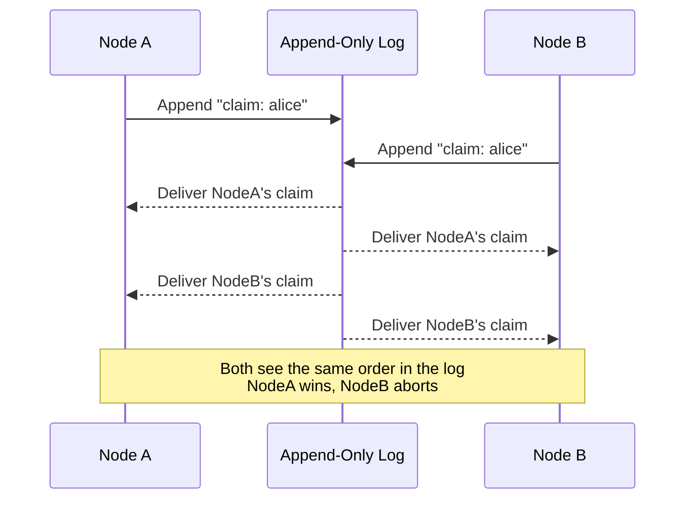
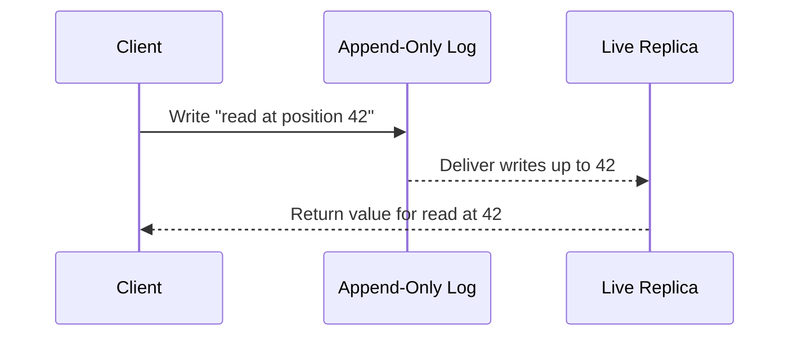
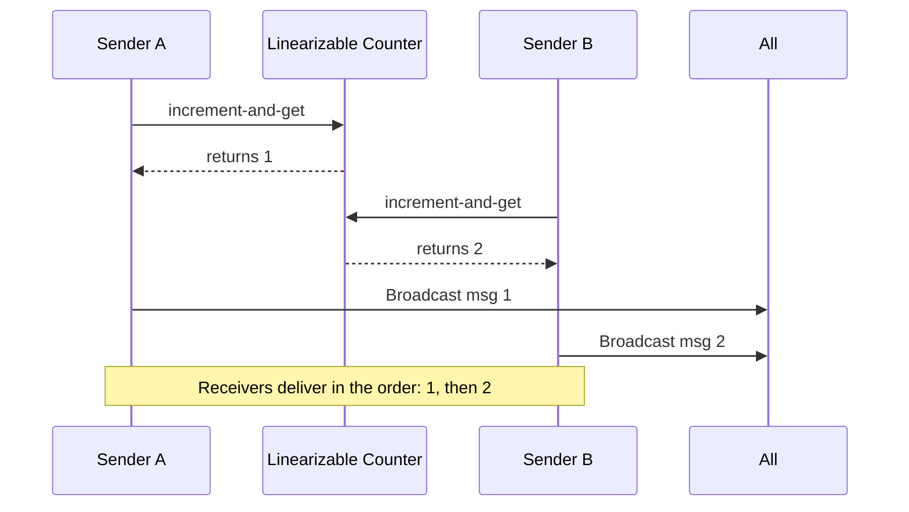

# Implementing Linearizable Storage with Total Order Broadcast

**Linearizability** and **total order broadcast** are two powerful, closely connected concepts in distributed systems. This guide explains how they relate, how one can be built from the other, and where their boundaries lie—using intuitive examples and step-by-step explanations.

---

## 🔄 What Are Linearizability and Total Order Broadcast?

- **Linearizability**: Guarantees that all operations on a data item appear to happen instantaneously, in a single global order. Every read returns the most recent value written.
  
- **Total Order Broadcast (TOB)**: Guarantees that all messages are delivered to all nodes in **the exact same order**, even in distributed environments.

### Key Difference:

| Concept | Order Guarantee | Recency Guarantee |
|--------|------------------|-------------------|
| Total Order Broadcast | ✅ Yes | ❌ No |
| Linearizability | ✅ Yes | ✅ Yes |

---

## 🏗️ Building Linearizable Storage with Total Order Broadcast

### ⚙️ Scenario: Unique Username Registration

You want to ensure that each username is unique—even if multiple users try to register it simultaneously.

### 💡 Steps:

1. **Append a claim message to the log**  
   → e.g., “User A claims username `bob123`”

2. **Wait until the log delivers your message back**  
   → Ensures all prior messages are visible to you.

3. **Check all claims for that username**  
   → If yours is the first one, ✅ succeed.  
   → If someone else claimed it earlier, ❌ abort.

> Because all messages are delivered in the same order to everyone, every node will agree on which claim came first.

---

## 🔄 Making Reads Linearizable

While total order broadcast ensures **linearizable writes**, reads may still see **stale data** if replicas lag behind.

### 📖 Three options to fix this:

1. Sequence reads through the log:
   - Append a special “read” message and only process the result when it is delivered back to you.

2. Synchronize on log index:
   - Wait for all messages up to a certain log position before reading.

3. Read from a synchronously updated replica:
   - Use a replica that applies every write in real time without lag.
Use a replica that applies every write in real time without lag.

---

## 🔁 Building Total Order Broadcast from Linearizable Storage

You can also go the other way—build **TOB from linearizable primitives**!

### 🧱 Simple Recipe:

1. Use a **linearizable counter (e.g., atomic increment-and-get)**
2. For each message:
   - Increment the counter
   - Tag your message with the counter value
   - Deliver messages in strict counter order

## 📋 Summary Table: Linearizable Counter vs. Lamport Timestamps

| Method                              | No Gaps | No Stale Delivery | Order Consistency | Gaps Allowed | Delivery May Be Out of Sync |
|-------------------------------------|:-------:|:-----------------:|:-----------------:|:------------:|:---------------------------:|
| Linearizable Counter (TOB sequence) |   ✅    |        ✅         |        ✅         |      ❌      |             ❌              |
| Lamport Timestamps                  |   ❌    |        ❌         |     Partial*      |      ✅      |             ✅              |

\*Partial: Lamport timestamps preserve causal order, but may not provide globally consistent order for concurrent events.

---

## ⚠️ Sequential Consistency vs. Linearizability

| Property | Linearizability | Sequential Consistency |
|---------|------------------|-------------------------|
| Fresh reads guaranteed? ✅ | ❌ |
| Operations appear in real-time order? ✅ | ✅ (but not necessarily latest state) |

---

# Linearizability vs. Total Order Broadcast in Real-Time Distributed Systems

- ## ✅ Linearizability – The Foundation of Real-Time Consistency

    **Linearizability** ensures operations in a distributed system appear to happen in a single, global, real-time order. It's intuitive and reliable for applications that require strong, predictable consistency.

    ### 💼 Widely Used In:

    - **Etcd** (via Raft)
    - **ZooKeeper**
    - **CockroachDB**
    - **FoundationDB**
    - **Spanner (Google)** – uses TrueTime for global linearizability
    - **Consul** (via Raft)
    - **Amazon QLDB**

    ### 🧩 Why Is Linearizability So Popular?

    - ✅ Guarantees **fresh reads** and **strong consistency**
    - ✅ Ensures **correct global ordering** of operations
    - ✅ Enables distributed systems features like:
    - Leader election
    - Locks
    - Transactions
    - Unique ID generation
    - ✅ Maps to real-world logic (e.g., "Did X happen before Y?")
    - ✅ Easy to reason about in applications

    ### 🛠️ How Is It Achieved?

    - **Consensus protocols** like Raft, Paxos, or Multi-Paxos
    - **Append-only replication logs**
    - **Quorum-based reads/writes**
    - **Global clocks (e.g., Google Spanner’s TrueTime)**

---

- ## Total Order Broadcast – The Unseen Backbone

    **Total Order Broadcast (TOB)** provides a common order of delivery across distributed nodes but doesn’t enforce a recency guarantee.

    ### 📦 Used In:

    - **Kafka** (ensures total order per partition)
    - **Raft and Paxos variants** (used internally)
    - **Virtual Synchrony Systems** (e.g., Spread toolkit, JGroups)

    ### 🧩 Why Use TOB?

    - Ensures **all nodes process the same set of messages in the same order**
    - Ideal for **command broadcasting** in systems
    - Useful for **replication** and **event sourcing**
    - Frequently used to **enforce linearizability** under the hood

    ---

    ## ⚖️ Linearizability vs. Total Order Broadcast: Practical Comparison

    | Feature                              | TOB                         | Linearizability                |
    |--------------------------------------|-----------------------------|-------------------------------|
    | Directly exposed to clients          | ❌ Rarely                   | ✅ Often (via APIs)            |
    | Underlying mechanism                 | ✅ Used under the hood       | ✅ Core to system behavior     |
    | Guarantees fresh (latest) reads      | ❌ No                        | ✅ Yes                         |
    | Used in distributed locks/services   | ❌ Not directly              | ✅ Yes                         |
    | Common in real-time DBs              | ⚠️ Sometimes (internally)   | ✅ Yes                         |

---

- ## ✅ Final Verdict

  - **Linearizability** is **explicitly guaranteed** and **visible** to the user/developer.
  - **TOB** is most often an **internal mechanism** that enables strong consistency behind the scenes.
  - Most real-time databases (like Spanner, CockroachDB, FoundationDB) **expose linearizability**, often **implemented using TOB**, consensus protocols, and append-only logs.

  > **Takeaway:**  
  > If you're building or relying on real-time distributed databases, **linearizability is what you care about** — while **total order broadcast ensures things stay in order behind the curtain**.

## 🧠 Summary

Some operations and coordination mechanisms used to enforce ordering and consistency in distributed systems are fundamentally equivalent to the **consensus problem** — reaching agreement across unreliable or asynchronous nodes.

### 🟰 Operational Equivalence Table

| Concept                      | Equivalent To |
|------------------------------|---------------|
| Linearizable Compare-and-Set | Consensus     |
| TOB (Total Order Broadcast)  | Consensus     |
| Atomic Increment-and-Get     | Consensus     |

> 🧩 **Takeaway:**  
> Building a linearizable register = solving **consensus**.  
> Building TOB = also solving **consensus**!

This connection is powerful: if you can solve one of these problems reliably, you can build the others on top of it.

---

## 📚 References

- [Designing Data-Intensive Applications](https://dataintensive.net) by Martin Kleppmann
- Etcd, ZooKeeper, Raft, Paxos – protocols and examples of linearizable systems.

