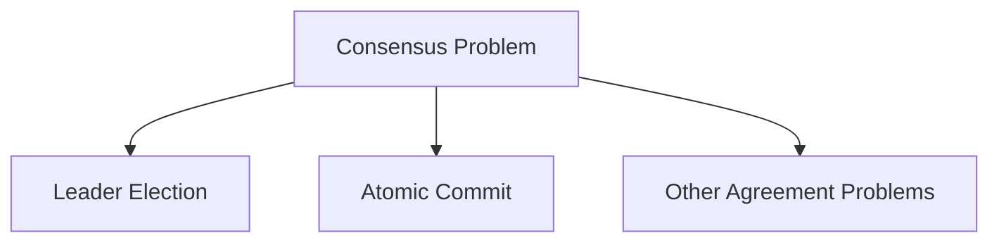
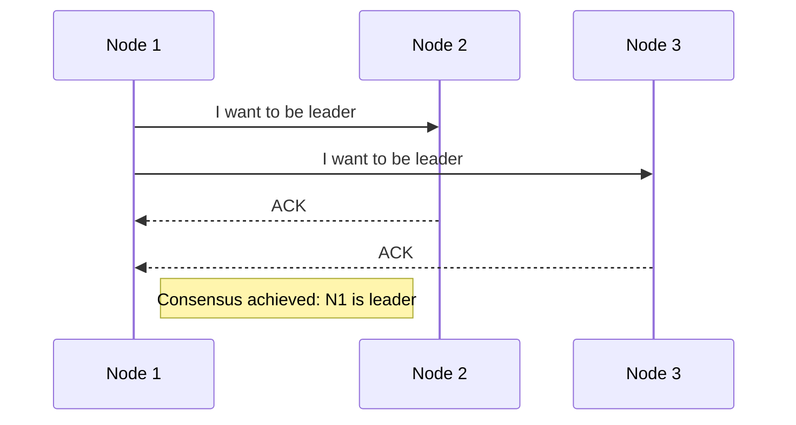
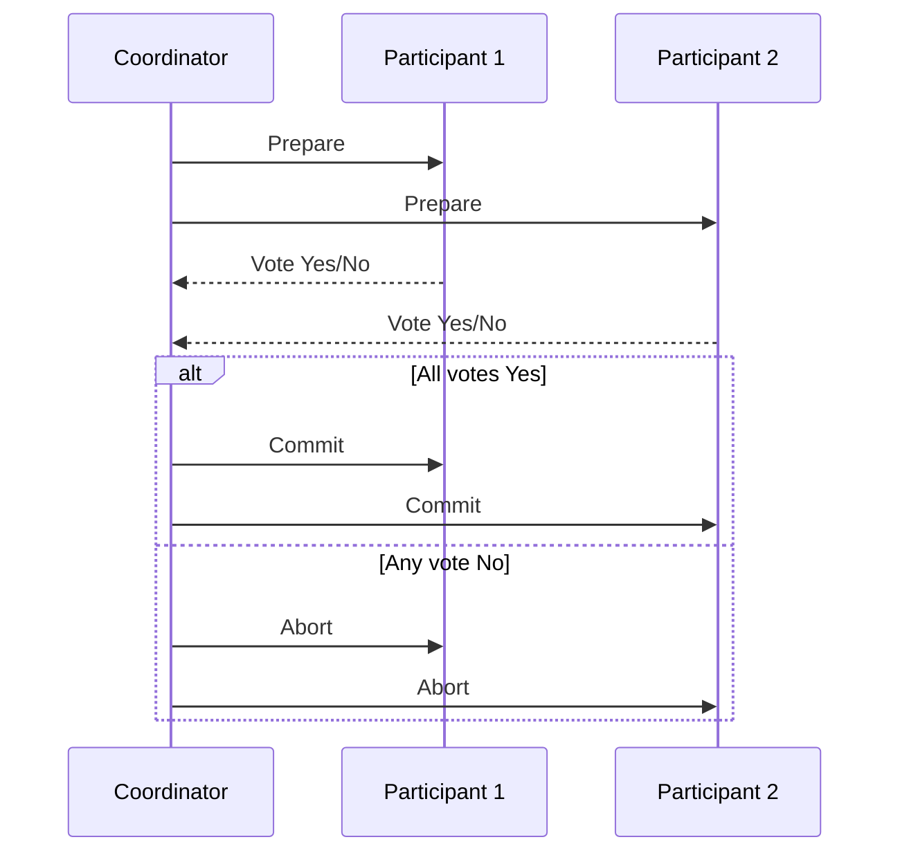

<!--
title: "Consensus in Distributed Systems",
description: "A deep dive into the consensus problem in distributed systems, exploring leader election, atomic commit, and the FLP impossibility result.",
tags: ["Distributed Systems", "Consensus", "    Leader Election", "Atomic Commit", "FLP Impossibility", "System Design"],
author: "Avinash Gurugubelli",
references: [{
    "title": "Designing Data-Intensive Applications",
    "author": "Martin Kleppmann",
    "link": ""
    }]
--->

# Consensus in Distributed Systems

**Consensus** is one of the most fundamental problems in distributed computing. At its core, it’s about getting multiple nodes to **agree on a single decision**.

While this may sound simple, many real-world systems have failed because they underestimated the difficulty of solving consensus reliably — especially in the presence of failures.

---

## 📌 What Is Consensus?



Consensus is required in many scenarios in distributed systems, most notably:

---

## 🔄 Why Consensus Matters

### 1. 🗳️ Leader Election

In **single-leader replication systems**, all nodes must agree on who the leader is. If consensus isn't achieved, nodes may enter a **"split brain"** situation — where multiple nodes think they’re the leader, leading to **conflicting writes and data corruption**.



### 2. ✅ Atomic Commit

When a transaction spans **multiple nodes**, all participants must **agree to either commit or abort** the transaction. If one node commits and another aborts, the system becomes inconsistent — violating **atomicity**.

---

## ❌ The FLP Impossibility Result

The **FLP theorem** (Fischer, Lynch, Paterson) states:

> In an asynchronous system, with at least one faulty process, no deterministic algorithm can guarantee consensus.

### So how do real-world systems work?

They use practical workarounds like:

- **Timeouts**
- **Failure detectors**
- **Randomized decisions**

These allow consensus algorithms to function **"well enough"** in most scenarios.

---

## 🔁 Two-Phase Commit (2PC)

2PC is the most common algorithm for **atomic commit** across distributed databases or services.

### 🔧 How 2PC Works



### 🔄 The Two Phases

#### Phase 1: Prepare

- Coordinator asks all participants: “Can you commit?”
- Each participant does necessary checks and replies:
  - `YES` → Ready to commit and promises to follow through
  - `NO` → Must abort

#### Phase 2: Commit or Abort

- If **all** vote `YES` → Coordinator sends **commit**
- If **any** vote `NO` or a timeout occurs → Coordinator sends **abort**
- Participants **must** obey the final decision

---

- ## ⚠️ Limitations of 2PC

  While 2PC ensures atomicity, it has some serious drawbacks:

  - **Blocking Problem:** If the **coordinator crashes** after participants vote `YES`, they’re stuck waiting forever — in an "in-doubt" state.

    ```mermaid
    graph LR
    A[Coordinator Crash] -->|After YES votes| B["⏳ Participants Blocked"]
    B --> C["🚫 System Halted"]
    C --> D["👨💻 Admin Intervention"]

    style A fill:#fff3f3,stroke:#ff6b6b
    style B fill:#fff8e8,stroke:#ffc107
    style C fill:#ffebee,stroke:#f44336
    style D fill:#f5f5f5,stroke:#9e9e9e
    ```

  - **Performance Overhead:** Involves multiple network round-trips.
  - **Single Point of Failure:** The coordinator is a bottleneck and failure point.

- ### Why 2PC Ensures Atomicity: A System of Promises
- You might wonder: if network failures, disk crashes, or message loss can occur at any time, how does 2PC actually guarantee atomic commit?

- The secret lies in a system of **irrevocable promises**, enforced through durable logging:
- For More Details, see the [Two-Phase Commit](../01-general/two-phase-commit.md) blog post.

---

## ⏩ Three-Phase Commit (3PC)

3PC is an extension of 2PC that tries to **avoid blocking** by adding a third phase:

1. **Can-Commit** (initial vote request)
2. **Pre-Commit** (participants prepare)
3. **Do-Commit** (final confirmation)

However, **3PC has limitations**:

- Assumes **bounded network delays**
- Assumes **bounded node response times**
- Rarely used in practice due to complexity and fragility

---


## 🚧 Limitations of Consensus in Distributed Systems

### 1. Performance Overhead

Consensus algorithms, such as Raft and Paxos, provide strong safety guarantees but require synchronous replication, which can result in significant performance overhead. In contrast, most databases prefer asynchronous replication for better performance, accepting some risk of data loss during failover.

### 2. Majority Requirement

A strict majority of nodes must be operational to make progress in consensus algorithms. For example, a system with 3 nodes can tolerate 1 failure, but if the majority is partitioned away, the system halts.

### 3. Static Membership Complexity

Many consensus algorithms assume a fixed set of nodes, making it challenging to change cluster membership dynamically. Adding or removing nodes requires dynamic reconfiguration, which is a harder and less mature process.

### 4. Sensitivity to Network Issues

Consensus algorithms rely on timeouts to detect failures, which can cause false positives in networks with variable delays. Frequent false leader elections can severely degrade performance, and edge cases (e.g., in Raft) can cause leadership instability in otherwise healthy networks.


# Why Consensus Systems Like ZooKeeper and etcd Are Special

While they resemble distributed key-value stores, their main role is coordination and configuration for other systems.

### Key Characteristics

* **Memory-Resident Data**: Designed for small, frequently-read data sets, not as a general-purpose database.

### Features Provided

* **Linearizable Atomic Operations**: Enable distributed locking with failure safety. (e.g., compare-and-set for distributed locks).
* **Totally Ordered Operations**: ensuring every replica sees actions in the same sequence, in other words Ensures consistent state across nodes via ordered logs (zxid).
* **Failure Detection**: sessions and heartbeats to know if clients or nodes are alive.
* **Change Notifications**: Applications can subscribe to updates instead of polling.

### Applications

* Used by systems like HBase, Hadoop YARN, and Kafka for leader election, failover coordination, and resource partitioning.

### Consensus and Cluster Coordination
---------------------------------

* **Automated Fault Recovery**: Via atomic operations, ephemeral nodes, and event notifications, clusters can recover without manual intervention.
* **Efficient Majority Voting**: Consensus typically runs on a small group of “voting” nodes, even if there are thousands of clients, keeping overhead manageable.


## Use Cases


### 1. Leader Election

* Primary databases or services use consensus to elect a leader, ensuring that only one node is responsible for handling requests and maintaining consistency.

### 2. Partition Assignment and Rebalancing

* Consensus is used to assign and rebalance partitions across nodes, ensuring that data is evenly distributed and that nodes are not overwhelmed.

### 3. Service Discovery

* While consensus isn't always necessary for service discovery, it can be used to ensure that all nodes agree on the current state of services and their locations.

### 4. Membership Management

* Nodes use consensus to agree on which nodes are currently active and part of the cluster, ensuring that the system remains consistent and fault-tolerant.

These use cases highlight the importance of consensus in distributed systems, enabling nodes to agree on critical aspects of the system and ensuring that it remains consistent and fault-tolerant.

Important Notes
-------------------

* **Not for High-Volume State Replication**: The data ZooKeeper manages changes slowly (e.g., leader assignments), not for fast-changing or transactional application state.
* **Service Discovery**: While consensus can help for leader info or membership, general service discovery can use less consistent but more scalable systems (like DNS).
* **Membership Services**: Consensus can help systems agree on cluster membership, crucial for leader election and coordinated action, even though network anomalies can still cause mischaracterization of a node’s liveliness.
* High-scale systems use a small fixed consensus cluster (e.g., 3 or 5 nodes) to coordinate many clients.

In Summary
----------

Consensus algorithms make distributed systems safe and reliable by enforcing majority agreement and total order, but they add overhead, require care in cluster design, and aren’t suited for every problem. Systems like ZooKeeper and etcd provide consensus tools for coordination and membership, but should be used thoughtfully, with full awareness of their limitations and capabilities.

## 🧠 Key Takeaways

- Consensus is **essential but difficult** in distributed systems.
- **Two-Phase Commit (2PC)** provides a basic solution for distributed transactions.
- **2PC can block** in case of coordinator failure.
- **Three-Phase Commit (3PC)** attempts to solve this, but is rarely used.
- Systems like **Raft and Paxos** offer more robust consensus for critical infrastructure.

---

## 📚 Want to Dive Deeper?

- [Raft Illustrated](https://raft.github.io/)
- [ZooKeeper Atomic Broadcast](https://zookeeper.apache.org/doc/current/zookeeperInternals.html#sc_zab)
- _Designing Data-Intensive Applications_ by Martin Kleppmann (Highly recommended!)
