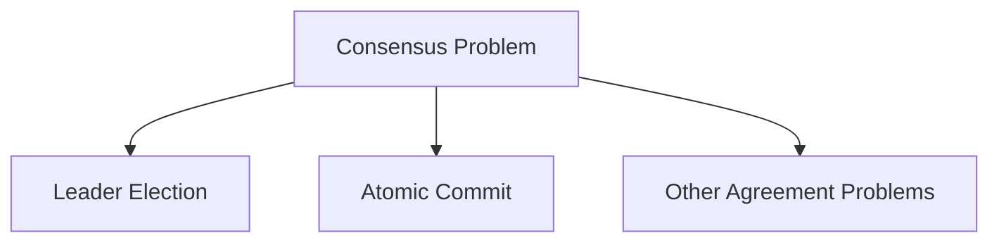
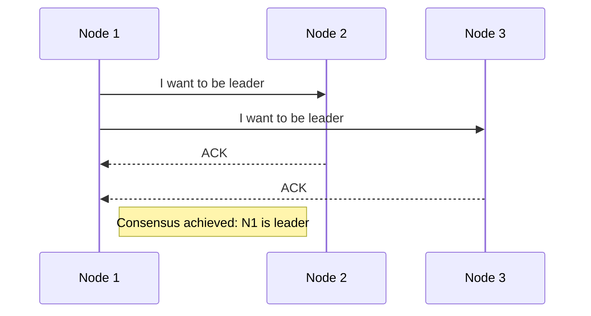
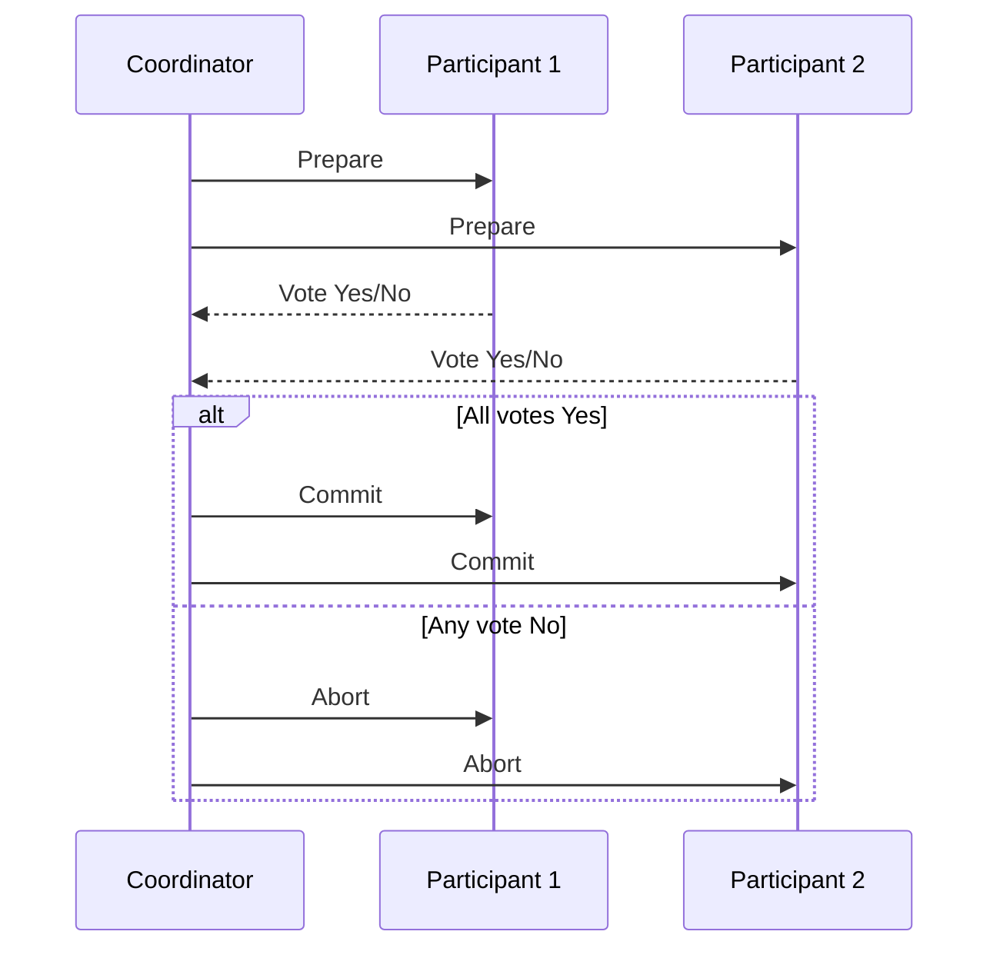

# Consensus in Distributed Systems

**Consensus** is one of the most fundamental problems in distributed computing. At its core, it’s about getting multiple nodes to **agree on a single decision**. 

While this may sound simple, many real-world systems have failed because they underestimated the difficulty of solving consensus reliably — especially in the presence of failures.

---

## 📌 What Is Consensus?



Consensus is required in many scenarios in distributed systems, most notably:

---

## 🔄 Why Consensus Matters

### 1. 🗳️ Leader Election

In **single-leader replication systems**, all nodes must agree on who the leader is. If consensus isn't achieved, nodes may enter a **"split brain"** situation — where multiple nodes think they’re the leader, leading to **conflicting writes and data corruption**.



### 2. ✅ Atomic Commit

When a transaction spans **multiple nodes**, all participants must **agree to either commit or abort** the transaction. If one node commits and another aborts, the system becomes inconsistent — violating **atomicity**.

---

## ❌ The FLP Impossibility Result

The **FLP theorem** (Fischer, Lynch, Paterson) states:

> In an asynchronous system, with at least one faulty process, no deterministic algorithm can guarantee consensus.

### So how do real-world systems work?

They use practical workarounds like:

- **Timeouts**
- **Failure detectors**
- **Randomized decisions**

These allow consensus algorithms to function **"well enough"** in most scenarios.

---

## 🔁 Two-Phase Commit (2PC)

2PC is the most common algorithm for **atomic commit** across distributed databases or services.

### 🔧 How 2PC Works



### 🔄 The Two Phases

#### Phase 1: Prepare
- Coordinator asks all participants: “Can you commit?”
- Each participant does necessary checks and replies:
  - `YES` → Ready to commit and promises to follow through
  - `NO` → Must abort

#### Phase 2: Commit or Abort
- If **all** vote `YES` → Coordinator sends **commit**
- If **any** vote `NO` or a timeout occurs → Coordinator sends **abort**
- Participants **must** obey the final decision

---

- ## ⚠️ Limitations of 2PC

    While 2PC ensures atomicity, it has some serious drawbacks:
  - **Blocking Problem:** If the **coordinator crashes** after participants vote `YES`, they’re stuck waiting forever — in an "in-doubt" state.

    ```mermaid
    graph LR
    A[Coordinator Crash] -->|After YES votes| B["⏳ Participants Blocked"]
    B --> C["🚫 System Halted"]
    C --> D["👨💻 Admin Intervention"]
    
    style A fill:#fff3f3,stroke:#ff6b6b
    style B fill:#fff8e8,stroke:#ffc107
    style C fill:#ffebee,stroke:#f44336
    style D fill:#f5f5f5,stroke:#9e9e9e
    ```

  - **Performance Overhead:** Involves multiple network round-trips.
  - **Single Point of Failure:** The coordinator is a bottleneck and failure point.

 - ### Why 2PC Ensures Atomicity: A System of Promises
  - You might wonder: if network failures, disk crashes, or message loss can occur at any time, how does 2PC actually guarantee atomic commit?

  - The secret lies in a system of **irrevocable promises**, enforced through durable logging:
  - For More Details, see the [Two-Phase Commit](../01-general/two-phase-commit.md) blog post.
---

## ⏩ Three-Phase Commit (3PC)

3PC is an extension of 2PC that tries to **avoid blocking** by adding a third phase:

1. **Can-Commit** (initial vote request)
2. **Pre-Commit** (participants prepare)
3. **Do-Commit** (final confirmation)

However, **3PC has limitations**:
- Assumes **bounded network delays**
- Assumes **bounded node response times**
- Rarely used in practice due to complexity and fragility

---

## ⚙️ Modern Consensus Algorithms

Real-world distributed systems often prefer **stronger and more robust** consensus protocols:

- **Paxos** – Theoretically solid but notoriously hard to implement
- **Raft** – Easier to understand, used in `etcd`, `Consul`, and others
- **Zab** – Used in Apache ZooKeeper for consistent coordination

These protocols solve **leader election**, **replication**, and **consistency** problems more effectively than 2PC in most modern use cases.

---

## 🧠 Key Takeaways

- Consensus is **essential but difficult** in distributed systems.
- **Two-Phase Commit (2PC)** provides a basic solution for distributed transactions.
- **2PC can block** in case of coordinator failure.
- **Three-Phase Commit (3PC)** attempts to solve this, but is rarely used.
- Systems like **Raft and Paxos** offer more robust consensus for critical infrastructure.

---

## 📚 Want to Dive Deeper?

- [Raft Illustrated](https://raft.github.io/)
- [ZooKeeper Atomic Broadcast](https://zookeeper.apache.org/doc/current/zookeeperInternals.html#sc_zab)
- *Designing Data-Intensive Applications* by Martin Kleppmann (Highly recommended!)
