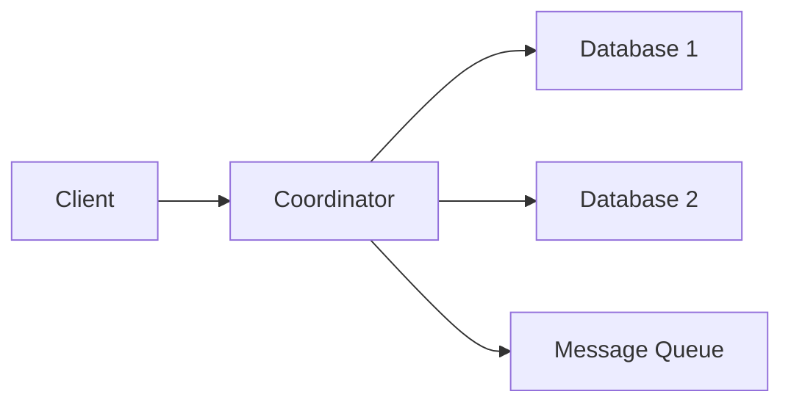
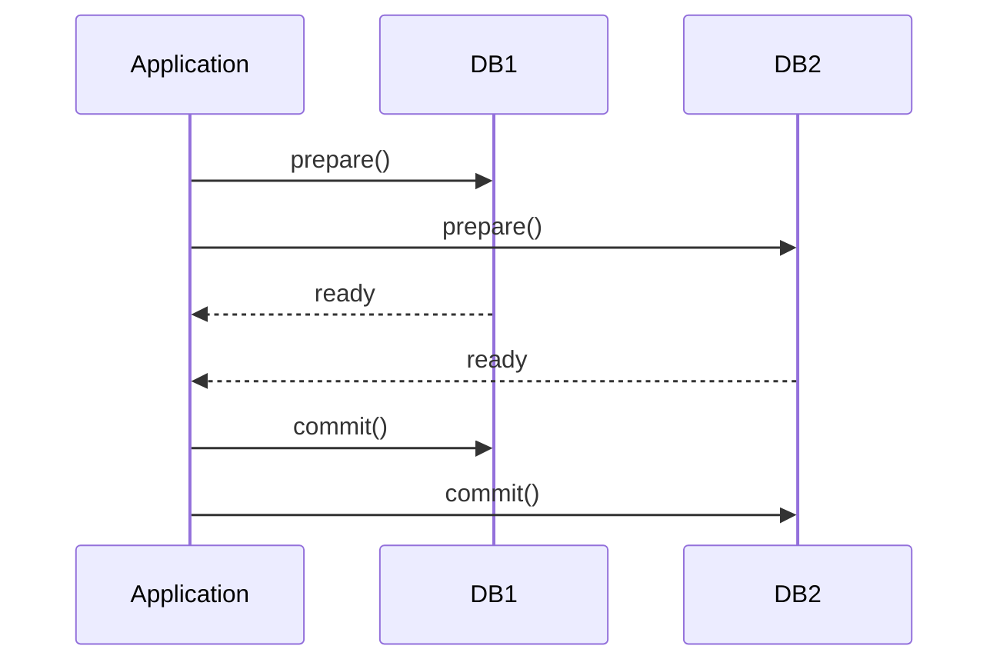
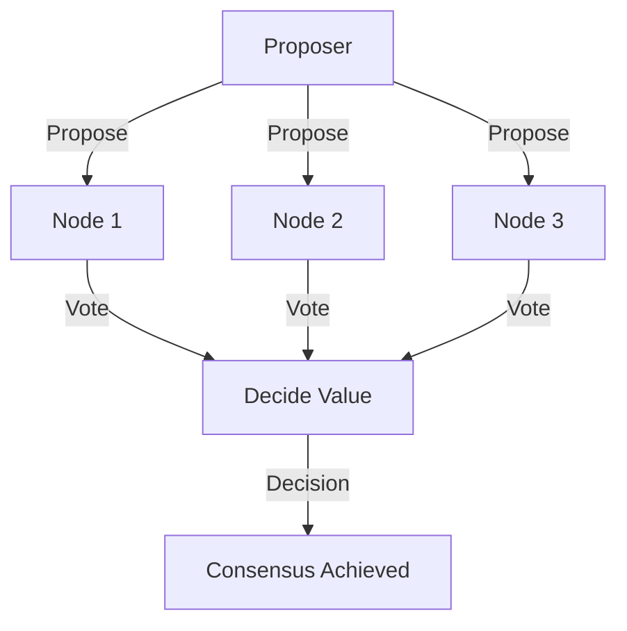

<!---
title: "Distributed Transactions and Fault-Tolerant Consensus in Practice",
description: "Exploring the challenges and solutions in achieving consensus across distributed transactions.",
tags: ["Distributed Systems", "Consensus", "Total Order Broadcast", "Leader Election", "Fault Tolerance", "XA/2PC", "System Design", "X/Open XA standard"],
author: "Your Name"
references: [{
    "title": "",
    "author": "",
    "link": ""
}]
-->

# Distributed Transactions and Fault-Tolerant Consensus in Practice

Continuing our exploration of consistency and consensus, we now shift from theory to the **operational realities** of distributed transactions and the mechanisms that allow systems to reliably reach agreement.

---

## 🚦 Distributed Transactions: Promise and Pitfalls

Distributed transactions span **multiple databases or systems** and are often implemented using **Two-Phase Commit (2PC)**.

### Challenges:

- **⚡ Performance Hit:** Multiple round-trips, disk fsyncs—often 10x slower than single-node transactions.
- **🛠️ Operational Complexity:** Many cloud providers avoid them due to fragility.
- **❗ Guarantees May Break:** Failures can leave data “in doubt”, affecting availability.

---

## 🧩 Types of Distributed Transactions

### 1. **Database-Internal Transactions**

> All participants use the **same database** (e.g., VoltDB, MySQL Cluster).

- Efficient due to internal optimizations.
- Optimized for speed (same software, tight integration).

### 2. **Heterogeneous Transactions**

> Participants span **different systems** (e.g., message broker + database).

- Requires **XA/2PC** protocols, which are harder to optimize and more fragile.

---

## 🔁 Exactly-Once Message Processing

Exactly-once delivery depends on **atomic commit protocols**.

**Example:**
- Message from Kafka → DB insert → Ack.
- If either fails, both are rolled back and retried.

⚠️ **Caution:** Side effects like sending emails can get duplicated if not idempotent.

---

## ⚖️ XA Transactions and the Coordinator Problem

The **X/Open XA standard** (short for eXtended Architecture) is a widely-adopted interface for coordinating distributed transactions between different systems, supporting many relational databases and message brokers.

- **Coordinator runs in the app** and manages 2PC, usually as a library within the application process.
- **Coordinator failure** leads to:
  - **In-doubt transactions** (locks held).
  - **Manual resolution**.
  - **Heuristic decisions** break atomicity.

### 🔒 In-Doubt Transactions and Their Risks
- Coordinator crash = locks held in DB.

- Other queries blocked.

- Recovery log loss = deadlock.

- In a worst-case scenario, administrators must manually resolve in-doubt transactions—an error-prone, high-stress task.
- Heuristic decisions (emergency uncoordinated commits or rollbacks) are possible in some systems, but break the atomicity guarantee and should only be used as a last resort.

### ⚠️ Limitations of XA and Distributed Transactions
- **Single Point of Failure:** Many coordinators are not highly available, so the entire distributed transaction system shares their fate.

- **Stateful Application Servers:** When the coordinator runs inside an app server, those servers can't be stateless—coordinator logs are essential for recovery.

- **Lowest Common Denominator:** XA protocols cannot detect deadlocks across diverse systems or work with advanced isolation levels (like Serializable Snapshot Isolation).

- **Amplification of Failures:** For 2PC to succeed, all participants must be available. One failure can block the entire transaction, increasing system fragility.

## Achieving Fault-Tolerant Consensus: The Backbone of Distributed Systems

Distributed consensus is the process by which a group of nodes agrees on a single value or a sequence of values in the presence of failures—crucial for leader election, replication logs, and coordination in distributed systems.

**Core Consensus Properties**

A robust consensus protocol must provide:

- **Uniform Agreement:** No two nodes decide differently.

- **Integrity:** No node decides more than once.

- **Validity:** Only proposed values can be chosen.

- **Termination:** Every correct node eventually reaches a decision (liveness).

While a **“dictator”** leader can force agreement (satisfying the first three properties), such approaches fail to guarantee termination in the presence of faults (the dictator may crash and progress stalls).

Here is the metadata for the file in a `.md` file format:

### Consensus in the Real World

True fault tolerance requires that consensus can be reached even if some nodes fail, as long as a majority is operational. If the system waits for a crashed node to recover (as in 2PC), it cannot guarantee liveness under failure.

Most consensus protocols don’t handle Byzantine (arbitrary/malicious) faults, only crash or network failures. Byzantine fault-tolerance requires even more complex algorithms, beyond the scope of this post.

### From Consensus to Total Order Broadcast (TOB)

Most practical consensus algorithms extend the single-decision model to sequences (logs), guaranteeing all nodes deliver the same messages in the same order—known as total order broadcast.

Well-known algorithms include:

* Paxos and Multi-Paxos
* Raft
* Viewstamped Replication (VSR)
* Zab (used by ZooKeeper)

Total order broadcast guarantees each message is delivered once, not duplicated, and only messages that were truly sent are delivered.

### Leader Election and Circular Consensus Dependency

Single-leader replication looks similar to total order broadcast, but with a key caveat: automatic and fault-tolerant leader election itself requires consensus, leading to a “chicken-and-egg” problem. **How do we break the cycle?**

Epochs, Quorums, and Recovery
================================

### Breaking the Cycle (Circular Consensus Dependency) with Epochs and Quorums

Consensus protocols solve the cycle using epochs (ballot/view/term numbers) and quorums:

#### Epochs

* Each leader election is associated with a unique, increasing epoch number.
* [For more information refer this article](../01-general/epochs-in-distributed-consensus.md)

#### Quorums

* Decisions (including leader election and subsequent proposals) require votes from a quorum (typically a majority).

#### Overlap

* The overlap ensures that a new leader will not make decisions that contradict uncommitted decisions made by previous leaders—ensuring safety.

### Key Differences from 2PC

Unlike 2PC, consensus protocols:

* Do not require unanimous agreement (only a quorum)
* Are designed with recovery mechanisms
* Can survive failures of minority subsets without stalling the entire system

### 🔚 Final Takeaways
- ✅ Distributed transactions (2PC/XA) are fragile in practice.
- ✅ Consensus-based systems (like Raft) offer better availability.
- ✅ Modern systems prefer idempotent, saga-based, or application-coordinated designs.

