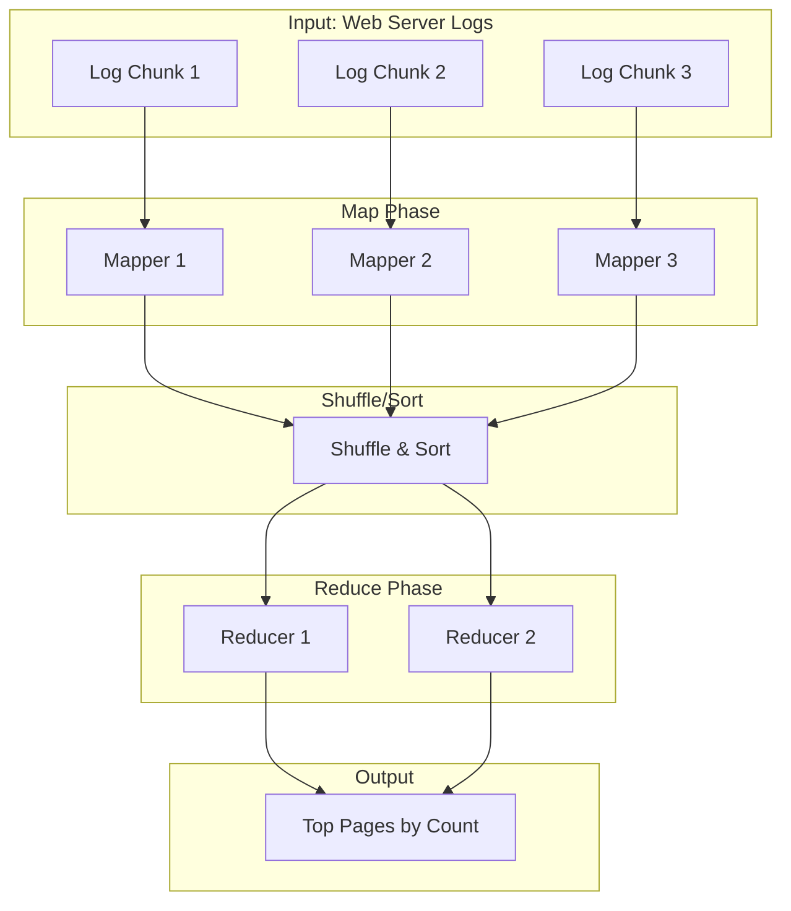
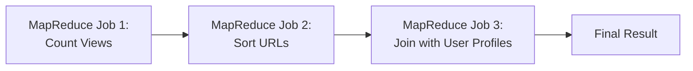
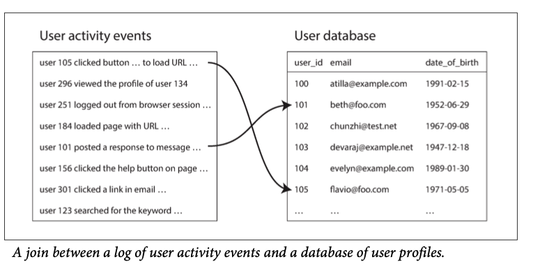
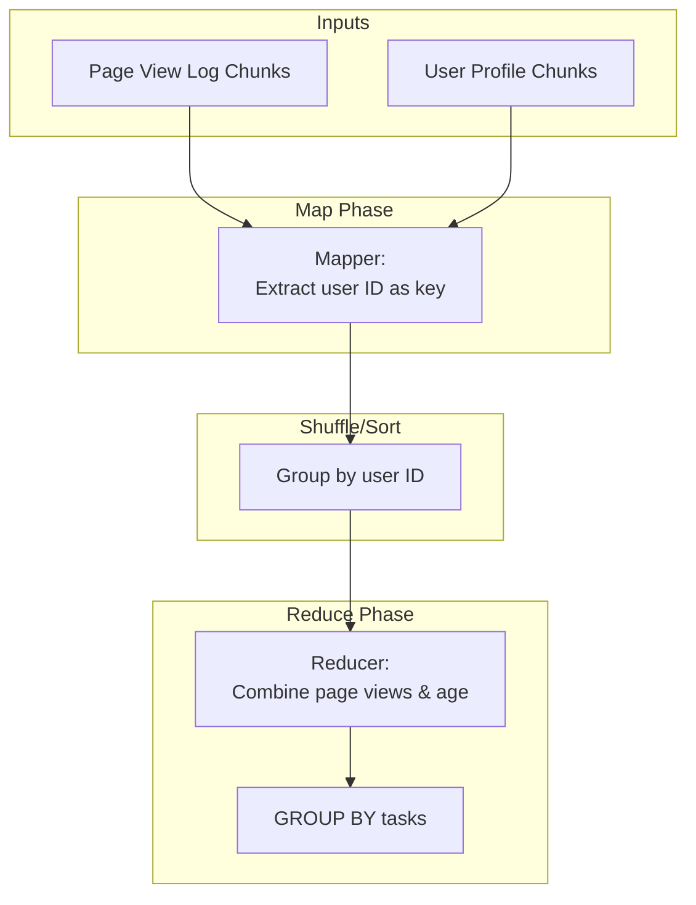
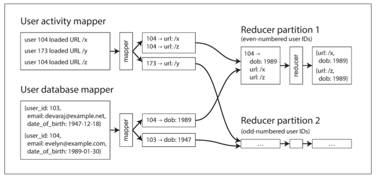
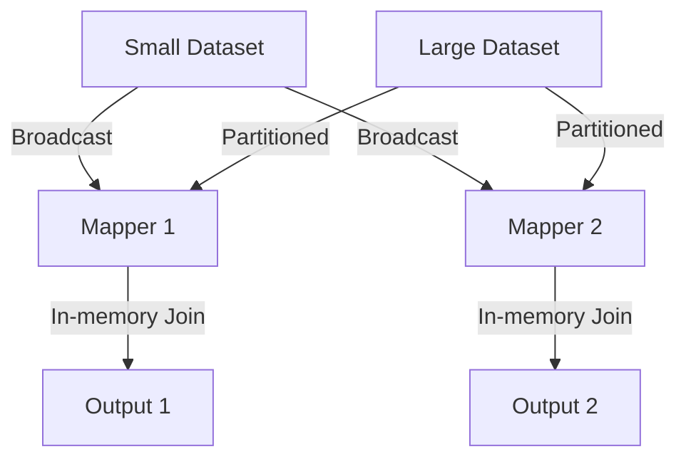
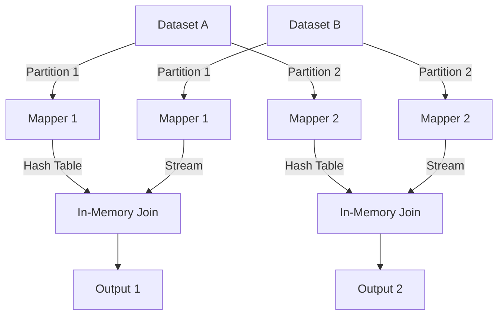
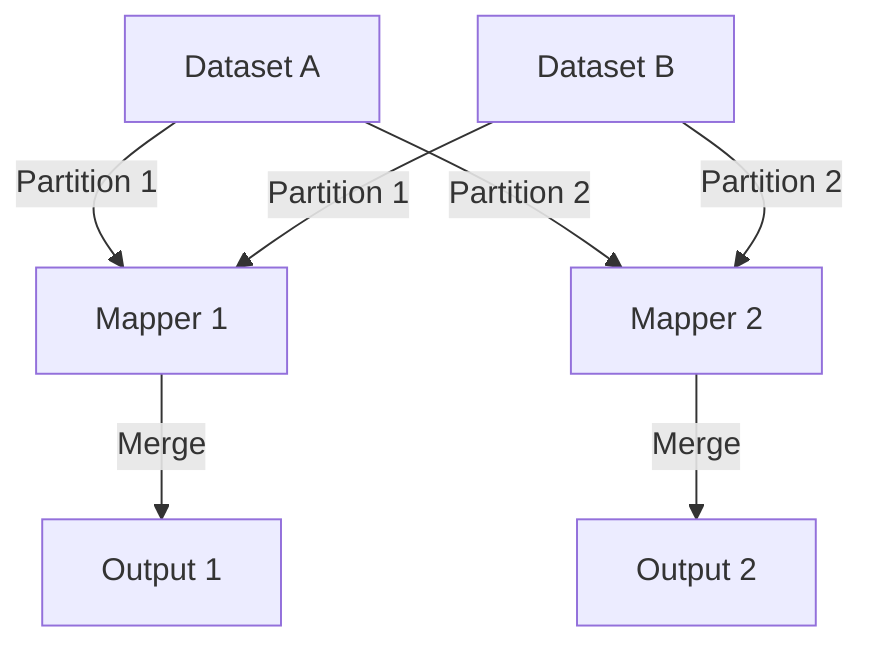
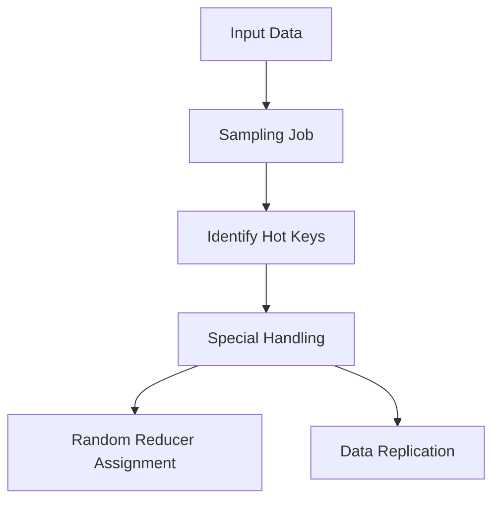

<!--
author: "Avinash Gurugubelli",
title: "Join Strategies in MapReduce",
description: "Understanding different join strategies in MapReduce and their applications in big data processing.",
tags: ["MapReduce", "Big Data", "Distributed Systems", "Join Strategies", "Data Processing", "Hadoop"],
references: [{
    "title": "Hadoop: The Definitive Guide",
    "author": "Tom White",
    "link": ""
}]
-->

# Batch Processing

Ever wondered how Google, Facebook, or your favorite weather app analyze vast amounts of data? Behind the scenes, technologies like **MapReduce** and **distributed filesystems** make it possible!

Let’s break it down in simple terms, using clear analogies, diagrams, and practical examples.

---

## What is MapReduce & Why Do We Need Distributed Filesystems?

Imagine you run a big website. Every time someone visits a page, a line is written to a log file. Very soon, you have **gigabytes** or even **terabytes** of log data—far too big to process on a single laptop. You need a way to:

- Store lots of files reliably, even if some servers fail.
- Process that data quickly—ideally, by splitting the work across many computers.

Enter **Distributed Filesystems** (like HDFS) and the **MapReduce** processing model.

> 📝 **Key Idea**  
> **Distributed Filesystem**: Like a giant, shared hard drive spread across many servers. If one server fails, copies of each file are stored on others.  
> **MapReduce**: A way to split a big data processing task into small chunks ("map"), do the work on many servers, and then combine results ("reduce").

---

## How Does MapReduce Job Execution Work?

Let’s stick with the web log example. You want to know:

> **What are the top 5 pages on my website, by traffic?**

### 🔁 The MapReduce Steps

1. **Map**: Each server takes a chunk of the log and extracts the page URL from every line.
2. **Shuffle & Sort**: The system gathers all identical URLs together across servers and sorts them.
3. **Reduce**: Each reducer counts how many times each URL appeared.
4. **Result**: The system outputs `(URL, count)` pairs—you can now sort and find the top 5.

### 📈 MapReduce High-Level Flow



---
### Components Explained
- Mapper:
    - Processes input records one at a time
    - Extracts key-value pairs
    - Stateless between records

- Shuffle Phase:

    - Groups values by key
    - Sorts keys
    - Distributes to reducers

- Reducer:
    - Receives all values for a key
    - Performs aggregation
    - Writes final output

## Distributed Execution: How Does it Scale?

Now, imagine **100 servers** each process a part of the data in parallel. This is possible because:

- Data is **chunked and distributed** across servers by the distributed filesystem (e.g., HDFS in Hadoop).
- Each chunk is processed **independently** in the **map** phase.
- **Reduce** tasks also run on many servers.

This parallelism makes processing **terabytes** of data feasible within **hours or even minutes**.

---

## MapReduce Workflows: Chaining Multiple Jobs

Real-world tasks often need more than one MapReduce step.

### 📌 Example Workflow

1. Count pageviews per URL (as before).
2. Sort URLs by pageviews to get the top 5.
3. Join with another dataset (e.g., user profiles) to segment top pages by age or country.

Each step becomes a **job**, and they can be **chained together** into a workflow.




---

## 5. Reduce-Side Joins and GROUP BY: Combining Datasets

Example: 
Suppose you want to know **which age group likes which articles**. You have two datasets:

- Logs of page views (with user IDs)
- User profiles (with age)
  


Problems:
- Making random-access requests over the network for every record you want to process is too slow.
- querying a remote database would mean that the batch job becomes nondeterministic, because the data in the remote database might change.

Solutions:
- A  better approach would be to take a copy of the user database (for example, extracted from a database backup using an ETL process

### 🔗 Join Type: Reduce-side join

- Mappers read both datasets; both set the **user ID** as the key.
- During the shuffle, all data for a given user ID is sent to the same reducer.
- The reducer can now match **page views** to **user age** and compute the result.




> 🧠 **GROUP BY**: Grouping by a column (e.g., age) is handled just like joining—MapReduce ensures all records with the same key (e.g., age) arrive at the same reducer, which then counts, sums, or otherwise processes them.

---


Join Strategies in MapReduce
==========================

### 1. Broadcast Hash Join
---
**Best for:** Small datasets that fit in memory

#### Diagram



#### Characteristics

* Entire small dataset loaded into each mapper's memory
* Large dataset processed in parallel
* No reducers needed
* Simple but memory-intensive

### 2. Partitioned Hash Join
---
**Best for:** Large datasets with compatible partitioning

#### Diagram



#### Requirements

* Both datasets must have:
	+ Same number of partitions
	+ Same partitioning function
	+ Same partition keys

#### Advantages

* More memory efficient than broadcast
* Scales to larger datasets
* Still no reducer phase needed

### 3. Map-Side Merge Join
---
**Best for:** Pre-partitioned and pre-sorted datasets

#### Diagram



#### How it Works

* Mappers read corresponding partitions from both datasets
* Performs merge operation (like mergesort)
* Joins records when keys match
* Most efficient but requires strict pre-processing

Handling Data Skew
-----------------

* Data skew occurs when some keys are much more frequent than others, causing uneven workload distribution.

Skew Mitigation Techniques
-------------------------



#### Common Approaches

* Two-Phase Aggregation:
	+ First phase: Partial aggregation
	+ Second phase: Combine partial results
* Skewed Join in Pig:
	+ Sample data to identify hot keys
	+ Distribute hot keys across reducers
	+ Replicate other join input
* Custom Partitioning:
	+ Isolate hot keys to separate reducers
	+ Balance remaining keys normally

Practical Example: Log Analysis Pipeline
--------------------------------------

### Stage 1: Extract and count URLs

```bash
cat access.log | awk '{print $7}' | sort | uniq -c > url_counts.txt
```

### Stage 2: Join with user data (broadcast hash join)

```bash
hadoop jar join.jar BroadcastJoin \
    -input access.log \
    -small_input user_data.tsv \
    -output joined_data \
    -mapper "extract_user_url.py" \
    -reducer NONE
```

#### Diagram

```graph LR
    Logs[Access Logs] --> Extract[Extract URLs]
    Extract --> Count[Count Occurrences]
    UserData[User Database] --> Join[Join with Logs]
    Count --> Report[Generate Report]
    Join --> Report
```

Performance Considerations
-------------------------

| Factor | Broadcast | Partitioned Hash | Map-Side Merge |
| --- | --- | --- | --- |
| Memory Usage | High | Moderate | Low |
| Network Traffic | Low | None | None |
| Pre-processing Needs | None | Partitioning | Partition+Sort |
| Scalability | Small-Med | Large | Very Large |

Conclusion
----------

MapReduce provides powerful patterns for batch processing large datasets:
- **MapReduce** lets you easily scale data processing across hundreds/thousands of machines.
- **Distributed filesystems** like **HDFS** make storing and accessing vast data reliable and fast.
- **Workflows** chain together multiple jobs for richer analysis.
- **Reduce-side joins** and **GROUP BY** aggregate or combine data from different sources at scale.
* Choose join strategy based on data characteristics:
	+ Broadcast for small datasets
	+ Partitioned hash for large, compatibly partitioned data
	+ Map-side merge for pre-sorted data
* Handle skew carefully to avoid performance bottlenecks
* Consider pre-processing requirements when designing pipelines
* Monitor memory usage especially with in-memory joins


These patterns underlie much of today’s big data analytics—from counting Twitter mentions to mining patterns in shopping data!

---
