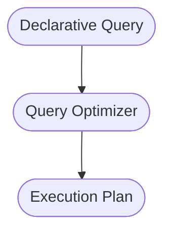

<!--
author: "Avinash Gurugubelli",
title: "Graphs and Iterative Batch Processing",
description: "Understanding modern approaches and architectures for graph processing and iterative batch processing in big data systems.",
tags: ["Graph Processing", "Batch Processing", "Big Data", "Distributed Systems", "MapReduce", "Spark", "Flink", "Pregel"],
references: [{
    "title": "Designing Data-Intensive Applications",
    "author": "Martin Kleppmann",
    "link": ""
}]
-->

Graphs and Iterative Batch Processing: Modern Approaches and Architectures
====================================================================

Introduction
------------

Graphs aren't just for quick database lookups—they're at the heart of powerful batch processing algorithms used in machine learning, ranking systems, and network analysis. Frameworks like Spark, Flink, and Google's Pregel have revolutionized the way we process large-scale graphs and made it easier for engineers and data scientists to focus on logic rather than plumbing.

In this post, we'll break down core concepts of batch graph processing, discuss modern distributed systems, and highlight how high-level APIs and declarative languages boost productivity and performance. To enhance clarity, we've included key Mermaid diagrams for architectural visualization.

Graphs in Batch Processing
---------------------------

Batch processing in graph databases extends far beyond executing simple lookup queries:

* Use cases include: PageRank (web search), recommendation engines, influence propagation, community detection, etc.
* These require iteratively traversing graph structures, passing information along edges until convergence—a process ill-suited to classic MapReduce.

MapReduce’s Limitation for Graphs
---------------------------------

Classic MapReduce jobs process datasets in single passes, making them inefficient for iterative graph algorithms. Iterative processing must be orchestrated outside the engine, which means repeated reading/writing of the entire dataset even for tiny state changes.

### MapReduce Iterative Batch Flow

Dataflow Engines and DAGs
-------------------------

Modern engines (Spark, Flink, Tez) structure data processing jobs as Directed Acyclic Graphs (DAGs). However, note the distinction:

* Dataflow DAG: The process pipeline, not the graph-shaped data.
* Graph Processing: The data itself forms a graph, requiring specialized computation patterns.

### Dataflow Engine Model vs. Graph Data Model

Dataflow engines optimize how data flows between processing stages, while graph data models enable traversals within interlinked entities.

The Pregel Model: Bulk Synchronous Parallel Graph Processing
---------------------------------------------------------

Pregel (and derivations like Apache Giraph, GraphX, Gelly) uses the Bulk Synchronous Parallel (BSP) Model for efficient graph computation:

* Vertices communicate via messages.
* Vertex state persists across iterations.
* Only active (messaged) vertices do work, reducing computation.
* Fault tolerance via checkpointing and replay.

### Pregel/BSP Iterative Processing

Each round (superstep), all vertices process incoming messages and send out new ones for the next step.

Parallelism and Partitioning
-----------------------------

The framework partitions the graph across machines.

* Ideally, highly connected vertices co-locate to reduce network traffic—yet most partitioning is based on vertex IDs, so cross-machine communication remains heavy.
* If graph fits on a single machine: Local processing is usually faster than distributed.

High-Level APIs and Declarative Languages
-----------------------------------------

SQL-inspired languages (Hive, Pig, Spark DataFrames) brought declarative query capabilities, allowing engines to choose the optimal execution plan.

* High-level APIs simplify development and enable interactive experimentation.

### SQL-like APIs and Query Optimization

Declarative interfaces let the system optimize joins, aggregations, and minimize intermediate data.

Combining Extensibility and Performance
-----------------------------------------

Unlike databases, modern batch frameworks call native or user-defined functions as mappers/reducers—retaining huge flexibility for custom analytics.

* Internally, frameworks compile simple operators (e.g., filters/maps) into fast, vectorized code for best performance.

### Specialization for Different Domains
Reusable algorithm libraries span:

- Machine Learning: Libraries like Mahout (MapReduce, Spark) or MADlib (MPP databases).

- Spatial/genome processing: Graph-based similarity and approximate search algorithms.