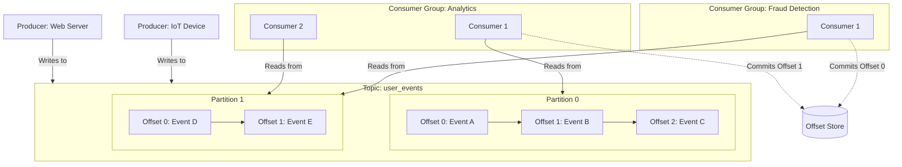
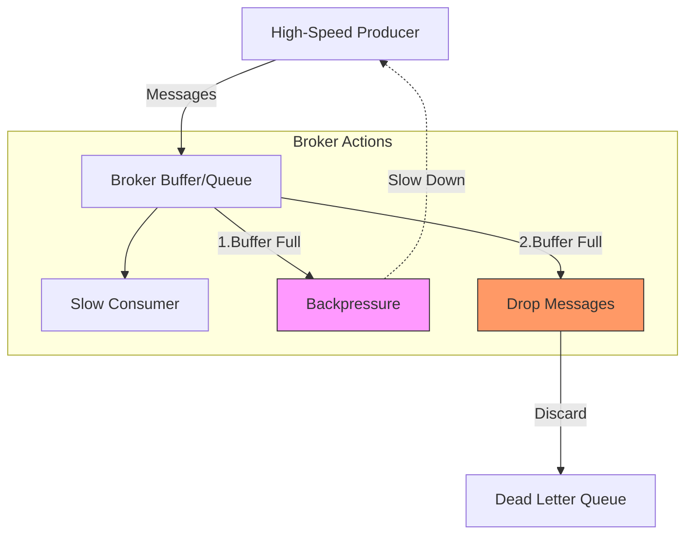
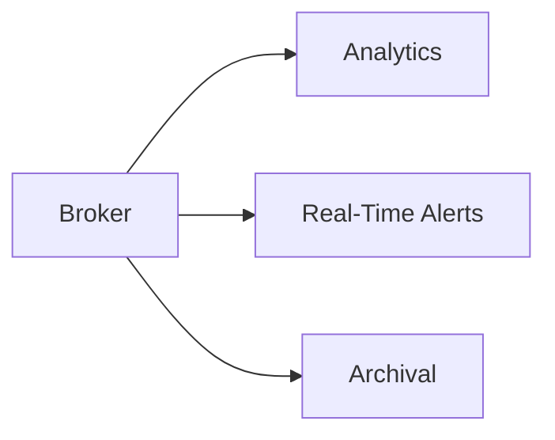
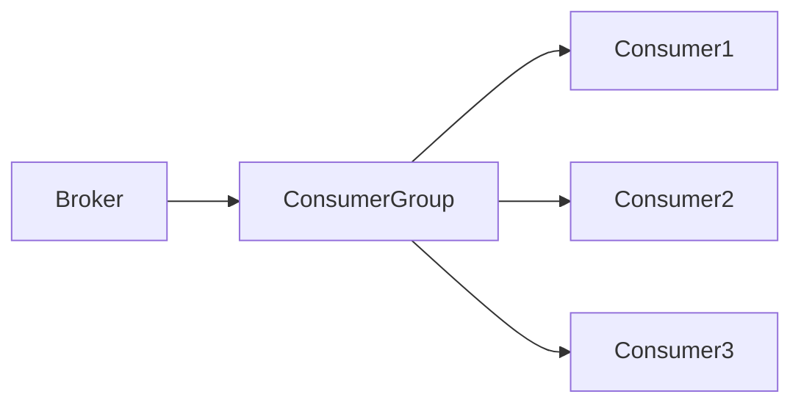
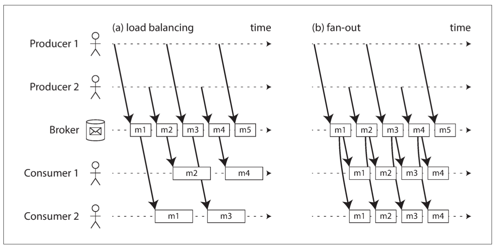
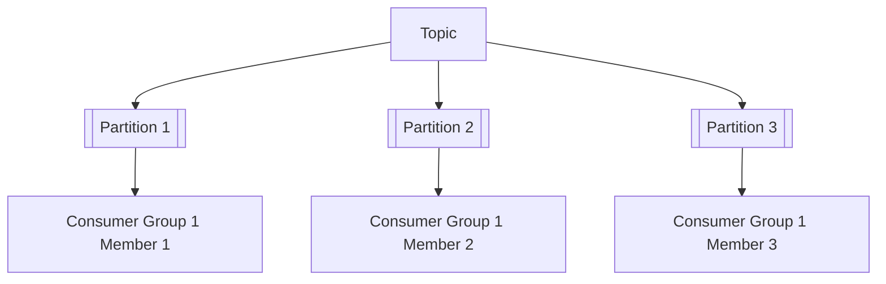
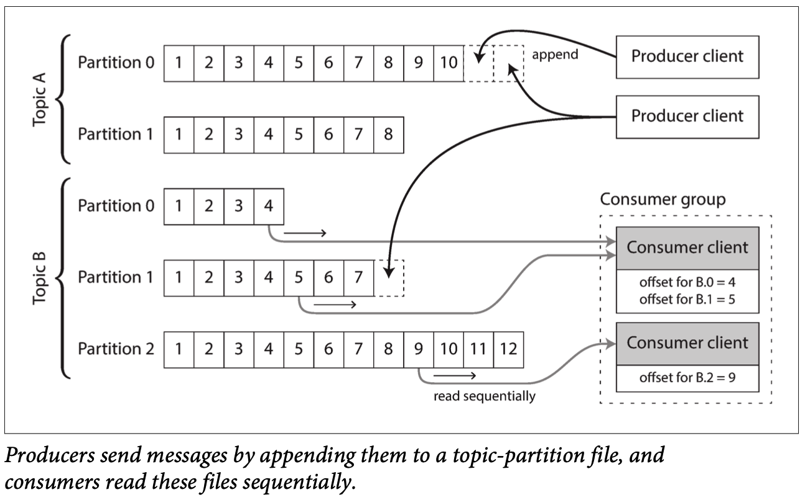
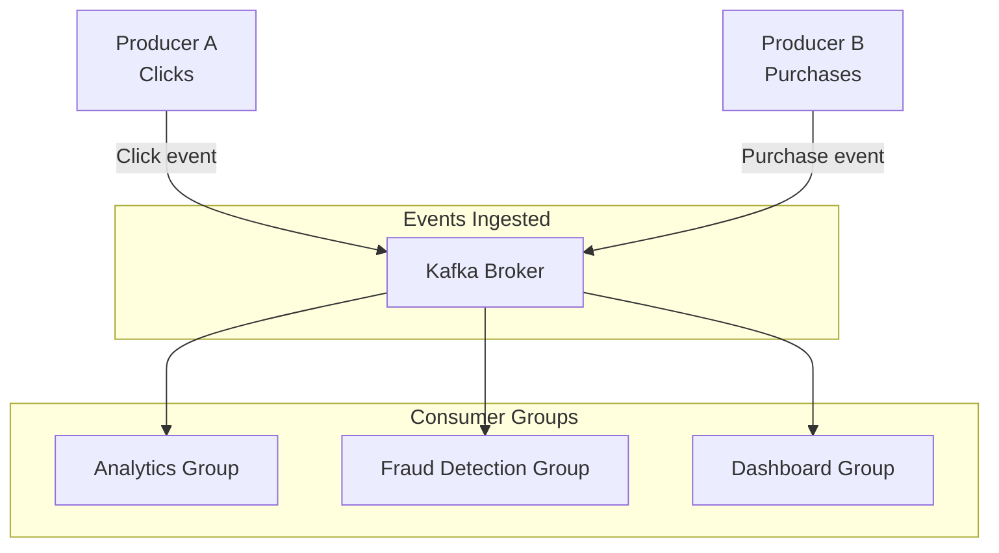

# The Definitive Guide to Stream Processing: Architecture, Operations & Failure Handling (Deep Dive with Diagrams)

Modern systems generate continuous, unbounded streams of data—from IoT sensors to user interactions, financial transactions, and logs. Stream processing is the architectural and operational framework that enables processing this data in real time with high throughput, low latency, and fault tolerance.

This guide walks you through every major aspect of stream processing systems, from core components to complex failure handling and scaling strategies—with detailed, interactive diagrams for clarity.

---

## Background: The Evolution From Batch to Stream Processing

### Why batch processing became insufficient:
- Batch jobs operate on bounded datasets — finite files or datasets that can be processed start-to-finish.
- All data are collected before processing begins — causing delays unsuitable for real-time purposes.
- Inability to process continuous data streams that never truly “finish” (e.g., continuous user clicks, sensor data).

### Real-time demands:
- Systems must respond instantly to events (fraud alerts, personalized recommendations).
- Streaming solves this by processing events as they arrive, with minimal delay.

---

## Core Concepts of Stream Processing Architecture

### Components and their roles

- **Producer:** Generates events; may be a web server, sensor, user client, or application service.
- **Event:** Smallest atomic data unit (user click, sensor reading). Immutable, usually timestamped.
- **Broker:** Persistent queue or append-only log acting as an intermediary—buffering and distributing events.
- **Consumer:** One or more nodes reading and processing events asynchronously.

---

## Event format and immutability

- Events are immutable records encoding a fact about the world at a point in time, often including metadata like timestamps, event IDs, and context.
- This immutability aids replay and fault recovery.

---

## Handling Throughput Imbalance: Producer Faster Than Consumer

### Handling Throughput Imbalance

### Buffering

* **Broker Stores Events**: Broker stores events until the consumer can process them.
* **Limitations**: Limited by RAM/disk.
* **Consequences**: Can cause consumer lag and increased latency.

### Backpressure

* **Broker Signals Producers**: Broker signals producers to slow event production.
* **Implementation**: Rarely supported at protocol level; implemented via flow control APIs or "stop-the-world" mechanisms.

### Dropping Messages

* **Non-Ideal Solution**: Non-ideal; results in data loss and inconsistency, acceptable only in specific scenarios.

### Effects of Buffer Overflow

* **System Behavior**: System behavior under load depends on buffer size and backpressure implementation.
* **Monitoring Critical**: Monitoring queue size and consumer lag is critical to prevent silent failures.

**Key Takeaways**

* Buffering can lead to consumer lag and increased latency.
* Backpressure can help prevent buffer overflow, but is rarely supported at protocol level.
* Dropping messages is a non-ideal solution that can result in data loss and inconsistency.
* Monitoring queue size and consumer lag is crucial to prevent silent failures.

---

## Event Delivery Guarantees and Consumer Acknowledgments

### Message Acknowledgment Protocol

* **Consumer Acknowledgment**: Consumer acknowledges only after fully processing an event.
* **Broker Retention**: Broker retains event until acknowledgment.
* **Redelivery**: To prevent message loss in crashes, events may be redelivered if acknowledgment isn't received.

### Delivery Guarantees Framework

| Guarantee Type | Description | Pros | Cons |
| --- | --- | --- | --- |
| **At-most-once** | Event sent once or none | No duplicates | Possible message loss |
| **At-least-once** | Event sent one or more times | No message loss | Possible duplicate processing |
| **Exactly-once** | Event processed only once | Strongest consistency | Complex, costly, sometimes impractical |

### Duplicate Processing Consequences and Idempotency

* **Consequences of Duplicate Events**: Duplicate events can cause incorrect aggregates, billing errors, or repeated alerts.
* **Idempotent Consumers**: Consumers should be designed idempotently: processing the same event multiple times yields the same result.

**Key Takeaways**

* Message acknowledgment protocol ensures events are processed before being acknowledged.
* Delivery guarantees framework provides options for balancing consistency and performance.
* Idempotent consumers are crucial for handling duplicate events and ensuring correct processing.

## Multiple Consumers & Delivery Patterns: Fan-out vs Load Balancing

#### Fan-Out: Broadcasting events to multiple independent consumers

- All consumers get all messages.
- Useful when independent systems need the same data differently.

#### Load Balancing: Sharing work across a consumer group

- Each event is processed once within the group.

- Events assigned to consumers such that no message is processed twice within this group.

- Improves throughput by horizontal scaling.
---

## Topics, Partitions & Consumer Groups: Partitioned Logs for Scale

- **Topic:** Logical stream name grouping related events.
- **Partition:** Append-only, ordered logs within topics.
  - Each partition is totally ordered; no ordering guarantees across partitions.
  -  Number of partitions determines max parallelism for consumers.
- **Consumers** in a group divide partitions among themselves.
  - Consumers in a group divide partitions among themselves.
  - Multiple consumer groups can independently consume the same topic for different use-cases.
  - Partition reassignment automatically occurs on consumer join/leave/failure.

---

## Offset Management & Replay Capabilities

### What is an Offset?

* **Definition**: Each message in a partition has an increasing sequence number: the offset.
* **Consumer Tracking**: Consumer tracks which offset it has processed and acknowledged.

### Why Offsets Matter

* **Resume from Last Processed Event**: Allow consumers to resume from last processed event on crash/restart.
* **Replaying Historical Data**: Enable replaying historical data, essential for debugging, reprocessing, or updating derived data.

### Replay and Retention

* **Broker Retention**: Broker retains messages based on configured retention time or total size.
* **Consumer Lag**: Consumer lag (distance between last processed offset and latest offset) indicates system health.
* **Data Loss**: If lag exceeds retention period, consumer misses data permanently.

## Handling Failures & Fault Tolerance: What Can Go Wrong?

### Producer Failures

* **Network Failure**: Network failure during send: producer retries; may cause duplicates.
* **Producer Crash**: Producer crash: no further events until restart; existing events in broker remain.

### Broker Failures

* **Broker Crash**: Broker crashes must not lose messages.
* **Disk Persistence and Replication**: Achieved through disk persistence and replication across broker nodes.
* **Recovery**: Recovery involves leader election and log repair.

### Consumer Failures

* **Consumer Crash**: Consumer crashes after processing but before ack → broker resends the event.
* **Consumer Lag**: If consumer falls behind, buffer grows, leading to possible event retention breach.
* **Consumer Group Reassignment**: Consumer group reassignment redistributes partitions if a member fails.

### Network Failures & Partitions

* **Network Outages**: Network outages cause delayed messages or duplicates due to retries.
* **Distributed Brokers**: Distributed brokers handle partitioning and consensus to maintain availability.

---

## Operational Considerations & Monitoring

**Key Metrics to Track**

To ensure the health and performance of your stream processing system, track the following key metrics:

### 1. **Consumer Lag**

* **Is the consumer keeping up?**: Monitor the delay between the time an event is produced and the time it is consumed.

### 2. **Broker Disk Usage**

* **Is retention capacity nearing limits?**: Track the amount of disk space used by the broker to ensure it does not reach capacity.

### 3. **Throughput**

* **Events per second at producer, broker, consumer**: Monitor the rate at which events are being produced, processed, and consumed.

### 4. **Consumer Group Status**

* **Partition assignments**: Track which partitions are assigned to each consumer group.
* **Consumer health**: Monitor the health and status of each consumer in the group.

By tracking these key metrics, you can identify potential issues and take proactive steps to ensure the performance and reliability of your stream processing system.

---

**Cleaning up Logs and Disk Space Management**
=============================================

### Automatic Log Cleanup

When brokers use logs persisted to disk, the log is segmented. Old segments are periodically deleted based on configured retention policies (by time, size, or both). This cleanup is automatic to a degree but requires careful operational management.

### Consequences of Disk Capacity Issues

If the broker disk reaches its capacity due to slow consumers lagging behind, older message segments are purged. This means any consumer lagging beyond the retention window or last segment cleanup loses data.

### Manual Intervention

To prevent data loss and ensure system health, manual intervention is necessary:

#### Admin Tasks

* **Monitor Disk Utilization**: Continuously monitor disk utilization, retention policies, and consumer lag.
* **Adjust Retention Period or Disk Capacity**: Increase retention period or disk capacity proactively when lagging consumers or storage fills up.
* **Scale Consumers or Optimize Processing**: Scale consumers or optimize processing to reduce lag.
* **Use Alerts**: Use alerts for retention breaches or disk space exhaustion.
* **Archive or Offload Old Log Segments**: Archive or offload old log segments if needed based on business policies.

#### Developer Tasks

* **Design Consumers for Performance**: Design consumers to process faster or scale horizontally.
* **Handle Data Purge Situations**: Handle situations where old data may have been purged gracefully.
* **Implement Monitoring**: Implement monitoring for data loss, lag, and system health.
* **Design Fallbacks or Backups**: Possibly design fallbacks or backups if guaranteed complete and indefinite retention is required.
---

## Comparing RabbitMQ and Apache Kafka

| Aspect              | RabbitMQ                                     | Apache Kafka                                                   |
|---------------------|-----------------------------------------------|----------------------------------------------------------------|
| Architecture        | Broker queues, routing exchanges              | Distributed log                                                |
| Messaging Model     | Complex routing, exchanges                    | Partitioned logs, pub/sub                                      |
| Persistence         | Messages deleted post-ack                     | Messages retained post-ack                                     |
| Ordering            | Strong per-queue                              | Guaranteed per-partition                                       |
| Scalability         | Limited, more complex                         | High throughput, partition-based                               |
| Delivery Guarantees | At-least-once, transactional                  | At-least-once, exactly-once with Streams API                   |
| Use Cases           | Task queues, RPC                              | Event streaming, logging, analytics                            |

---

**When to Use RabbitMQ and Kafka**
=====================================

### When to Use RabbitMQ

* **Complex Routing**: You need complex routing with multiple exchange types.
* **Traditional Message Queue Semantics**: Traditional message queue semantics with immediate delivery and acknowledgment.
* **Low Latency**: Lower latency, typical request-response or RPC messaging.
* **Work Queue and Task Distribution**: Work queue and task distribution scenarios.

### When to Use Kafka

* **Large Volumes of Data**: You need to process large volumes of data with durable storage.
* **Event Sourcing and Audit Logs**: Event sourcing or audit log requirements where replayability is essential.
* **Stream Processing and Analytics**: Stream processing and analytics pipelines needing partitioned scalability.
* **Loose Coupling**: Systems requiring loose coupling between many producers and consumers.
* 
## Putting It All Together: End-to-End Event Flow Example

---

## Summary and Best Practices

- Stream processing requires balancing throughput, latency, and fault tolerance.
- Brokers decouple producers and consumers, providing buffering, durability, and replay capabilities.
- Retention policies and disk management are crucial operational areas.
- Monitor consumer lag and broker resources continuously.
- Choose between RabbitMQ and Kafka based on use case and scale.
- Design consumers to be idempotent and duplicate-tolerant.

> Stream processing is a foundational technology for today's real-time applications and scalable architectures. Understanding its facets will empower you to build resilient, efficient streaming systems.
